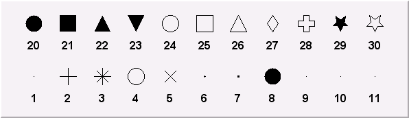
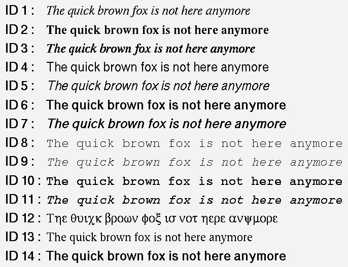

<div style="text-align: left">
<font face="微软雅黑" size=5 color=#FF00FF>
  小关的读书笔记
</font> 
</div>


<center> ROOT 教程 </font>
===========================

> ROOT 是粒子物理与核物理数据分析的好工具！！！      
> ROOT的学习不是一朝一夕的事情,需要反复反复再反复使用，才可能较好地掌握它.             
这里是我学习使用ROOT的总结、感悟. 本文档的出发点是给初学者提供一种学习ROOT的思路如果C++基础好,学习ROOT会很快上手！这里简单介绍ROOT里面几个
最常用到的类,以及这些类的基本操作方法对于一些重要的类,仔细研读源程序会
有很大收获！                                


> ROOT学习资料
> [1. ROOT_for_beginners](https://cloud.tsinghua.edu.cn/d/bad40bc16faa4061ada3/) // 个人觉得这是最适合新手的学习资料,一共5篇
> [2. 杨振伟老师ROOT课程讲义](https://cloud.tsinghua.edu.cn/d/9132b3d20f884fc59f1f/) // 适合新手入门
> [3. ROOT-User-Guide](https://root.cern.ch/root/htmldoc/guides/users-guide/ROOTUsersGuide.html)
> [4. $ROOTSYS/tutorials](https://root.cern.ch/root/htmldoc/guides/users-guide/ROOTUsersGuide.html#rootsystutorials-1) // tutorials源代码在root/tutorials下，是非常好的学习资料！
> [5. 新版本Reference-Guide](https://root.cern/doc/master/annotated.html )  
> [6. *旧版本Reference-Guide](https://root.cern.ch/root/html304/)


>  <font color=#DC143C >ROOT学习方法参考!!!</font>
> 1. 入门阶段：建议阅读顺序，ROOT_for_beginners，杨振伟老师ROOT课程讲义, 完成里面的练习
> 2. 提高阶段: ROOT-User-Guide 与 tutorials 结合使用 ( <font color=#DC143C >User-Guide不适合从头到尾阅读!!!</font>)
> 3. 熟练阶段： 在root环境下善用Tag键不全，必要时查阅Reference-Guide
                                             


目录
-----
[toc]


---------------------------------------------------
# <font color=#DC143C> 附录: </font>

### <font color=#00BFFF> Markers  </font>


### <font color=#00BFFF> 希腊字母表  </font>


### <font color=#00BFFF> 数学符号  </font>


### <font color=#00BFFF> 填充格式  </font>


### <font color=#00BFFF> 填充颜色  </font>


------------------------------------------------------
## <font color=#DC143C> ROOT 安装步骤 </font>

### make 安装方法
```C++
1. 必须安装的软件包
   sudo apt-get install git dpkg-dev cmake g++ gcc binutils libx11-dev libxpm-dev libxft-dev libxext-dev   //安装 Required packages

2. 选择安装的软件包
   sudo apt-get install gfortran libssl-dev libpcre3-dev xlibmesa-glu-dev libglew1.5-dev libftgl-dev
              libmysqlclient-dev libfftw3-dev libcfitsio-dev  graphviz-dev libavahi-compat-libdnssd-dev
              libldap2-dev python-dev libxml2-dev libkrb5-dev libgsl0-dev libqt4-dev
   // 安装Optional packages // libcfitsio-dev可能出错，则改为libcfitsio3-dev

3. 下载需要的ROOT版本 <https://root.cern.ch/releases>
   解压到指定文件夹，比如：/home/gfh16/Packages/root/

4. ./configure   ##在/home/gfh16/Packages/root/ 下打开终端
     （或者 ./configure --all  ### 安装更多的功能）

5. make -j4   ### jn 根据自己的电脑情况而定  ### 这一步可能需要等很长时间

6. 配置环境变量： source /home/gfh16/Packages/root/bin/thisroot.sh 添加到 .bashrc文件中

7. 安装成功

```

### cmake 安装方法
```C++
1. 必须安装的软件包
   sudo apt-get install git dpkg-dev cmake g++ gcc binutils libx11-dev libxpm-dev libxft-dev libxext-dev   //安装 Required packages

2. 选择安装的软件包
   sudo apt-get install gfortran libssl-dev libpcre3-dev xlibmesa-glu-dev libglew1.5-dev libftgl-dev
              libmysqlclient-dev libfftw3-dev libcfitsio-dev  graphviz-dev libavahi-compat-libdnssd-dev
              libldap2-dev python-dev libxml2-dev libkrb5-dev libgsl0-dev libqt4-dev
   // 安装Optional packages // libcfitsio-dev可能出错，则改为libcfitsio3-dev

3. 下载需要的ROOT版本：https://root.cern.ch/releases
   需要注意几个问题：
   (1) root 版本有source版本(源代码)、binary版本。一定要下载source版
   (2) ubuntu18.04, ubuntu16.04, ubuntu14.04 对root版本要求不一样，要选择配套的root版本

4. 如下载：root_v6.18.00.source.tar.gz
   解压： tar zxvf root_v6.18.00.source.tar.gz
   解压后自动生成文件：root_v6.18.00.source

5. 在root_v6.18.00.source所在的路径新建文件夹，用来安装root;进入新建文件夹：
   mkdir root_install
   cd root_install

6. cmake ../root_v6.18.00.source/

7. cmake --build . -- -jN      // N is the number of available cores

8. 设置环境变量：source /home/sea/Packages/root6.18/root_install/bin/thisroot.sh
```


### 附录： 配置环境变量

```C++
#!/bin/bash
#export cadmesh_DIR=/home/nuclearresearch/MyPrograms/CADMesh/install/lib/cmake/cadmesh-.
#export LD_LIBRARY_PATH=$LD_LIBRARY_PATH:/home/nuclearresearch/MyPrograms/CADMesh/install/lib

#for root setting
#!/bin/bash
#export ROOTSYS=$PACKAGES_PATH/root
source  /home/sea/Packages/root6.18/root_install/bin/thisroot.sh

#######################################
##for xerces-c-3.1.1
#export XERCESC_LIBRARY=/usr/local/lib
#export XERCESC_INCLUDE_DIR=/usr/local/include/xercesc
#export LD_LIBRARY_PATH=$LD_LIBRARY_PATH:/usr/local/lib

#################################################
##for Geant4.9.6.p03
#export Geant4_9_6_path=/home/gfh16/Packages/Geant4/geant4.9.6.p03-install
#source $Geant4_9_6_path/bin/geant4.sh
#source $Geant4_9_6_path/share/Geant4-9.6.3/geant4make/geant4make.sh


####for data
#export  G4ABLA3=/home/gfh16/Geant4/geant4.9.6.p03-install/data/G4ABLA3.0
#export  G4EMLOW=/home/gfh16/Geant4/geant4.9.6.p03-install/data/G4EMLOW6.50
#export  G4ENSDFSTATE=/home/gfh16/Geant4/geant4.9.6.p03-install/data/G4ENSDFSTATE2.1
#export  G4NDL=/home/gfh16/Geant4/geant4.9.6.p03-install/data/G4NDL4.5
#export  G4PII=/home/gfh16/Geant4/geant4.9.6.p03-install/data/G4PII1.3
#export  G4NEUTRONXS=/home/gfh16/Geant4/geant4.9.6.p03-install/data/G4NEUTRONXS1.4
#export  G4SAIDDATA=/home/gfh16/Geant4/geant4.9.6.p03-install/data/G4SAIDDAT1.1
#export  G4TENDL=/home/gfh16/Geant4/geant4.9.6.p03-install/data/G4TENDL1.3
#export  PhotonEvaporation=/home/gfh16/Geant4/geant4.9.6.p03-install/data/G4PhotonEvaporation4.3.2
#export  RadioactiveDecay=/home/gfh16/Geant4/geant4.9.6.p03-install/data/RadioactiveDecay5.1.1
#export  RealSurface=/home/gfh16/Geant4/geant4.9.6.p03-install/data/RealSurface1.0

##for Geant4.9.6.p03// for /home/gfh16/Geant4
#export Geant4_9_6_path=/home/gfh16/Packages/geant4/geant4.9.6.p03-install
#source $Geant4_9_6_path/bin/geant4.sh
#source $Geant4_9_6_path/share/Geant4-9.6.3/geant4make/geant4make.sh

##for Geant4.9.6.p03// for /home/gfh16/Geant4
#export Geant4_9_6_path=/home/gfh16/Packages/GEANT4/geant4.10.03.p01-install
#source $Geant4_9_6_path/bin/geant4.sh
#source $Geant4_9_6_path/share/Geant4-10.3.1/geant4make/geant4make.sh
```


-------------------------------------------------------
# <font color=#DC143C> 一. ROOT 基础篇 </font>

### <font color=#00BFFF> 1.1 ROOT-Framework简介 </font>
*  $ROOTSYS/bin : 二进制文件: 
* $ROOTSYS/lib : ROOT库文件<font color=#DC143C> (写makefile时需要用到！！！)</font>
* $ROOTSYS/tutorials: ROOT例子源代码 
* $ROOTSYS/Test : 包含整个ROOT-Framework的全部实例,值得进一步探索！！!
* $ROOTSYS/include: 包含所有的头文件


&emsp;
### <font color=#00BFFF> 1.2 ROOT 终端常用命令(更多内容参见cling) </font>

```C++
root -h  //help作用，查看root后面参数如何使用
root -l  //关root的欢迎界面
root -b  //关闭图形界面，及不显示Canvas
root myMacro.C > myMacro.log  // 将 myMacro.C 的结果输出到 myMacro.log中

root[] .?             // 查看root环境下所有的用法
root[].L myFile.C     // Load myFile.C 
root[].x myFile.C     // Load and execute myFile.C 
//更多用法参照 cling 的介绍
```


&emsp;
### <font color=#00BFFF> 1.3 ROOT的代码规范  </font>

#### <font color=#FF00FF> 1.3.1 代码约定  </font>

|  命名规则          | 代码规范  |
|:---               |:---      |
|类名以 "T" 开头     |TLine, TTree, ...|
|非类类型以"_t"结尾   |Int_t, Double_t, Bool_t, ....|
|类的数据成员以"f"开头 |fTTree, ...|
|成员函数以大写字母开头 |Loop(), ...|
|常量以"k"开头        |kRed, ...|
|全局变量以"g"开头     |gROOT, gStyle, ...|
|静态数据成员以 "fg" 开头 |fgTokenClient, ...|
|枚举型以 "E" 开头        |EColorLevel, ...|
|局域变量与参数开头小写     |nbytes, ...|
|Getters and Setters 分别以 "Get" "Set" 开头|SetLast(), GetFirst(), ...|


&emsp;
#### <font color=#FF00FF> 1.3.2 数据类型规范  </font>
```C++
// 为避免新老机器对同一种数据类型可能有不同的长度, ROOT使用下面的 pre-defined 类型

* Char_t         //Signed Character 1 byte
* UChar_t        //Unsigned Character 1 byte
* Short_t        //Signed Short integer 2 bytes
* UShort_t       //Unsigned Short integer 2 bytes
* Int_t          //Signed integer 4 bytes
* UInt_t         //Unsigned integer 4 bytes
* Long64_t       //Portable signed long integer 8 bytes
* ULong64_t      //Portable unsigned long integer 8 bytes
* Float_t        //Float 4 bytes
* Double_t       //Float 8 bytes
* Double32_t     //Double 8 bytes in memory, written as a Float 4 bytes
* Bool_t         //Boolean (0=false, 1=true)
```

&emsp;
### <font color=#00BFFF>  1.4 全局变量  </font>

#### <font color=#FF00FF> 1.4.1 gROOT  </font>
```C++
// By using gROOT pointer, you can get the access
// to every object created in a ROOT program

root[] gROOT->ProcessLine(".x myHist.C");
root[] gROOT->GetListOfFunctions();
root[] gROOT->GetListOfCanvases()->FindObject("c1");
...
```

#### <font color=#FF00FF> 1.4.2 gPad  </font>
```C++
// gPad is always pointing to the active pad
{
  gPad->SetFillColor(38);
  gPad->Modified(); // Tell the canvas that an object it is displaying has changed
  gPad->Update();  // Force the canvas to refresh
  ...
}
```

#### <font color=#FF00FF> 1.4.3 gStyle  </font>

```C++
root[] gStyle->SetFillStyle(); 
root[] gStyle->SetPalette(1);     // To plot with nice colors
root[] gStyle->SetOptFit(kTRUE);  // 显示拟合参数
root[] gStyle->SetOptStat(1);     // 显示详细的拟合参数
root[] gStyle->SetOptDate(Int_t optdate); 
               // optdate = 10 * format + mode
               // mode = 1  显示位置 bottom/left
               // mode = 2  显示位置 bottom/right
               // mode = 3  显示位置 top/right
               // format = 0(默认), 1, 2  日期显示格式
...

```

#### <font color=#FF00FF> 1.4.4 gRandom  </font>
```C++
// A pointor to the current random number generator.
// Points to 'TRandom3' by default

root[] gRandom->Print(); // 查看当前的 random number generator
root[] delete gRandom;   // 删除当前的 random number generator
root[] gRandom = new TRandom2(0); // seed = 0, 新的random number generator
...
```

#### <font color=#FF00FF> 1.4.5 gSystem  </font>

```C++
root[] gSystem->Getenv("USER")  // returns the value of the system enviroment variable 'USER' 
```

#### <font color=#FF00FF> 1.4.6 其他全局变量  </font>

> 在 root 终端键入g, 按 Tab 补全可查看所有的全局变量！


&emsp;
### <font color=#00BFFF> 1.5 环境设置  </font>

#### <font color=#FF00FF> 1.5.1 rootlogon.C  </font>
```C++
// 运行 root 时自动加载当前目录下 rootlogon.C 里面的代码

{
   gStyle->SetPalette(1);                                      // 使画图颜色更加好看
   cout << "Salut " << gSystem->Getenv("USER") << "!" << endl;
   gSystem->Exec("date");                                      // 显示系统时间日期
}
```

#### <font color=#FF00FF> 1.5.2 rootlogoff.C  </font>

> rootlogoff.C is a script loaded at shutdown


#### <font color=#FF00FF> 1.5.3 rootalias.C  </font>
```C++
// rootalias.C file is loaded but not executed at start-up, 
// it contians small functions like:

ls(path)
edit(filename)
dir(path)
pwd()
cd(path)
```


&emsp;
### <font color=#00BFFF> 1.6 对象  </font>

#### <font color=#FF00FF> 1.6.1 Inspecting Objects  </font>

```C++
root[] TFile f("staff.root");
root[] f.Inspect() 
root[] f.Print()
```

#### <font color=#FF00FF> 1.6.2 Object Ownership  </font>
```C++
// 了解对象的所有权归属, 有助于对对象进行操作!

// 1.By Current Directory (gDirectory)
// 所有权归当前目录的有: histograms, tree, event list(TEventList)
TH1F *h = (TH1F*)gDirectory->GetList()->FindObject("myHist");

// 2.By the Master TROOT Object (gROOT)
// 所有权归gROOT的有: 一些列 "collections of objects",比如 fCanvases， fColors,... 
TCanvas *cc = (TCanvas*)gROOT->GetListOfCanvases()->FindObject("c1");
 
// 3.By Other Objcets
// When an object creates another, the creating object
// is the owner of the created one
myHisto->Fit("gaus");

// 4.By the user
```


&emsp;
### <font color=#00BFFF> 1.7 ROOT中的C++  </font>

#### <font color=#FF00FF> 1.7.1 C++ 解释器 -- Cling  </font>
 
>+ Cling 是 ROOT 使用的 C++ 解释器. Cling 可以简化我们在root环境下的C++语法! 
>+ Cling 是解释器, 不是编译器！ 它给我们在 root 环境下使用 C++ 带来便利! 比如：root 可以直接执行 ROOT 脚本(也叫"Macro")而不需要编译， 这样的 macro 甚至不需要包含必要的头文件， <font color=#DC143C>但且要求文件名与函数同名！ </font>
>+ ROOT Macro 一般不能通过C++编译!!!  <font color=#DC143C> 所以在写需要编译的复杂程序是不能使用 cling 带来的这些便利！ 切记！</font>
>+ [链接到cling](https://root.cern.ch/cling)

```C++
// 1.解释器命令以"."开头, 在root终端可产看所有的命令
root[] .?  // 查看所有的命令

// 2.命令行模式使用多行代码：以 "{" 开头,以 "}" 结尾
root[] {
root[] ? for(int i=0; i<5; i++){
root[] ?    cout<< i << endl;
root[] ?}

// 3.ROOT脚本的执行
// ROOT script files 通常也叫作 "Macros". 可以在一个脚本中执行另一个脚本.
// calls a script to build the root file if it does not exist
void cernstaff()
{
  if(gSystem->AccessPathName("cernstaff.root")) // 如果"cernstaff.root"不存在，则返回 true
  {
    gROOT->ProcessLine(".x cernbuid.C");
  }
}
```


#### <font color=#FF00FF> 1.7.2 ACLiC: Compiling Scripts Into Libraries  </font>
```C++
// 1.使用方法
root[] .L MyScript.C+  // build and load a shared library containing your script
gROOT->ProcessLine(".L MyScript.C+");

// 2.设置头文件路径
root[] .include  // get the include path
root[] .include $HOME/mypackage/inlcude  // append to the include path

gSystem->AddIncludePath(" -I$HOME/mypackage/inlcude");// 在脚本中添加
gSystem->SetIncludePath(" -I$HOME/mypackage/inlcude"); // overwrite the existing include path
gSystem->AddLinkedLibs("-L/my/path -lanylib"); // Add library
gSystem->Load("mydir/mylib"); // Load library
```


&emsp;
### <font color=#00BFFF> 1.8 GUI 图形用户界面  </font>

#### <font color=#FF00FF> 1.8.1 画图  </font>
```C++
// 2D: lines, polygons(多边形), arrows, plots, histograms
// 3D graphical objects
object.Draw()
```


&emsp;
#### <font color=#FF00FF> 1.8.2 操作画图对象  </font>
> 对屏幕上的对象进行操作将会改变对象的内存

**1.8.2.1 鼠标左键 -- Moving, Resizing and Modifying Objects** 
>+ 图形界面 -- 点击鼠标左键
>+ 使用代码 -- 通过编程改变图形, 需要"Update the Pad"才能显示出来

**1.8.2.2 鼠标中键 -- 选中画图对象**
>+ 图形界面 -- 点击鼠标中键
>+ 使用代码 -- root[ ] cd->cd

**1.8.2.3 鼠标右键 -- 快捷菜单**
>+ 右键单击图形中任何地方, 将会显示对应对象的菜单
>+ 可以向一个类中添加菜单, 用  // \*MENU\* 标记注释


&emsp;
#### <font color=#FF00FF> 1.8.3 图形容器 -- TCanvas && TPad  </font>


>+ Canvases 等同于窗口, 而 Pads 是图像的真正载体
>+ TCanvas 是 TPad 的子类. 一个 canvas 本身是一个大 pad, 这个大的 pad 可以分为多个小 pad
>+ 任何时候，只能有一个 pad 处于 active 状态, 画图也将画在 active 的 pad 上
>+ 对 TPad 的操作同样适用于 TCanvas. Canvas 的使用可在 root 环境下右键查看.


```C++
//常见用法
root[] obj = gPad->GetPrimitive("myobjectname"); // 将myobjectname的指针返回给obj
root[] obg = (TPaveLabel*)(gPad->GetPrimitive("myobjectname")); // 只当返回类型
root[] li = gPad->GetListOfPrimitives();
root[] gPad->Range(float x1,float y1,float x2,float y2); //改变 pad 大小
root[] pad->Divide(n1,n2); // 分成n1列, n2行
root[] gPad->Modified();  // the pad has changed
root[] gPad->Update();    // update all modified pads 
root[] gPad->SetLogx(1);  // 1-对数坐标, 0-重置
root[] gPad->SetLogy(1);
root[] gPad->SetLogz(1);
```


**1.8.3.1 The Global Pad -- gPad**
```C++
// gPad is always pointing to the active pad

// 1.Finding a n Object in a Pad
root[] obj = gPad->GetPrimitive("myobjectname"); // 将myobjectname的指针返回给obj
root[] obg = (TPaveLabel*)(gPad->GetPrimitive("myobjectname")); // 只当返回类型

// 2.Hinding an Object
root[] li = gPad->GetListOfPrimitives();
root[] li->Remove(obj);
```

**1.8.3.2 Pad 的坐标系**
```C++
// 1.用户坐标系 (最常用)
root[] gPad->Range(float x1,float y1,float x2,float y2);

// 2.归一化坐标系(NDC) 
(1)与窗口大小、用户坐标系无关. 
(2)横坐标范围(0,1), 纵坐标范围(0,1). 坐标原点(0,0)在左下角. 
(3)如果需要将文本画在图中的固定地方, 需要用到NDC坐标

// 3.像素坐标系
原点(0,0)在左上角
```

**1.8.3.3 坐标转换**
  >+ 像素坐标: (px,py)
  >+ 用户坐标: (ux,xy)
  >+ 归一坐标: (apx,apy)
  >+ 绝对像素坐标: (apx,apy)
  > NDC to Pixel 
  > Pixel to User
  > Absolute pixel to user
  > User to Pixel
  > User to absolute pixel

  
**1.8.3.4 Divide a Pad into Sub-pads**
```C++
// 1.创建多个Pad, 画在同一个Canvas上
root[] spad1 = new TPad("spad1","The first subpad",.1,.1,.5,.5);//NDC坐标
root[] spad1->Draw()

// 2.将同一个Pad分成多个Sub-Pads
root[] pad1->Divide(3,2); // 3行2列
root[] pad1->Divide(3,2,0.1,0.1); // 设定sub-pad间隔, 10% of the parent width
```

**1.8.3.5 Updating the Pad**
```C++
// 默认地, 若对当前的 pad 进行操作, 图形界面并不会即时更新. 
// 用鼠标点击一下 pad 即可刷新. 也可用代码实现:
root[] gPad->Modified();  // the pad has changed
root[] gPad->Update();    // update all modified pads 
```

**1.8.3.6 设置 Pad 的透明度**
```C++
// istyle = 4000 - 4100, 4000完全透明，4100完全不透明
root[] pad->SetFillStyle(istyle);
```

**1.8.3.7 设置对数坐标**
```C++
// 对数坐标是对 pad 设置, 不是对直方图或者坐标轴
// 如果一个 pad 分成多个 sub-pad, 需要分别对各个 sub-pad 进行设置
root[] gPad->SetLogx(1);  // 1-对数坐标, 0-重置
root[] gPad->SetLogy(1);
root[] gPad->SetLogz(1);
```

**1.8.3.8 WaitPrimitive 方法**
```C++
canvas->WaitPrimitive(); // 处于"等待"状态, 双击 canvas 结束
```

&emsp;
#### <font color=#FF00FF> 1.8.4 图形  </font>

```C++
//常见图形构造函数
TLine* line = new TLine();          //直线
TArrow* arr = new TArrow();         //箭头
TPolyLine* polyl = new TPolyLine(); //折线
TEllipse* ellipse = new TEllipse(); //椭圆、扇形、圆
TBox* box = new TBox();             //方形
TMarker* mark = new TMarker();

```

**1.8.4.1 线条: 直线, 箭头, 折线**
```C++
// 1.直线
TLine* line = new TLine(Double_t x1, Double_t y1, 
                        Double_t x2, Double_t y2);  
// 2.箭头
TArrow* arr = new TArrow(Double_t x1, Double_t y1,
                         Double_t x2, Double_t y2,
                         Float_t arrowsize, Option_t* option) 
        // Option选项: ">" "|>" "<" "<|" "<>" "<|>"
        // "|" 表示家头加粗, "<", ">" 分别表示左右箭头
arr->SetFillColor(icolor); // 设置箭头的填充颜色
arr->SetAngle(angle);      // 设置箭头的角度,默认 60 度
    
// 3.折线
TPolyLine* polyl = new TPolyLine(Int_t n, Double_t* x,
                                 Double_t* y, Option_t* option)
                          // n 是数据点的数目
```


**1.8.4.2 椭圆、扇形、圆**
```C++
// 1.通过 TEllipse 来创建椭圆, 然后通过设置椭圆的 phi 角度范围定义扇形.
// 2.ROOT 里面没有直接画圆的函数.
// 3.通过 TAttLine 设置图形的边界, TAttFill 设置填充方式
TEllipse(Double_t x1, Double_t y1, Double_t r1, Double_t r2);
TEllipse(Double_t x1, Double_t y1, Double_t r1, Double_t r2,
        Double_t phimin, Double_t phimax, Double_t theta);
       // (x1,y1)为中心点, r1,r2分别是长轴和短轴, phimin,phimax是扇形张角范围
       // theta 是旋转角度
```


**1.8.4.2 方形**
```C++
TBox* box = new TBox(Double_t x1, Double_t x2,
                    Double_t y1, Double_t y2);
      // (x1,y1)是左下角顶点,(x2,y2)是右上角顶点
```


**1.8.4.3 Markers**
```C++
// 通过 TMarker 方式创建. 点类型的 marker(1, 6, 7)不能调节大小
TMarker* mark = new TMarker(Double_t x, Double_t y, Int_t marker);
```


**1.8.4.4 Feymann 图**
> 两个有用的类: TCurlyLine, TCurlyArc
> 费曼图的例子参见: $ROOTSYS/tutorials/graphics/feyman.C


**1.8.4.5 文本与 Latex 数学公式**
> ROOT 的文本输入采用 TLatex, 与 Latex的使用方法一致
>+ 常用 TLatex 用法 

| 名称  | 用法  | 效果  | 备注 |
|:-------:|:-------:|:---------:| :-------: |
| 上角标  |  x\^{y^{2}}    | $x^{y^{2}}$ |
| 下角标  |  x_{2y}        | $x_{2y}$    |
| 分数   |  #frac{x}{y} | $\frac{x}{y}$ |
| 根号   |  #sqrt{x}, #sqrt[3]{x}    | $\sqrt{x}, \sqrt[3]{3}$  |
| 大写括号| #{}{...}, #(){...}, #\| \|{...}|  
| 希腊字母 | #gamma, #Gamma | $\gamma, \Gamma$ | 见附录希腊字母表 | 

>+ 脚本 $ROOTSYS/tutorials/graphics/latex.C


>+ 脚本 $ROOTSYS/tutorials/graphics/latex2.C


>+ 脚本 $ROOTSYS/tutorials/graphics/latex3.C


**1.8.4.6 Text in a Pad**
```C++
// TPaveLabel: Text 只有一行
// TPaveText: Text 有多行
// TPavesText: 多个 TPaveText 组成
// Option:
// option = "T" top frame
// option = "B" bottom frame
// option = "R" right frame
// option = "L" left frame
// option = "NDC" x1,y1,x2,y2 are given in NDC

TPaveLabel(Double_t x1, Double_t y1, Double_t x2, Double_t y2,
          const char* label, Option_t* option);

TPaveText pt1(Double_t x1, Double_t y1, Double_t x2, Double_t y2);
TText* t1 = pt1.AddText("some text");

TPavesText(Double_t x1, Double_t y1, Double_t x2, Double_t y2
          Int_t npaves, Option_t* option);
```


&emsp;
#### <font color=#FF00FF> 1.8.5 坐标设置  </font>


**1.8.5.1 坐标选项与常见属性**
```C++
TAxis *axis = histo->GetXaxis();
axis->SetAxisColor();
axis->SetLabelColor();
axis->SetLabelFont();
axis->SetLabelOffset();
axis->SetLabelSize();
axis->SetNdivisions();  // 设置坐标轴刻度
axis->SetNoExponent();
axis->SetTickLength();
axis->SetTitleOffset();
axis->SetTitleSize();
axis->SetRange();   //设置坐标轴范围,设置 bin 值
axis->SetRangeUser();  //设置坐标轴范围,设置坐标值
```

**1.8.5.2 坐标轴刻度 -- TAxis::SetNdivisions()**
```C++
TAxis *axis = histo->GetXaxis();
axis->Saxis->SetNdivisions(ndiv, optim); //默认值: ndiv=510,optim=kTRUE
// ndiv = N1 + 100*N2 + 10000*N3
// N1 = 一级刻度,即大刻度, 比如(-100,100)分成10大格,则 N1=10, 每一个是20
// N2 = 二级刻度,即小刻度, 比如 N2 = 10，则每大格分成10小格, 最小分度值 2.
// N3 = 三级刻度     
```

**1.8.5.3 坐标轴放缩**
```C++
// SetRange() 设定的是 bin 值, SetRangeUser() 设定的是坐标值
TAxis *axis = histo->GetXaxis();
axis->SetRange(Int_t binfirst, Int_t binlast); 
axis->SetRangeUser(Axis_t ufirst, Axis_t ulast);
```

**1.8.5.4 坐标轴独立于图形或直方图**
```C++
TGaxis* gaxis = new TGaxis(Double_t xmin, Double_t ymin, Double_t xmax, Double_t ymax,
                           const char* funcname, Int_t ndiv=510,
                           Option_t* chopt, Double_t gridlength=0) 
```

**1.8.5.5 坐标轴刻度线方向**
```C++
// chopt: 设置刻度线的方向
if `xmin = xmax`, then negative.
chopt = '+': tick marks are drawn on Positive side. (Default)  
chopt = '-': tick marks are drawn on the negative side.
chopt = '+-': tick marks are drawn on both sides of the axis.
chopt = ‘U': unlabeled axis, default is labeled.
```

**1.8.5.6 坐标标记**
```C++
// 1.设置刻度线的位置
默认情况, 坐标标记与刻度线在相反一侧;
if chopt = '=', 则在同一侧;

// 2.设置指数坐标标记
TAxis::SetNoExponent(kTRUE)

// 3.设置坐标数字位数
TGaxis::SetMaxDigits(num); // 默认位数是 5

// 4.设置小数坐标
TStyle::SetStripDecimals(Bool_t strip=kTRuE);
```

**1.8.5.7 坐标设置为时间格式**
```C++
// hist 为直方图
h->GetXaxis()->SetTimeDisplay(1); // X axis is a time axis

// 1.设置时间格式
h->GetXaxis()->SetTimeFormat("%d/%m/%y"); // 多种时间格式可调

// 2.设置 Time offset (3 种方式设置时间起点)
//(1) 使用系统时间起点
TDatime da(2003,02,28,12,00,00);
gStyle->SetTimeOffset(da.Convert());

//(2) 使用自定义时间起点
TDatime dh(2001,09,23,15,00,00);
h->GetXaxis()->SetTimeOffset(dh.Convert());

//(3) 使用 SetTimeFormat 方式
//    使用控制符: %F 
//    具体格式: yyyy-mm-dd hh:mm:ss
h->GetXaxis()->SetTimeFormat("%d/%m/%y%F2000-02-28 13:00:01");

//(4) 将时间格式分成两行显示
axis->SetLabelOffset(0.02);
axis->SetTimeFormat("#splitline{%Y}{%d/%m}");
```
&emsp;
#### <font color=#FF00FF> 1.8.6 图形属性设置  </font>

**1.8.6.1 文本属性**
```C++
// 文本属性主要包括: font, size, color
root[] TLatex* la = TLatex();

// 1.对齐方式
root[] la->SetTextAlign(align);
       // align = 10 * 水平对齐 + 竖直对齐;
       // 水平对齐: 1=向左对齐, 2=居中对齐, 3=向右对齐
       // 竖直对齐: 1=底部对齐, 2=居中对齐, 3=顶部对齐
// 2.设置角度
root[] la->SetTextAngle(angle); //角度单位:度

// 3.设置颜色
root[] la->SetTextColor(color); // 颜色设置查看调色板

// 4.设置字体格式
root[] la->SetTextFont(font); 
       // font = 10 * fontID + precision
       // precision = 0, 1, 2
       // fontID: 查看下图

// 5.设置字体大小
root[] la->SetTextSize(size); // size 是当前 pad 大小的百分比
```



**1.8.6.2 线条属性**
```C++
// 线条属性主要包括: color, style, width
TLine* li = new TLine();

// 1.设置颜色
root[] li->SetLineColor(color);  // 颜色设置查看调色板

// 2.设置 style
root[] li->SetLineStyle(style);
       // 1=solid, 2=dash, 3=dot, 4=dash-dot

// 3.设置 width
root[] li->SetLineWidth(width); // width 以 pixel 为单位
```

**1.8.6.3 填充格式**
```C++
// 直方图, 图形等, 有时候需要填充
TH1F* h = new TH1F();

// 1.填充颜色
root[] h->SetFillColor(color); // 颜色设置查看调色板

// 2.填充形状
root[] h->SetFillStyle(style); 
       // 0 : hollow （空）
       // 1001: solid （实填充）
       // 2001: hatch style
       // 3000+number: 3ijk (见下图)
       // 4000-4100： 透明度, 4000完全透明, 4100 完全不透明
```


**1.8.6.4 颜色属性**
```C++
// 1.使用参考颜色

// 2.root[] 环境下查看
root[] auto color = gROOT->GetListOfColors();
root[] color->Print()

// 3.自定义颜色
TColor(Int_t color, Float_t r, Float_t g, Float_t b, const char* name)
     // color： 颜色用一个数字表示
     // r,g,b: 红绿蓝三种颜色比分, 取值0-1
     // name： 颜色名称, 可选
// 如果自定义颜色已存在, 需要将其从列表中清除, 并重新设置颜色
root[] color=(TColor*)(gROOT->GetListOfColors()->At(index_color))
root[] color->SetRGB(r,g,b)

// 4.使用调色板(直方图) - palette
TStyle::SetPallette(Int_t ncolors, Int_t* color_indexes) // 设置调色板
root[] gStyle->SetPallette(1); // 设置当前调色板为 "美观".
```


**1.8.6.5 图形编辑器(略)**
> 可打开一个 root 窗口, 自行摸索


**1.8.6.6 图例属性 - Legends**
```C++
// 构造函数
TLegend(Double_t x1, Double_t y1, Double_t x2, Double_t y2,
        const char* header, Option_t* option)
        // NDC 坐标: x1,y1,x2,y2
        // header: 标题, 默认无标题

// Legend 属性(默认): 
对齐(Alignment): 12 左中对齐
角度(Angle): 0 (度)
颜色（Color）： 1 (黑色)
尺寸(Size)： 根据图例数目而定
字体(Font): helvetica-medium-r-normal scalable font = 42, and bold = 62

// 添加图例 AddEntry()
// 方式1: TObject* obj
root[] TLegend* legend = new TLegend();
root[] legend->AddEntry(TObject* obj, const char* label, Option_t* option);
       // obj: 需要添加图例的对象, 可以是 histogram 或 graph
       // label: 图例名称
       // option: 图例显示方式
       //   "L"： 线
       //   "P"： marker
       //   "F"： 填充 fill

// 方式2: const char* name
root[] legend->AddEntry(const char* name, const char* label, Option_t* option);
       // name： 需要添加图例的对象名称
```

&emsp;
#### <font color=#FF00FF> 1.8.7 图片输出格式  </font>
> 常用的图片输出格式: .eps, .pdf, .png, .jpg, .C


**1.8.7.1 eps/ps 格式 - TPostScript**
```C++
// 1.保存 ps 格式图片
c1->Print("xxx.ps"); // or 
c1->Print("xxx.eps");

// 2.设置图片大小
TPostScript myps("myfile.ps",111)；
   // 格式 111: ps portrait 
   // 格式 112: ps landscape
   // 格式 113: ps eps
myps.Range(xsize,ysize);
object->Draw();
myps.Close();


// 3.将多个图片保存到同一个 ps 文件中
// 方法1: TCanvas::Print("file.ps(")
文件名以 "(" 结束, 文件保持 "open" 状态;
文件名以 ")" 结束, 文件关闭
{
   TCanvas c1("c1");
   h1.Draw();
   c1.Print("c1.ps("); // write canvas and keep the ps file open
   h2.Draw();
   c1.Print("c1.ps");  // canvas is added to "c1.ps"
   h3.Draw();
   c1.Print("c1.ps)"); // canvas is added to "c1.ps"
                       // and ps file is closed
}


// 方法2: TCanvas::Print("file.ps[")
文件名以 "[" 结束, 文件保持 "open" 状态;
文件名以 "]" 结束, 文件关闭


// 方法3: 如果使用循环, 文件开头和结尾需要特别处理
c1.Print("file.ps[");      // no actual print; just open file.ps
for (i=0; i<10; ++i) {
   // fill canvas for context i
   ...
   c1.Print("file.ps");   // actually print canvas to file.ps
}  // end loop
c1.Print("file.ps]");     // no actual print; just close file.ps


// 方法4: c1.Update()
{
   TFile f("hsimple.root");
   TCanvas c1("c1","canvas",800,600);

   //select PostScript  output type
   Int_t type = 111;         //portrait  ps

   //create a PostScript  file and set the paper size
   TPostScript ps("test.ps",type);
   ps.Range(16,24);          //set x,y of printed page

   //draw 3 histograms from file hsimple.root on separate pages
   hpx->Draw();
   c1.Update();              //force drawing in a script
   hprof->Draw();
   c1.Update();
   hpx->Draw("lego1");
   c1.Update();
   ps.Close();
}

// 4.Color Models
//  (1) TPostScript and TPDF 支持两种 color model: RGB, CMYK
//  (2) CMYK 拥有更丰富的黑色
//  (3) 更改 color model:
gStyle->SetColorModelPS(c);
        // c=0  RGB model (默认)
        // c=1  CMYK model 
//  (4) 两者可以相互转换
 Double_t Black   = TMath::Min(TMath::Min(1-Red,1-Green),1-Blue);
 Double_t Cyan    = (1-Red-Black)/(1-Black);
 Double_t Magenta = (1-Green-Black)/(1-Black);
 Double_t Yellow  = (1-Blue-Black)/(1-Black);
```

**1.8.7.2 pdf 格式**
>+ pdf 格式使用方法与 eps 一致


&emsp;
#### <font color=#FF00FF> 1.8.8 3D Viewers(略)  </font>


&emsp;
### <font color=#00BFFF> 1.9 Input/Output  </font>


--------------------------------------------------------
# <font color=#DC143C> 二. ROOT 功能篇 </font>

### <font color=#00BFFF> 2.1 Histograms 直方图  </font>

#### <font color=#FF00FF> 2.1.1 直方图概述 </font>
#### <font color=#FF00FF> 2.1.2 直方图创建-填充-画图-保存 </font>
#### <font color=#FF00FF> 2.1.3 直方图的操作 </font>
#### <font color=#FF00FF> 2.1.4 THStack </font>
#### <font color=#FF00FF> 2.1.5 TH2  </font>
#### <font color=#FF00FF> 2.1.5 直方图其他功能与设置  </font>


* 从已有root文件中读取histogram
```C++
 TFile * in = new TFile("文件路径");
 TH1F  * h1 = (TH1F*)in->Get("ObjectName");
 TF1F  * h1 = (TH1F*)gROOT->FindObject("ObjectName"); //在ROOT环境下使用
```

* 创建并保存root文件
```C++
h1->GetNbinsX();          // get the number of bins in X axis
h1->GetBinCenter(i);      // get the center of bin NO.i
h1->GetBinContent(i);     // get the Y value of bin NO.i
h1->GetEntries();         // get the number of entry
```

* 直方图有用的用法
```C++
TH1F *hist = (TH1F*)h1->Clone();  // 克隆一个直方图
h->Scale(1./h->Integral());       // 归一化
```

* 直方图的画图技巧
```C++
hs->GetXaxis()->SetNdivisions(-505);   // 设置坐标值分度值
h->SetStats(0);                        // 关闭直方图右上方显示的box
h->SetOptStat(0);                      //
h->GetListOfFunctions()->Add(func); h->Draw(); // Draw the histo with the fit function
```


-------------------------------------------------------------------
### <font color=#00BFFF> 2.2 Graphs 画图  </font>

> 常用的 graph 类有: TGraph, TGraphErrors, TGraphAsymmErrors, TMuiltiGraph, TGraph2D

#### <font color=#FF00FF> 2.2.1 TGraph </font>
 
**2.2.1.1 Build a graph**
```C++
// 方法1: 创建时指定数据
TGraph *gr1 = new TGraph(n, x, y); 
            // n 是数据点的数目
            // x,y 是个点的坐标,都是数组,x=x[n],y=y[n]

// 方法2: 创建后, 再逐点指定数据
TGraph *gr2 = new TGraph(n); // 或者 TGraph *gr2 = new TGraph(n);
gr2->SetPoint(Int_t i, Double_t x, Double_t y);
```

**2.2.1.2 Graph Draw Options**
```C++
// Graph 的 draw option 都在 TGraph::PaintGraph 下
// 这些 draw option 可以结合使用

// Draw Options
"L"   A simple poly-line between every points is draw

"F"   A fill area is drawn

"F1"  Idem as "F" but fill area is no more repartee around
      X=0 or Y=0

"F"   draw a fill area poly line connecting the center of bins

"A"   Axis are drawn around the graph

"C"   A smooth curve is drawn

"*"   A star is plotted at each point

"P"   The current marker of the graph is plotted at each point

"B"   A bar chart is drawn at each point

"[]"  Only the end vertical/horizontal lines of the error bars
      are drawn. This option only applies to the TGraphAsymmErrors

"1"   ylow = rwymin

// Some Examples:
graph->Draw("AC*");  // 坐标轴,光滑连线,数据点标星号 
graph->Draw("AB");   // Bar graphs
graph->Draw("AF");   // Filled graphs 
graph->Draw("AB"); 

// Marker Options
graph->SetMarkerStyle(style);  // 见 1.8.4.3 Markers
```


**2.2.1.3 Graph Draw Options**
```C++
// 将两个/多个 graph 画在一起
// 坐标轴只需要画一次
graph1->Draw("AC*");
graph2->Draw("CP");
```


#### <font color=#FF00FF> 2.2.2 带误差的 graph  </font>
**2.2.2.1 创建带带有对称误差棒的 graph**
```C++
// 创建带带有对称误差棒的 graph
TGraphErrors *gr = new TGraphErrors(n,x,y,ex,ey); // x,y,ex,ey都是数组

// TGraphErrors 的 draw options
// 除了与 TGraph 的 draw options 以外, 还有
"z"   leave off the small lines at the end of the error bars
">"   an arrow is drawn at the end of the error bars
"|>"  a full arrow is drawn at the end of the error bars, 
      //its size is 2/3 of the marker size 
 
//control the size of the lines at the end of the error bars
gr->SetEndErrorSize(np);  // by default, np=1; 
```

**2.2.2.2 创建带带有非对称误差棒的 graph**
```C++
// 创建带带有非对称误差棒的 graph
// x,y,exl,exh,eyl,eyh 都是数组, exl,exh,eyl,eyh 分别是左、右、下、上误差
TGraphAsymmErrors *gr = new TGraphAsymmErrors(n,x,y,exl,exh,eyl,eyh);
```

**2.2.2.3 Graphs with Asymmetric Bent Errors**
```C++
// Graphs with Asymmetric Bent Errors
TGraphBentErrors *gr = new TGraphBentErrors(n,x,y,exl,exh,
                                            eyl,eyh,exld,exhd,eyld,eyhd);
```


#### <font color=#FF00FF> 2.2.3 TMuiltiGraph </font>
```C++
// TMultiGraph is a collection of TGraph
TGraph *gr1 = new TGraph(n,x1,y1);
TGraphErrors *gr2 = new TGraphErrors(n,x,y,ex,ey);
TMultiGraph *mg = new TMultiGraph();
mg->Add(gr1);
mg->Add(gr2);
mg->Draw("APL");
```

#### <font color=#FF00FF> 2.2.4 TGraphPolar</font>
```C++
// 创建 TGraphPolar
TGraphPolar *grP1 = new TGraphPolar(n,r,theta); // r,theta 是数组.
// An Example
{
   TCanvas *CPol = new TCanvas("CPol","TGraphPolar Examples",700,700);
   Double_t rmin=0;
   Double_t rmax=TMath::Pi()*2;
   Double_t r[1000];
   Double_t theta[1000];
   TF1 * fp1 = new TF1("fplot","cos(x)",rmin,rmax);
   for (Int_t ipt = 0; ipt < 1000; ipt++) {
      r[ipt] = ipt*(rmax-rmin)/1000+rmin;
      theta[ipt] = fp1->Eval(r[ipt]);
   }
   TGraphPolar * grP1 = new TGraphPolar(1000,r,theta);
   grP1->SetLineColor(2);
   grP1->Draw("AOL");
}

// Draw Options:
"O"  Polar labels are paint orthogonally to the polagram radius
"P"  Polar labels are paint at each point position
"E"  Paint error bars
"F"  Paint fill area
"A"  Force axis redrawing even if a polagram already exists
```


#### <font color=#FF00FF> 2.2.5 禁区/阴影</font>
```C++
// 当 graph option 是 "C" 或 "L", 可以在线的一端画出阴影
// 当 graph 的线宽大于 99 时, 阴影被自动画出来
// 例如: SetLineWidth(-2002)表示阴影在线的下方
//      SetLineWidth(2002)表示阴影在线的上方
```


#### <font color=#FF00FF> 2.2.6 TGraphQQ</font>
>+ TGrapgQQ allows drawing quantile-quantile plots
>+ Such plots can be drawn for two datasets, or for one dataset and a  theoretical distribution function.


#### <font color=#FF00FF> 2.2.7 TGraph2D </font>
>+ I use TGraph2DErrors() to draw data(error value equal to 0), i try to fit with TF2 function, error happens: "fill data empty"  <font color=#DC143C>  // Reason: Reason: TF2 fit ignore data without an error </font>

**2.2.7.1 Build a 2D Graph**
```C++
// 方法1: 数组
TGraph2D *gr = new TGraph2D(n,x,y,z);  // x,y,z 是数组

// 方法2: SetPoint() 
TGraph2D *gr = new TGraph2D(n);  // 带参数 n
gr->SetPoint(i,x,y,z);

// 方法3: SetPoint() 只能使用整数数组
TGraph2D *gr = new TGraph2D();  // 不带参数

// 方法4: 读取文件
// "graph.dat" 数据格式 "%lg  %lg  %lg".
TGraph2D *gr = new TGraph2D("graph.dat");
```

**2.2.7.2 2D Graph Draw Options**
```C++
// A TGraph2D can be also drawn with ANY options valid for
// 2D histogram drawing.
// An Example: $ROOTSYS/tutorials/fit/graph2dfit.C
"TRI"   the Delaunay triangles are drawn using filled area. 
"TRIW"  the Delaunay triangles are drawn as wire frame.
"TRI1"  the Delaunay triangles are painted with color levels. 
"TRI2"  the Delaunay triangles are painted with color levels.
"P"     draws a marker at each vertex.
"P0"    draws a circle at each vertex. Each circle background is white.
```

**2.2.7.2 TGraph2DErrors**
```C++
// An Example: $ROOTSYS/tutorials/graphs/graph2derrorsfit.C
```


#### <font color=#FF00FF> 2.2.8 画图的基本设置 </font>
**2.2.8.1 Graph 拟合**
>+ Graph 的拟合与一般的 Fitting 完全一样！

**2.2.8.2 Graph 坐标轴设置**
```C++
// 设置坐标轴, 首先要画出坐标轴, draw option "A"
root[] gr5 = new TGraph(n,x,y)
root[] gr5->Draw("ALP")
root[] gr5->GetXaxis()->SetTitle("X-Axis")
root[] gr5->GetYaxis()->SetTitle("Y-Axis")
root[] gr5->GetXaxis()->CenterTitle()
root[] gr5->GetYaxis()->CenterTitle()
... // 更多的设置可在 root 环境下 Tag 键补全查看！ 
root[] gr5->Draw("ALP")
```

**2.2.8.3 Graph 放缩**
```C++
// Graph 不能直接放缩, 一般做法如下:
// 1.创建一个空的直方图, 在直方图设置坐标显示范围
// 2.画 graph 不带坐标轴, 即使用空 histogram 的坐标轴
// An Example：
{
   c1 = new TCanvas("c1","A Zoomed Graph",200,10,700,500);
   hpx = new TH2F("hpx","Zoomed Graph Example",10,0,0.5,10,1.0,8.0);
   hpx->SetStats(kFALSE);   // no statistics
   hpx->Draw();
   Int_t n = 10;
   Double_t x[n] = {-.22,.05,.25,.35,.5,.61,.7,.85,.89,.95};
   Double_t y[n] = {1,2.9,5.6,7.4,9,9.6,8.7,6.3,4.5,1};
   gr = new TGraph(n,x,y);
   gr->SetMarkerColor(4);
   gr->SetMarkerStyle(20);
   gr->Draw("LP");// and draw it without an axis
}
```


-------------------------------------------------------------------
### <font color=#00BFFF> 2.3 Fitting 拟合  </font>

> [Link-to-Root-User's-Guide](https://root.cern.ch/root/htmldoc/guides/users-guide/ROOTUsersGuide.html#fitting-histograms)

```C++
 gStyle->SetOptFit(kTRUE);           // 显示拟合参数
 hist->Fit("gaus","V","E1",-1,1.5); 
// Fit("function name","fit options","drawing options",fit limits) 
``` 

#### <font color=#FF00FF> 2.3.1 Use_predefined_funtion 使用自带函数  </font>

```C++
* Root 中自带的四类拟合函数： "gaus","expo","polN","landau"
* 获取拟合参数
  Get the function: TF1 * gfit = (TF1*)h->GetFunction("gaus");
  Get the parameters:
  gfit->GetParameter(0);
  gfit->GetParameter(1);
  gfit->GetParError(0);
  ......
  double par[3];
  gfit->GetParameter(par);
```

#### <font color=#FF00FF> 2.3.2 Use user-defined function 使用自定义函 </font>

> 自定义函数必须初始化才能使用
```C++
* Define the function 
* Include it in a TF1 
* Set parameters  : mw->SetParNames(); mw->SetParameter(1); mv->SetParameters(par);
* Make the fit    
* Sensitive to the initial values: mw->SetParLimits(0,lowlimit, highlimit);
* Get fit results : mw->GetChisquare();mw->GetNDF(); // Number of Degrees of Freedom
```

#### <font color=#FF00FF> 2.3.3 Use mixing functions 使用混合函数  </font>
```C++
* Pre-defined functions : TF1 *fc=new TF1("f5","pol3(0)+[4]*sin(gaus(5)+[8])",0,10)
* User-defined functions: 

    Double_t DeuxMaxwell(Double_t *x, Double_t *par)
    {
      /// Sum of 2 Maxwellian functions
      return Maxwell(x,&par[0])+Maxwell(x,&par[3]); 
    }

注意两点：
a.使用自定义函数拟合时，拟合结果对参数初始化很敏感  
b.一般需要给参数设定边界   
```

#### <font color=#FF00FF> 2.3.4 Fittting options 拟合选项  </font>
```C++
* "Q"   Quite model,终端不输出拟合结果
* "V"   Verbose model, 详细的输出    <font color=#DC143C>//(默认的模式介于两者之间) </font>
* "R"   使用函数定义时给定的区间进行拟合 (用于多区间拟合)
* "+"   在不删除前一个函数的情况下，将当前的拟合函数添加到list里面 <font color=#DC143C>     //默认情况是只保留最后一个拟合函数 </font>
* "N"   不存储拟合函数，也不画图显示   <font color=#DC143C  > //(默认情况是既保存又画图) </font>
* "0"   不画出拟合结果
* "LL"  An Improved Log Likelihood fit for low statistics   <font color=#DC143C> //(当Bin content大于100时，不要使用这种方式)</font> 
```

#### <font color=#FF00FF> 2.3.5 Set Bounds for Parameters 拟合参数设置 </font>
 
```C++
func->SetParameter();    // 单独给某一个参数赋初值
func->SetParameters();   // 同时给所有的参数赋初值
func->SetParLimits();    // 给某一个参数设定边界
func->FixParameter();    // 固定某个参数
```

#### <font color=#FF00FF> 2.3.6 Get the associated function </font> 
```C++
* TF1 *myfunc = h->GetFunction("myfunc");  // 从直方图的拟合函数中提取
* Fit Statistics: gStyle->SetOptFit(mode)  mode = pcev (defaul = 0111)
      p=1   打印 probability
      c=1   打印 Chi2/NDF
      e=1   打印 errors (if e=1, v must be 1)
      v=1   打印参数 name/values   
```

#### <font color=#FF00FF> 2.3.7 ROOT::Fit::Fitter ROOT6拟合新方法 </font>
[应用举例](https://root.cern.ch/doc/v612/combinedFit_8C.html)
>+ ROOT::Fit is a new ROOT Class in ROOT6
>+ 相比于TH1::Fit， ROOT::Fit 能对Fit进行更多精细的操作和控制！
>+ ROOT::Fit::BinData    used for least chi-square fits of histograms or TGraphs
   ROOT::Fit::UnBInData  used for fitting vectors of data points (e.g. from a TTree)

```C++
{
// 1. Create the input fit data object
  TH1 * h1 = (TH1*)filein->Get("histName");
  ROOT::Fit::DataOptions opt;
  opt.fIntegral = true; // Use the integral of bin content instead of bin center(default)
  ROOT::Fit::DataRange range(10, 50); 
  // ROOT::Fit::DataRange range;
  // range.setRange(10, 50);
  ROOT::Fit::BinData data(opt,range);
  ROOT::Fit::FillData(data, h1);


// 2. Create the input model functon
   TF1 * f1 = new TF1("f1","guas");
   ROOT::Math::WrappedMultiTF1 fitfunc(*f1,f1->GetNdim());


// 3. Congidure the fit
   Double_t par[3] = {100, 30, 10};
   ROOT::Fit::Fitter fitter;
   fitter.setFunction(fitfunc, false);
   fitter.Config().SetParamsSettings(3, par);
   fitter.Config().ParSettings(4).Fix();
   fitter.Config().ParSettings().SetLimits(-10, -1.E-4);
   fitter.Config().ParSettings(3).SetLimits(0,10000);
   fitter.Config().ParSettings(3).SetStepSize(5);


// 4. Chose the minimizer
   fitter.Config().SetMinimizer("Minuit","Migrad");
   // To print the default minimizer 


// 5. Perform the data fitting
   fitter.FitFCN(3, fitfunc, 0, data.Size(), true);

// 6. Examine the result
   ROOT::Fit::FitResult result = fitter.Result();
   result.Print(std::cout);


// 7. Draw 
   f1->SetFitResult(result, par);
   f1->SetRange(range().first, range().second);
   h1->GetListOfFunctions()->Add(f1);
   h1->Draw();
}
```

#### <font color=#FF00FF> 2.3.8 FUMILI Minimization Package  最小化算法 </font>
>* To minimize Chi-square functio  <font color=#DC143C>   //(ROOT中默认的拟合方式是最小Chi2)  </font>
>* To search maximum of likelihood function

**2.3.8.1 MINUIT**
**2.3.8.2 MINUIT2**


#### <font color=#FF00FF> 2.3.9 利用神经网络进行数据拟合 </font>


-----------------------------------------------------
### <font color=#00BFFF> 2.4 Trees 树  </font>


-----------------------------------------------------------
# <font color=#DC143C> 三. ROOT 提高篇 </font>

### <font color=#00BFFF> 3.1 Folders and Tasks  </font>

#### <font color=#FF00FF> 3.1.1 Folders </font>
> To reduce class dependencies and improve modularity
1. 创建文件夹

```C++
{
   // Add the top folder of my hierary to //root
   TFolder *aliroot=gROOT->GetRootFolder()->AddFolder("aliroot",
                                   "aliroot top level folders");
   // Add the hierarchy to the list of browsables
   gROOT->GetListOfBrowsables()->Add(aliroot,"aliroot");

   // Create and add the constants folder
   TFolder *constants=aliroot->AddFolder("Constants",
                                         "Detector constants");
}
```

2. 在文件夹添加内容 (Producer)
``` C++
TObjArray *array;
run_mc->Add(array);
```

3. 从文件夹读取内容 (Consumer)
``` C++
conf=(TFolder*)gROOT->FindObjectAny("/aliroot/Run/Configuration");
// or ...
conf=(TFolder*)gROOT->FindObjectAny("Configuration");
```

#### <font color=#FF00FF> 3.1.2 Tasks </font>


---------------------------------------------------
### <font color=#00BFFF> 3.2 Writing-GUI 手写GUI  </font>


----------------------------------------------------
### <font color=#00BFFF> 3.3 Geometry Package  </font>


---------------------------------------------------
### <font color=#00BFFF> 3.4 Python Interface  </font>


---------------------------------------------------
### <font color=#00BFFF> 3.5 Networking  </font>


----------------------------------------------------
### <font color=#00BFFF> 3.6 Threads 线程  </font>


---------------------------------------------------
### <font color=#00BFFF> 3.7 Parallel-Processing 并行计算  </font>


----------------------------------------------------
# <font color=#DC143C> 四. ROOT 运算篇 </font>


### <font color=#00BFFF> 4.1 Math-Libraries 数学库  </font>


----------------------------------------------------
### <font color=#00BFFF> 4.2 Matrix 矩阵  </font>


----------------------------------------------------
### <font color=#00BFFF>  4.3 Physics-Vectors 矢量运算 </font>


---------------------------------------------------
# <font color=#DC143C> 五. ROOT 其他篇 </font>


### <font color=#00BFFF>  5.1 TCutG   </font>
> <font color=#DC143C> Int_t TCutG::IsInside(Double_t x, Double_t y) const  </font>

1. 判断一个点是否在给定Cut范围内
```C++ 
if(mycut->IsInside(x,y)==1) // (x,y) is inside the cut region
if(mycut->IsInside(x,y)==0) // (x,y) is outside the cut region
```

2. 读取已有的Cut与作新的Cut
```C++
TCutG cut = (TCutG*)gPad->GetPrimitive("CUTG")       // get a cut
TCutG * mycut = (TCutG*)gPad->WaitPrimitive("CUTG"); // draw a new cut
```


### <font color=#00BFFF>  5.2 TList  </font>

```C++
TList * list = gPad->GetLIstOfPrimitives();   // List of objects in the current canvas
```


