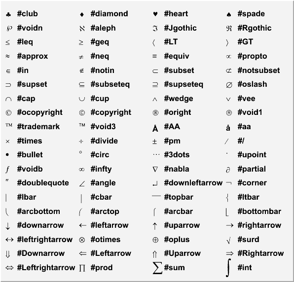
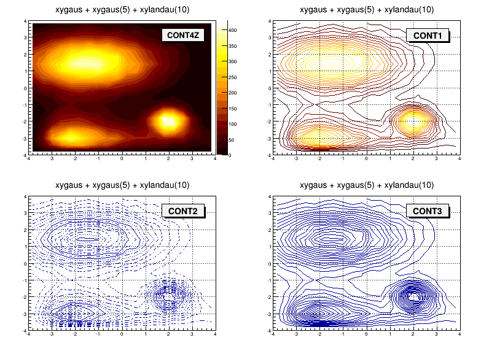
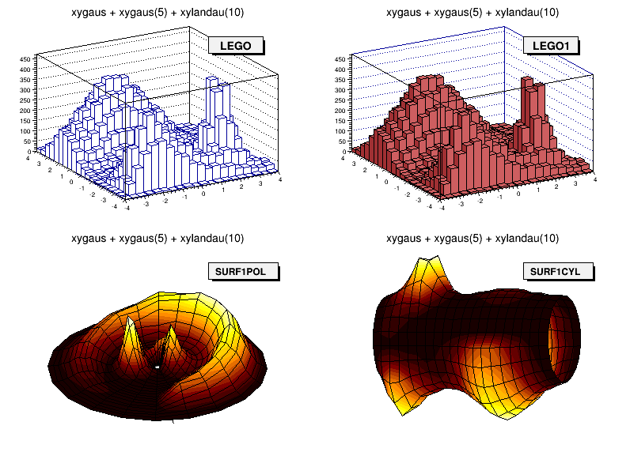
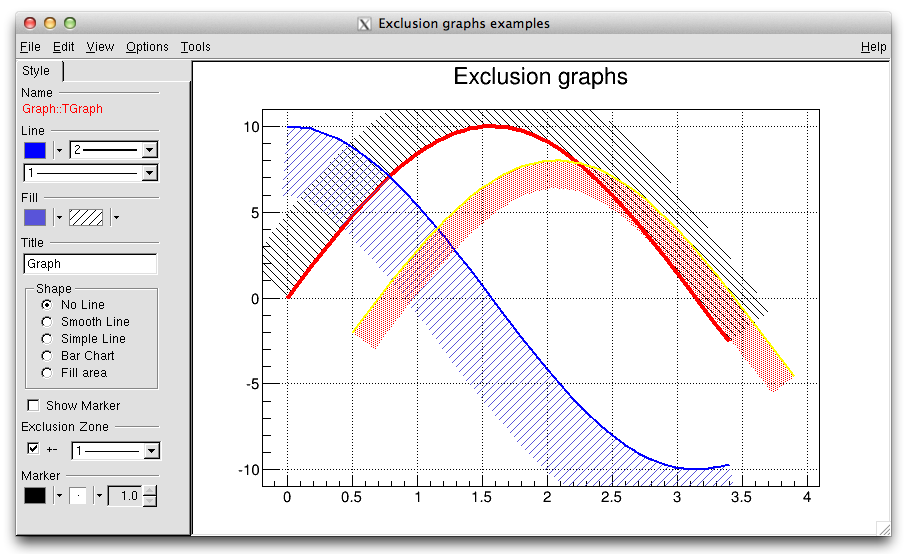

<div style="text-align: left">
<font face="微软雅黑" size=5 color=#FF00FF>
  小关的读书笔记
</font> 
</div>


<center> ROOT 教程 </font>
===========================

>+ ROOT 是粒子物理与核物理数据分析的好工具！！！      
>+ ROOT的学习不是一朝一夕的事情,需要反复反复再反复使用，才可能较好地掌握它.             
这里是我学习使用ROOT的总结、感悟. 本文档的出发点是给初学者提供一种学习ROOT的思路. 
如果C++基础好,学习ROOT会很快上手！这里简单介绍ROOT里面几个最常用到的类,以及这些
类的基本操作方法对于一些重要的类,仔细研读源程序会有很大收获！                                


> ROOT学习资料
> [1. ROOT_for_beginners](https://cloud.tsinghua.edu.cn/d/bad40bc16faa4061ada3/) // 个人觉得这是比较适合新手的学习资料,一共5篇
> [2. 杨振伟老师ROOT课程讲义](https://cloud.tsinghua.edu.cn/d/9132b3d20f884fc59f1f/) // 适合新手入门
> [3. ROOT-User-Guide](https://root.cern.ch/root/htmldoc/guides/users-guide/ROOTUsersGuide.html)
> [4. $ROOTSYS/tutorials](https://root.cern.ch/root/htmldoc/guides/users-guide/ROOTUsersGuide.html#rootsystutorials-1) // tutorials源代码在root/tutorials下，是非常好的学习资料！
> [5. 新版本Reference-Guide](https://root.cern/doc/master/annotated.html )  
> [6. *旧版本Reference-Guide](https://root.cern.ch/root/html304/)
> [7. ROOT 官网上的 cources 资料](https://root.cern/courses)


>  <font color=#DC143C >ROOT学习方法参考!!!</font>
> 1. 入门阶段：建议阅读顺序，ROOT_for_beginners，杨振伟老师ROOT课程讲义, 完成里面的练习
> 2. 提高阶段: ROOT-User-Guide 与 tutorials 结合使用 ( <font color=#DC143C >User-Guide不适合从头到尾阅读!!!</font>)
> 3. 熟练阶段： 在root环境下善用Tag键不全，必要时查阅Reference-Guide
                                             


目录
-----
[toc]


---------------------------------------------------
# <font color=#DC143C> 附录: </font>

### <font color=#00BFFF> Markers  </font>


### <font color=#00BFFF> 希腊字母表  </font>


### <font color=#00BFFF> 数学符号  </font>



### <font color=#00BFFF> 填充格式  </font>


### <font color=#00BFFF> 填充颜色  </font>


------------------------------------------------------
## <font color=#DC143C> ROOT 安装步骤 </font>

### make 安装方法
```C++
1. 必须安装的软件包
   sudo apt-get install git dpkg-dev cmake g++ gcc binutils libx11-dev libxpm-dev libxft-dev libxext-dev   //安装 Required packages

2. 选择安装的软件包
   sudo apt-get install gfortran libssl-dev libpcre3-dev xlibmesa-glu-dev libglew1.5-dev libftgl-dev
              libmysqlclient-dev libfftw3-dev libcfitsio-dev  graphviz-dev libavahi-compat-libdnssd-dev
              libldap2-dev python-dev libxml2-dev libkrb5-dev libgsl0-dev libqt4-dev
   // 安装Optional packages // libcfitsio-dev可能出错，则改为libcfitsio3-dev

3. 下载需要的ROOT版本 <https://root.cern.ch/releases>
   解压到指定文件夹，比如：/home/gfh16/Packages/root/

4. ./configure   ##在/home/gfh16/Packages/root/ 下打开终端
     （或者 ./configure --all  ### 安装更多的功能）

5. make -j4   ### jn 根据自己的电脑情况而定  ### 这一步可能需要等很长时间

6. 配置环境变量： source /home/gfh16/Packages/root/bin/thisroot.sh 添加到 .bashrc文件中

7. 安装成功

```

### cmake 安装方法
```C++
1. 必须安装的软件包
   sudo apt-get install git dpkg-dev cmake g++ gcc binutils libx11-dev libxpm-dev libxft-dev libxext-dev   //安装 Required packages

2. 选择安装的软件包
   sudo apt-get install gfortran libssl-dev libpcre3-dev xlibmesa-glu-dev libglew1.5-dev libftgl-dev
              libmysqlclient-dev libfftw3-dev libcfitsio-dev  graphviz-dev libavahi-compat-libdnssd-dev
              libldap2-dev python-dev libxml2-dev libkrb5-dev libgsl0-dev libqt4-dev
   // 安装Optional packages // libcfitsio-dev可能出错，则改为libcfitsio3-dev

3. 下载需要的ROOT版本：https://root.cern.ch/releases
   需要注意几个问题：
   (1) root 版本有source版本(源代码)、binary版本。一定要下载source版
   (2) ubuntu18.04, ubuntu16.04, ubuntu14.04 对root版本要求不一样，要选择配套的root版本

4. 如下载：root_v6.18.00.source.tar.gz
   解压： tar zxvf root_v6.18.00.source.tar.gz
   解压后自动生成文件：root_v6.18.00.source

5. 在root_v6.18.00.source所在的路径新建文件夹，用来安装root;进入新建文件夹：
   mkdir root_install
   cd root_install

6. cmake ../root_v6.18.00.source/

7. cmake --build . -- -jN      // N is the number of available cores

8. 设置环境变量：source /home/sea/Packages/root6.18/root_install/bin/thisroot.sh
```


### 附录： 配置环境变量

```C++
// 环境变量配置举例
// 来源与 /data/WorkEnvironment.sh (小秦智)
{
  alias useGeant4="source /data/CEE/NEW/fairsoft_may18p1_root6/installation/bin/geant4.sh"
  alias useROOT="source /data/CEE/NEW/fairsoft_may18p1_root6/installation/bin/thisroot.sh"

  # Recommend useFROOT(not useROOT) for ROOT because of some library installed in FairSoft not ROOT
  alias useFROOT="source /data/CEE/NEW/fairroot_v18.0.6-fairsoft_may18p1_root6/bin/FairRootConfig.sh"

  export CEE_dir="/data/CEE/NEW/CeeRoot"
  export ROOTEX_dir="/data/CEE/NEW/fairsoft_may18p1_root6/installation/share/doc/root/tutorials"
  export G4EX_dir="/data/CEE/NEW/fairsoft_may18p1_root6/installation/share/Geant4-10.4.1/examples"
  export FROOT_Template_dir="/data/CEE/NEW/fairroot_src_v18.0.6-fairsoft_may18p1_root6/templates/project_template"

  export GARFIELD_HOME="/data/CEE/NEW/garfield"
  alias usegarfield=". /data/CEE/NEW/garfield/build/setup.sh"    
}
```


-------------------------------------------------------
# <font color=#DC143C> 一. ROOT 基础篇 </font>

### <font color=#00BFFF> 1.1 ROOT-Framework简介 </font>
*  $ROOTSYS/bin : 二进制文件: 
* $ROOTSYS/lib : ROOT库文件<font color=#DC143C> (写makefile时需要用到！！！)</font>
* $ROOTSYS/tutorials: ROOT例子源代码 
* $ROOTSYS/Test : 包含整个ROOT-Framework的全部实例,值得进一步探索！！!
* $ROOTSYS/include: 包含所有的头文件


&emsp;
### <font color=#00BFFF> 1.2 ROOT 终端常用命令(更多内容参见cling) </font>

```C++
root -h  //help作用，查看root后面参数如何使用
root -l  //关root的欢迎界面
root -b  //关闭图形界面，及不显示Canvas
root myMacro.C > myMacro.log  // 将 myMacro.C 的结果输出到 myMacro.log中

root[] .?             // 查看root环境下所有的用法
root[].L myFile.C     // Load myFile.C 
root[].x myFile.C     // Load and execute myFile.C 
//更多用法参照 cling 的介绍
```


&emsp;
### <font color=#00BFFF> 1.3 ROOT的代码规范  </font>

#### <font color=#FF00FF> 1.3.1 代码约定  </font>

|  命名规则          | 代码规范  |
|:---               |:---      |
|类名以 "T" 开头     |TLine, TTree, ...|
|非类类型以"_t"结尾   |Int_t, Double_t, Bool_t, ....|
|类的数据成员以"f"开头 |fTTree, ...|
|成员函数以大写字母开头 |Loop(), ...|
|常量以"k"开头        |kRed, ...|
|全局变量以"g"开头     |gROOT, gStyle, ...|
|静态数据成员以 "fg" 开头 |fgTokenClient, ...|
|枚举型以 "E" 开头        |EColorLevel, ...|
|局域变量与参数开头小写     |nbytes, ...|
|Getters and Setters 分别以 "Get" "Set" 开头|SetLast(), GetFirst(), ...|


&emsp;
#### <font color=#FF00FF> 1.3.2 数据类型规范  </font>
```C++
// 为避免新老机器对同一种数据类型可能有不同的长度, ROOT使用下面的 pre-defined 类型

* Char_t         //Signed Character 1 byte
* UChar_t        //Unsigned Character 1 byte
* Short_t        //Signed Short integer 2 bytes
* UShort_t       //Unsigned Short integer 2 bytes
* Int_t          //Signed integer 4 bytes
* UInt_t         //Unsigned integer 4 bytes
* Long64_t       //Portable signed long integer 8 bytes
* ULong64_t      //Portable unsigned long integer 8 bytes
* Float_t        //Float 4 bytes
* Double_t       //Float 8 bytes
* Double32_t     //Double 8 bytes in memory, written as a Float 4 bytes
* Bool_t         //Boolean (0=false, 1=true)
```

&emsp;
### <font color=#00BFFF>  1.4 全局变量  </font>

#### <font color=#FF00FF> 1.4.1 gROOT  </font>
```C++
// By using gROOT pointer, you can get the access
// to every object created in a ROOT program

root[] gROOT->ProcessLine(".x myHist.C");
root[] gROOT->GetListOfFunctions();
root[] gROOT->GetListOfCanvases()->FindObject("c1");
...
```

#### <font color=#FF00FF> 1.4.2 gPad  </font>
```C++
// gPad is always pointing to the active pad
{
  gPad->SetFillColor(38);
  gPad->Modified(); // Tell the canvas that an object it is displaying has changed
  gPad->Update();  // Force the canvas to refresh
  ...
}
```

#### <font color=#FF00FF> 1.4.3 gStyle  </font>

```C++
root[] gStyle->SetFillStyle(); 
root[] gStyle->SetPalette(1);     // To plot with nice colors
root[] gStyle->SetOptFit(kTRUE);  // 显示拟合参数
root[] gStyle->SetOptStat(1);     // 显示详细的拟合参数
root[] gStyle->SetOptDate(Int_t optdate); 
               // optdate = 10 * format + mode
               // mode = 1  显示位置 bottom/left
               // mode = 2  显示位置 bottom/right
               // mode = 3  显示位置 top/right
               // format = 0(默认), 1, 2  日期显示格式
...

```

#### <font color=#FF00FF> 1.4.4 gRandom  </font>
```C++
// A pointor to the current random number generator.
// Points to 'TRandom3' by default

root[] gRandom->Print(); // 查看当前的 random number generator
root[] delete gRandom;   // 删除当前的 random number generator
root[] gRandom = new TRandom2(0); // seed = 0, 新的random number generator
...
```

#### <font color=#FF00FF> 1.4.5 gSystem  </font>

```C++
root[] gSystem->Getenv("USER")  // returns the value of the system enviroment variable 'USER' 
```

#### <font color=#FF00FF> 1.4.6 其他全局变量  </font>

> 在 root 终端键入g, 按 Tab 补全可查看所有的全局变量！


&emsp;
### <font color=#00BFFF> 1.5 环境设置  </font>

#### <font color=#FF00FF> 1.5.1 rootlogon.C  </font>
```C++
// 运行 root 时自动加载当前目录下 rootlogon.C 里面的代码

{
   gStyle->SetPalette(1);                                      // 使画图颜色更加好看
   cout << "Salut " << gSystem->Getenv("USER") << "!" << endl;
   gSystem->Exec("date");                                      // 显示系统时间日期
}
```

#### <font color=#FF00FF> 1.5.2 rootlogoff.C  </font>

> rootlogoff.C is a script loaded at shutdown


#### <font color=#FF00FF> 1.5.3 rootalias.C  </font>
```C++
// rootalias.C file is loaded but not executed at start-up, 
// it contians small functions like:

ls(path)
edit(filename)
dir(path)
pwd()
cd(path)
```


&emsp;
### <font color=#00BFFF> 1.6 对象  </font>

#### <font color=#FF00FF> 1.6.1 Inspecting Objects  </font>

```C++
root[] TFile f("staff.root");
root[] f.Inspect() 
root[] f.Print()
```

#### <font color=#FF00FF> 1.6.2 Object Ownership  </font>
```C++
// 了解对象的所有权归属, 有助于对对象进行操作!

// 1.By Current Directory (gDirectory)
// 所有权归当前目录的有: histograms, tree, event list(TEventList)
TH1F *h = (TH1F*)gDirectory->GetList()->FindObject("myHist");

// 2.By the Master TROOT Object (gROOT)
// 所有权归gROOT的有: 一些列 "collections of objects",比如 fCanvases， fColors,... 
TCanvas *cc = (TCanvas*)gROOT->GetListOfCanvases()->FindObject("c1");
 
// 3.By Other Objcets
// When an object creates another, the creating object
// is the owner of the created one
myHisto->Fit("gaus");

// 4.By the user
```


&emsp;
### <font color=#00BFFF> 1.7 ROOT中的C++  </font>

#### <font color=#FF00FF> 1.7.1 C++ 解释器 -- Cling  </font>
 
>+ Cling 是 ROOT 使用的 C++ 解释器. Cling 可以简化我们在root环境下的C++语法! 
>+ Cling 是解释器, 不是编译器！ 它给我们在 root 环境下使用 C++ 带来便利! 比如：root 可以直接执行 ROOT 脚本(也叫"Macro")而不需要编译， 这样的 macro 甚至不需要包含必要的头文件， <font color=#DC143C>但且要求文件名与函数同名！ </font>
>+ ROOT Macro 一般不能通过C++编译!!!  <font color=#DC143C> 所以在写需要编译的复杂程序是不能使用 cling 带来的这些便利！ 切记！</font>
>+ [链接到cling](https://root.cern.ch/cling)

```C++
// 1.解释器命令以"."开头, 在root终端可产看所有的命令
root[] .?  // 查看所有的命令

// 2.命令行模式使用多行代码：以 "{" 开头,以 "}" 结尾
root[] {
root[] ? for(int i=0; i<5; i++){
root[] ?    cout<< i << endl;
root[] ?}

// 3.ROOT脚本的执行
// ROOT script files 通常也叫作 "Macros". 可以在一个脚本中执行另一个脚本.
// calls a script to build the root file if it does not exist
void cernstaff()
{
  if(gSystem->AccessPathName("cernstaff.root")) // 如果"cernstaff.root"不存在，则返回 true
  {
    gROOT->ProcessLine(".x cernbuid.C");
  }
}
```


#### <font color=#FF00FF> 1.7.2 ACLiC: Compiling Scripts Into Libraries  </font>
```C++
// 1.使用方法
root[] .L MyScript.C+  // build and load a shared library containing your script
gROOT->ProcessLine(".L MyScript.C+");

// 2.设置头文件路径
root[] .include  // get the include path
root[] .include $HOME/mypackage/inlcude  // append to the include path

gSystem->AddIncludePath(" -I$HOME/mypackage/inlcude");// 在脚本中添加
gSystem->SetIncludePath(" -I$HOME/mypackage/inlcude"); // overwrite the existing include path
gSystem->AddLinkedLibs("-L/my/path -lanylib"); // Add library
gSystem->Load("mydir/mylib"); // Load library
```


&emsp;
### <font color=#00BFFF> 1.8 GUI 图形用户界面  </font>

#### <font color=#FF00FF> 1.8.1 画图  </font>
```C++
// 2D: lines, polygons(多边形), arrows, plots, histograms
// 3D graphical objects
object.Draw()
```


&emsp;
#### <font color=#FF00FF> 1.8.2 操作画图对象  </font>
> 对屏幕上的对象进行操作将会改变对象的内存

**1.8.2.1 鼠标左键 -- Moving, Resizing and Modifying Objects** 
>+ 图形界面 -- 点击鼠标左键
>+ 使用代码 -- 通过编程改变图形, 需要"Update the Pad"才能显示出来

**1.8.2.2 鼠标中键 -- 选中画图对象**
>+ 图形界面 -- 点击鼠标中键
>+ 使用代码 -- root[ ] cd->cd

**1.8.2.3 鼠标右键 -- 快捷菜单**
>+ 右键单击图形中任何地方, 将会显示对应对象的菜单
>+ 可以向一个类中添加菜单, 用  // \*MENU\* 标记注释


&emsp;
#### <font color=#FF00FF> 1.8.3 图形容器 -- TCanvas && TPad  </font>


>+ Canvases 等同于窗口, 而 Pads 是图像的真正载体
>+ TCanvas 是 TPad 的子类. 一个 canvas 本身是一个大 pad, 这个大的 pad 可以分为多个小 pad
>+ 任何时候，只能有一个 pad 处于 active 状态, 画图也将画在 active 的 pad 上
>+ 对 TPad 的操作同样适用于 TCanvas. Canvas 的使用可在 root 环境下右键查看.


```C++
//常见用法
root[] obj = gPad->GetPrimitive("myobjectname"); // 将myobjectname的指针返回给obj
root[] obg = (TPaveLabel*)(gPad->GetPrimitive("myobjectname")); // 只当返回类型
root[] li = gPad->GetListOfPrimitives();
root[] gPad->Range(float x1,float y1,float x2,float y2); //改变 pad 大小
root[] pad->Divide(n1,n2); // 分成n1列, n2行
root[] gPad->Modified();  // the pad has changed
root[] gPad->Update();    // update all modified pads 
root[] gPad->SetLogx(1);  // 1-对数坐标, 0-重置
root[] gPad->SetLogy(1);
root[] gPad->SetLogz(1);
```


**1.8.3.1 The Global Pad -- gPad**
```C++
// gPad is always pointing to the active pad

// 1.Finding a n Object in a Pad
root[] obj = gPad->GetPrimitive("myobjectname"); // 将myobjectname的指针返回给obj
root[] obg = (TPaveLabel*)(gPad->GetPrimitive("myobjectname")); // 只当返回类型

// 2.Hinding an Object
root[] li = gPad->GetListOfPrimitives();
root[] li->Remove(obj);
```

**1.8.3.2 Pad 的坐标系**
```C++
// 1.用户坐标系 (最常用)
root[] gPad->Range(float x1,float y1,float x2,float y2);

// 2.归一化坐标系(NDC) 
(1)与窗口大小、用户坐标系无关. 
(2)横坐标范围(0,1), 纵坐标范围(0,1). 坐标原点(0,0)在左下角. 
(3)如果需要将文本画在图中的固定地方, 需要用到NDC坐标

// 3.像素坐标系
原点(0,0)在左上角
```

**1.8.3.3 坐标转换**
  >+ 像素坐标: (px,py)
  >+ 用户坐标: (ux,xy)
  >+ 归一坐标: (apx,apy)
  >+ 绝对像素坐标: (apx,apy)
  > NDC to Pixel 
  > Pixel to User
  > Absolute pixel to user
  > User to Pixel
  > User to absolute pixel

  
**1.8.3.4 Divide a Pad into Sub-pads**
```C++
// 1.创建多个Pad, 画在同一个Canvas上
root[] spad1 = new TPad("spad1","The first subpad",.1,.1,.5,.5);//NDC坐标
root[] spad1->Draw()

// 2.将同一个Pad分成多个Sub-Pads
root[] pad1->Divide(3,2); // 3行2列
root[] pad1->Divide(3,2,0.1,0.1); // 设定sub-pad间隔, 10% of the parent width
```

**1.8.3.5 Updating the Pad**
```C++
// 默认地, 若对当前的 pad 进行操作, 图形界面并不会即时更新. 
// 用鼠标点击一下 pad 即可刷新. 也可用代码实现:
root[] gPad->Modified();  // the pad has changed
root[] gPad->Update();    // update all modified pads 
```

**1.8.3.6 设置 Pad 的透明度**
```C++
// istyle = 4000 - 4100, 4000完全透明，4100完全不透明
root[] pad->SetFillStyle(istyle);
```

**1.8.3.7 设置对数坐标**
```C++
// 对数坐标是对 pad 设置, 不是对直方图或者坐标轴
// 如果一个 pad 分成多个 sub-pad, 需要分别对各个 sub-pad 进行设置
root[] gPad->SetLogx(1);  // 1-对数坐标, 0-重置
root[] gPad->SetLogy(1);
root[] gPad->SetLogz(1);
```

**1.8.3.8 WaitPrimitive 方法**
```C++
canvas->WaitPrimitive(); // 处于"等待"状态, 双击 canvas 结束
```

&emsp;
#### <font color=#FF00FF> 1.8.4 图形  </font>

```C++
//常见图形构造函数
TLine* line = new TLine();          //直线
TArrow* arr = new TArrow();         //箭头
TPolyLine* polyl = new TPolyLine(); //折线
TEllipse* ellipse = new TEllipse(); //椭圆、扇形、圆
TBox* box = new TBox();             //方形
TMarker* mark = new TMarker();

```

**1.8.4.1 线条: 直线, 箭头, 折线**
```C++
// 1.直线
TLine* line = new TLine(Double_t x1, Double_t y1, 
                        Double_t x2, Double_t y2);  
// 2.箭头
TArrow* arr = new TArrow(Double_t x1, Double_t y1,
                         Double_t x2, Double_t y2,
                         Float_t arrowsize, Option_t* option) 
        // Option选项: ">" "|>" "<" "<|" "<>" "<|>"
        // "|" 表示家头加粗, "<", ">" 分别表示左右箭头
arr->SetFillColor(icolor); // 设置箭头的填充颜色
arr->SetAngle(angle);      // 设置箭头的角度,默认 60 度
    
// 3.折线
TPolyLine* polyl = new TPolyLine(Int_t n, Double_t* x,
                                 Double_t* y, Option_t* option)
                          // n 是数据点的数目
```


**1.8.4.2 椭圆、扇形、圆**
```C++
// 1.通过 TEllipse 来创建椭圆, 然后通过设置椭圆的 phi 角度范围定义扇形.
// 2.ROOT 里面没有直接画圆的函数.
// 3.通过 TAttLine 设置图形的边界, TAttFill 设置填充方式
TEllipse(Double_t x1, Double_t y1, Double_t r1, Double_t r2);
TEllipse(Double_t x1, Double_t y1, Double_t r1, Double_t r2,
        Double_t phimin, Double_t phimax, Double_t theta);
       // (x1,y1)为中心点, r1,r2分别是长轴和短轴, phimin,phimax是扇形张角范围
       // theta 是旋转角度
```


**1.8.4.2 方形**
```C++
TBox* box = new TBox(Double_t x1, Double_t x2,
                    Double_t y1, Double_t y2);
      // (x1,y1)是左下角顶点,(x2,y2)是右上角顶点
```


**1.8.4.3 Markers**
```C++
// 通过 TMarker 方式创建. 点类型的 marker(1, 6, 7)不能调节大小
TMarker* mark = new TMarker(Double_t x, Double_t y, Int_t marker);
```


**1.8.4.4 Feymann 图**
> 两个有用的类: TCurlyLine, TCurlyArc
> 费曼图的例子参见: $ROOTSYS/tutorials/graphics/feyman.C


**1.8.4.5 文本与 Latex 数学公式**
> ROOT 的文本输入采用 TLatex, 与 Latex的使用方法一致
>+ 常用 TLatex 用法 

| 名称  | 用法  | 效果  | 备注 |
|:-------:|:-------:|:---------:| :-------: |
| 上角标  |  x\^{y^{2}}    | $x^{y^{2}}$ |
| 下角标  |  x_{2y}        | $x_{2y}$    |
| 分数   |  #frac{x}{y} | $\frac{x}{y}$ |
| 根号   |  #sqrt{x}, #sqrt[3]{x}    | $\sqrt{x}, \sqrt[3]{3}$  |
| 大写括号| #{}{...}, #(){...}, #\| \|{...}|  
| 希腊字母 | #gamma, #Gamma | $\gamma, \Gamma$ | 见附录希腊字母表 | 

>+ 脚本 $ROOTSYS/tutorials/graphics/latex.C


>+ 脚本 $ROOTSYS/tutorials/graphics/latex2.C


>+ 脚本 $ROOTSYS/tutorials/graphics/latex3.C


**1.8.4.6 Text in a Pad**
```C++
// TPaveLabel: Text 只有一行
// TPaveText: Text 有多行
// TPavesText: 多个 TPaveText 组成
// Option:
// option = "T" top frame
// option = "B" bottom frame
// option = "R" right frame
// option = "L" left frame
// option = "NDC" x1,y1,x2,y2 are given in NDC

TPaveLabel(Double_t x1, Double_t y1, Double_t x2, Double_t y2,
          const char* label, Option_t* option);

TPaveText pt1(Double_t x1, Double_t y1, Double_t x2, Double_t y2);
TText* t1 = pt1.AddText("some text");

TPavesText(Double_t x1, Double_t y1, Double_t x2, Double_t y2
          Int_t npaves, Option_t* option);
```


&emsp;
#### <font color=#FF00FF> 1.8.5 坐标设置  </font>

**1.8.5.1 坐标选项与常见属性**
```C++
TAxis *axis = histo->GetXaxis();
axis->SetAxisColor();
axis->SetLabelColor();
axis->SetLabelFont();
axis->SetLabelOffset();
axis->SetLabelSize();
axis->SetNdivisions();  // 设置坐标轴分度值等
axis->SetNoExponent();
axis->SetTickLength();  //设置刻度线的长度
axis->SetTitleOffset(); //设置标题的偏置，主要用于对齐与好看
axis->SetTitleSize();   //设置标题的字体大小
axis->SetRange();       //设置坐标轴范围,设置 bin 值
axis->SetRangeUser();   //设置坐标轴范围,设置坐标值
```

**1.8.5.2 坐标轴刻度 -- TAxis::SetNdivisions()**
```C++
TAxis *axis = histo->GetXaxis();
axis->Saxis->SetNdivisions(ndiv, optim); //默认值: ndiv=510,optim=kTRUE
// ndiv = N1 + 100*N2 + 10000*N3
// N1 = 一级刻度,即大刻度, 比如(-100,100)分成10大格,则 N1=10, 每一个是20
// N2 = 二级刻度,即小刻度, 比如 N2 = 10，则每大格分成10小格, 最小分度值 2.
// N3 = 三级刻度     
```

**1.8.5.3 坐标轴放缩**
```C++
// SetRange() 设定的是 bin 值, SetRangeUser() 设定的是坐标值
TAxis *axis = histo->GetXaxis();
axis->SetRange(Int_t binfirst, Int_t binlast); 
axis->SetRangeUser(Axis_t ufirst, Axis_t ulast);
```

**1.8.5.4 坐标轴独立于图形或直方图**
```C++
TGaxis* gaxis = new TGaxis(Double_t xmin, Double_t ymin, Double_t xmax, Double_t ymax,
                           const char* funcname, Int_t ndiv=510,
                           Option_t* chopt, Double_t gridlength=0) 
```

**1.8.5.5 坐标轴刻度线方向**
```C++
// chopt: 设置刻度线的方向
if `xmin = xmax`, then negative.
chopt = '+': tick marks are drawn on Positive side. (Default)  
chopt = '-': tick marks are drawn on the negative side.
chopt = '+-': tick marks are drawn on both sides of the axis.
chopt = 'U': unlabeled axis, default is labeled.

// 对于直方图，有如下的设置
//设置坐标轴的刻度尺
gPad->SetTickx(); // tickd marks on the other side of x axis are drawn
h->Draw("X+");    // x axis is drawn on the top side
h->Draw("Y+");    // y axis is drawn on the right side

// TPad::SetTicks()
h->SetTicks(tx,ty);
  //tx=ty=0  by defalt, the left Y axis and X bottom axis are drawn 
  //tx = 1   ticks marks on the top    (inside)
  //tx = 2   ticks marks and labels on the top
  //ty = 1   ticks marks on the right  (inside)
  //ty = 2   ticks marks and labels on the right
```

**1.8.5.6 坐标标记**
```C++
// 1.设置刻度线的位置
默认情况, 坐标标记与刻度线在相反一侧;
if chopt = '=', 则在同一侧;

// 2.设置指数坐标标记
TAxis::SetNoExponent(kTRUE)

// 3.设置坐标数字位数
TGaxis::SetMaxDigits(num); // 默认位数是 5

// 4.设置小数坐标
TStyle::SetStripDecimals(Bool_t strip=kTRuE);
```

**1.8.5.7 坐标设置为时间格式**
```C++
// hist 为直方图
h->GetXaxis()->SetTimeDisplay(1); // X axis is a time axis

// 1.设置时间格式
h->GetXaxis()->SetTimeFormat("%d/%m/%y"); // 多种时间格式可调

// 2.设置 Time offset (3 种方式设置时间起点)
//(1) 使用系统时间起点
TDatime da(2003,02,28,12,00,00);
gStyle->SetTimeOffset(da.Convert());

//(2) 使用自定义时间起点
TDatime dh(2001,09,23,15,00,00);
h->GetXaxis()->SetTimeOffset(dh.Convert());

//(3) 使用 SetTimeFormat 方式
//    使用控制符: %F 
//    具体格式: yyyy-mm-dd hh:mm:ss
h->GetXaxis()->SetTimeFormat("%d/%m/%y%F2000-02-28 13:00:01");

//(4) 将时间格式分成两行显示
axis->SetLabelOffset(0.02);
axis->SetTimeFormat("#splitline{%Y}{%d/%m}");
```

**1.8.5.8 自定义坐标轴范围与方向**


```C++
// 1. 坐标轴在左、在右、在上、在下，可以通过 Draw()的 Option 直接实现
hist->Draw("X+"); // The X-axis is drawn on the top side 
hist->Draw("Y+"); // The Y-axis is drawn on the right side 

// 2. 有时候，需要设置任意格式的坐标轴, 有两种方法:

// (1) 直接使用 TGaxis()
TGaxis* axis = new TGaxis(Double_t xmin, Double_t ymin, // 坐标轴起点
                          Double_t xmax, Double_t ymax, // 坐标轴终点 
                          Double_t wmin, Double_t wmax, // 坐标轴显示范围
                          Int_t ndiv = 510, // 新坐标轴的刻度，可设置
                          Option_t* chopt = "", // 坐标轴刻度线方向等
                          Double_t gridlength = 0)

// 实例1
{
  c1 = new TCanvas("c1","Examples of Gaxis",10,10,700,500);
  c1->Range(-10,-1,10,1);

  TGaxis *axis1 = new TGaxis(-4.5,-0.2,5.5,-0.2,-6,8,510,"");
  axis1->SetName("axis1");
  axis1->Draw();
  TGaxis *axis2 = new TGaxis(4.5,0.2,5.5,0.2,0.001,10000,510,"G");
  axis2->SetName("axis2");
  axis2->Draw();

  TGaxis *axis3 = new TGaxis(-9,-0.8,-9,0.8,-8,8,50510,"");
  axis3->SetName("axis3");
  axis3->Draw();
  TGaxis *axis4 = new TGaxis(-7,-0.8,7,0.8,1,10000,50510,"G");
  axis4->SetName("axis4");
  axis4->Draw();

  TGaxis *axis5 = new TGaxis(-4.5,-6,5.5,-6,1.2,1.32,80506,"-+");
  axis5->SetName("axis5");
  axis5->SetLabelSize(0.03);
  axis5->SetTextFont(72);
  axis5->SetLabelOffset(0.025);
  axis5->Draw();

  TGaxis *axis6 = new TGaxis(-4.5,0.6,5.5,0.6,100,900,50510,"-");
  axis6->SetName("axis6");
  axis6->Draw();
  TGaxis *axis7 = new TGaxis(8,-0.8,8,0.8,0,9000,50510,"+L");
  axis7->SetName("axis7");
  axis7->SetLabelOffset(0.01);
  axis7->Draw();

  // one can make axis top->bottom. However because of a problem,
  // the two x values should not be equal
  TGaxis *axis8 = new TGaxis(6.5,0.8,6.499,-0.8,0,90,50510,"-");
  axis8->SetName("axis8");
  axis8->Draw();
}


// (2) 使用 TGaxis() 与 TF1 结合

// 实例2
void gaxis3a()
{
  gStyle->SetOptStat(0);

  TH2F *h2 = new TH2F("h","Axes",2,0,10,2,-2,2);
  h2->Draw();
  TF1 *f1=new TF1("f1","-x",-10,10);
  TGaxis *A1 = new TGaxis(0,2,10,2,"f1",510,"-");
  A1->SetTitle("axis with decreasing values");
  A1->Draw();

  TF1 *f2=new TF1("f2","exp(x)",0,2);
  TGaxis *A2 = new TGaxis(1,1,9,1,"f2");
  A2->SetTitle("exponential axis");
  A2->SetLabelSize(0.03);
  A2->SetTitleSize(0.03);
  A2->SetTitleOffset(1.2);
  A2->Draw();

  TF1 *f3=new TF1("f3","log10(x)",0,800);
  TGaxis *A3 = new TGaxis(2,-2,2,0,"f3",505);
  A3->SetTitle("logarithmic axis");
  A3->SetLabelSize(0.03);
  A3->SetTitleSize(0.03);
  A3->SetTitleOffset(1.2);
  A3->Draw();

```


&emsp;
#### <font color=#FF00FF> 1.8.6 图形属性设置  </font>

**1.8.6.1 文本属性**
```C++
// 文本属性主要包括: font, size, color
root[] TLatex* la = TLatex();

// 1.对齐方式
root[] la->SetTextAlign(align);
       // align = 10 * 水平对齐 + 竖直对齐;
       // 水平对齐: 1=向左对齐, 2=居中对齐, 3=向右对齐
       // 竖直对齐: 1=底部对齐, 2=居中对齐, 3=顶部对齐
// 2.设置角度
root[] la->SetTextAngle(angle); //角度单位:度

// 3.设置颜色
root[] la->SetTextColor(color); // 颜色设置查看调色板

// 4.设置字体格式
root[] la->SetTextFont(font); 
       // font = 10 * fontID + precision
       // precision = 0, 1, 2
       // fontID: 查看下图

// 5.设置字体大小
root[] la->SetTextSize(size); // size 是当前 pad 大小的百分比
```


**1.8.6.2 线条属性**
```C++
// 线条属性主要包括: color, style, width
TLine* li = new TLine();

// 1.设置颜色
root[] li->SetLineColor(color);  // 颜色设置查看调色板

// 2.设置 style
root[] li->SetLineStyle(style);
       // 1=solid, 2=dash, 3=dot, 4=dash-dot

// 3.设置 width
root[] li->SetLineWidth(width); // width 以 pixel 为单位
```

**1.8.6.3 填充格式**
```C++
// 直方图, 图形等, 有时候需要填充
TH1F* h = new TH1F();

// 1.填充颜色
root[] h->SetFillColor(color); // 颜色设置查看调色板

// 2.填充形状
root[] h->SetFillStyle(style); 
       // 0 : hollow （空）
       // 1001: solid （实填充）
       // 2001: hatch style
       // 3000+number: 3ijk (见下图)
       // 4000-4100： 透明度, 4000完全透明, 4100 完全不透明
```


**1.8.6.4 颜色属性**
```C++
// 1.使用参考颜色

// 2.root[] 环境下查看
root[] auto color = gROOT->GetListOfColors();
root[] color->Print()

// 3.自定义颜色
TColor(Int_t color, Float_t r, Float_t g, Float_t b, const char* name)
     // color： 颜色用一个数字表示
     // r,g,b: 红绿蓝三种颜色比分, 取值0-1
     // name： 颜色名称, 可选
// 如果自定义颜色已存在, 需要将其从列表中清除, 并重新设置颜色
root[] color=(TColor*)(gROOT->GetListOfColors()->At(index_color))
root[] color->SetRGB(r,g,b)

// 4.使用调色板(直方图) - palette
TStyle::SetPallette(Int_t ncolors, Int_t* color_indexes) // 设置调色板
root[] gStyle->SetPallette(1); // 设置当前调色板为 "美观".
```


**1.8.6.5 图形编辑器(略)**
> 可打开一个 root 窗口, 自行摸索


**1.8.6.6 图例属性 - Legends**
```C++
// 构造函数
TLegend(Double_t x1, Double_t y1, Double_t x2, Double_t y2,
        const char* header, Option_t* option)
        // NDC 坐标: x1,y1,x2,y2
        // header: 标题, 默认无标题

// Legend 属性(默认): 
对齐(Alignment): 12 左中对齐
角度(Angle): 0 (度)
颜色（Color）： 1 (黑色)
尺寸(Size)： 根据图例数目而定
字体(Font): helvetica-medium-r-normal scalable font = 42, and bold = 62

// 添加图例 AddEntry()
// 方式1: TObject* obj
root[] TLegend* legend = new TLegend();
root[] legend->AddEntry(TObject* obj, const char* label, Option_t* option);
       // obj: 需要添加图例的对象, 可以是 histogram 或 graph
       // label: 图例名称
       // option: 图例显示方式
       //   "L"： 线
       //   "P"： marker
       //   "F"： 填充 fill

// 方式2: const char* name
root[] legend->AddEntry(const char* name, const char* label, Option_t* option);
       // name： 需要添加图例的对象名称
```

&emsp;
#### <font color=#FF00FF> 1.8.7 图片输出格式  </font>
> 常用的图片输出格式: .eps, .pdf, .png, .jpg, .C


**1.8.7.1 eps/ps 格式 - TPostScript**
```C++
// 1.保存 ps 格式图片
c1->Print("xxx.ps"); // or 
c1->Print("xxx.eps");

// 2.设置图片大小
TPostScript myps("myfile.ps",111)；
   // 格式 111: ps portrait 
   // 格式 112: ps landscape
   // 格式 113: ps eps
myps.Range(xsize,ysize);
object->Draw();
myps.Close();


// 3.将多个图片保存到同一个 ps 文件中
// 方法1: TCanvas::Print("file.ps(")
文件名以 "(" 结束, 文件保持 "open" 状态;
文件名以 ")" 结束, 文件关闭
{
   TCanvas c1("c1");
   h1.Draw();
   c1.Print("c1.ps("); // write canvas and keep the ps file open
   h2.Draw();
   c1.Print("c1.ps");  // canvas is added to "c1.ps"
   h3.Draw();
   c1.Print("c1.ps)"); // canvas is added to "c1.ps"
                       // and ps file is closed
}


// 方法2: TCanvas::Print("file.ps[")
文件名以 "[" 结束, 文件保持 "open" 状态;
文件名以 "]" 结束, 文件关闭


// 方法3: 如果使用循环, 文件开头和结尾需要特别处理
c1.Print("file.ps[");      // no actual print; just open file.ps
for (i=0; i<10; ++i) {
   // fill canvas for context i
   ...
   c1.Print("file.ps");   // actually print canvas to file.ps
}  // end loop
c1.Print("file.ps]");     // no actual print; just close file.ps


// 方法4: c1.Update()
{
   TFile f("hsimple.root");
   TCanvas c1("c1","canvas",800,600);

   //select PostScript  output type
   Int_t type = 111;         //portrait  ps

   //create a PostScript  file and set the paper size
   TPostScript ps("test.ps",type);
   ps.Range(16,24);          //set x,y of printed page

   //draw 3 histograms from file hsimple.root on separate pages
   hpx->Draw();
   c1.Update();              //force drawing in a script
   hprof->Draw();
   c1.Update();
   hpx->Draw("lego1");
   c1.Update();
   ps.Close();
}

// 4.Color Models
//  (1) TPostScript and TPDF 支持两种 color model: RGB, CMYK
//  (2) CMYK 拥有更丰富的黑色
//  (3) 更改 color model:
gStyle->SetColorModelPS(c);
        // c=0  RGB model (默认)
        // c=1  CMYK model 
//  (4) 两者可以相互转换
Double_t Black   = TMath::Min(TMath::Min(1-Red,1-Green),1-Blue);
Double_t Cyan    = (1-Red-Black)/(1-Black);
Double_t Magenta = (1-Green-Black)/(1-Black);
Double_t Yellow  = (1-Blue-Black)/(1-Black);
```

**1.8.7.2 pdf 格式**
>+ pdf 格式使用方法与 eps 一致


#### <font color=#FF00FF> 1.8.8 3D Viewers(略)  </font>


&emsp;
### <font color=#00BFFF> 1.9 Input/Output  </font>


&emsp;
# <font color=#DC143C> 二. ROOT 功能篇 </font>

### <font color=#00BFFF> 2.1 Histograms 直方图  </font>
>+ 关于直方图的使用

&emsp;
#### <font color=#FF00FF> 2.1.1 直方图概述 </font>
+ **2.1.1.1 直方图数据类型**
```C++
1.TH1C, TH2C, TH3C : one byte per bin, maximum bin content = 255
2.TH1S, TH2S, TH3S : one short per bin, maximum bin content = 65535
3.TH1I, TH2I, TH3I : one integer per bin, maximum bin content = 2147483647
4.TH1F, TH2F, TH3F : one float per bin, maximum precision = 7 digits
5.TH1D, TH2D, TH3D : one integer per bin, maximum precision = 14 digits
```

+ **2.1.1.2 剖面直方图**
  >+ 两组量 X，Y 之间的关联可以用二维直方图、或散点图表示
  >+ 在多数情况下, 剖面直方图(profile histograms)可以更好地替代二维直方图
  >+ Profile histogram: used to display the mean value of Y and its RMS for each bin in X
  >+ If Y is an unknown but single-valued approximate function of X, it will have greater precision in a profile histogram than in a scatter plot.

```C++
TProfile :   one-dimensional profiles
TProfile2D : two-dimensional profiles
```


&emsp;
#### <font color=#FF00FF> 2.1.2 直方图创建-填充-画图-保存 </font>
>+ 直方图的创建一般步骤:
   1.创建文件
   2.创建直方图
   3.填充直方图
   4.保存直方图


+ **创建直方图**
```C++
// 方法1：使用构造函数
TH1I* h1 = new TH1I("h1","h1 title",100,0.0,4.0);
TH2F* h2 = new TH2F("h2","h2 title",40,0.0,2.0,20,-1.5,3.5);
TH1D* h3 = new TH3D("h3","h3 title",80,0.0,1.0,100,-2.0,2.0,50,0.0,3.0);


// 方法2：克隆一个已知直方图
TH1* hc = (TH1*)h1->Clone();


// 方法3：2-D 或 3-D 直方图作投影
TH1* hx = h2->ProjectionX(); // 投影得到的直方图数据类型是 TH1D
TH1* hy = h2->ProjectionY(); // 投影得到的直方图数据类型是 TH1D


// 方法4：从文件中读取直方图 
TFile* filein = new TFile("histo.root");
TH1F* h1 = (TH1F*)filein->Get("ObjectName");
TF1F* h1 = (TH1F*)gROOT->FindObject("ObjectName"); //在ROOT环境下使用
```

+ **Bin 的设置**
```C++
// bin 值是从 1 开始的, 而 bin = 0 没有意义

1. Bin with 可以是常数, 也可以是数组
// 固定 bin 宽 
// X 区间[0.0, 4.0]被分成 100 个bin, 每个 bin 宽度为(4.0-0.0)/100=0.04
// bin 区间个数必须是整数, (4.0-0.0)/100 表示精度！
TH2* h = new TH2D(
   /* name  */  "h2",
   /* title */  "Hist with constant bin width",
   /* X-dimension */ 100, 0.0, 4.0,
   /* Y-dimension */ 200, -3.5, 1.5);


2. 可变 bin 宽
// 如果直方图有 n 个 bin 区间, 则共有 n+1 个边界
// 使用数组时, 数组长度必须为 n+1
// bin 区间的边界通常使用 double 类型
const Int_t NBINS = 5;
Double_t edges[NBINS + 1] = {0.0, 0.2, 0.3, 0.6, 0.8, 1.0};
// Bin 1 corresponds to range [0.0, 0.2]
// Bin 2 corresponds to range [0.2, 0.3] etc...

TH1* h = new TH1D(
   /* name */ "h1",
   /* title */ "Hist with variable bin width",
   /* number of bins */ NBINS,
   /* edge array */ edges
);


3. Re-binning 
// 使用 TH1::Rebin()方法
// rebin 只能将 bin 区间越分越宽.
// 如: 原来 bin=100, h1->Rebin(2), 则 bin=50
h1->Rebin(Int_t n); // n 为整数, 实际有效的 rebin 应该是 n >= 2


4. 对 Bin 的操作
TAixs *axis = h1->GetXaxis();
axis->GetNbins(); 
bin_number = axis->FinBin(x_value);

```

+ **填充直方图**
```C++
1. Fill() 方法
// 填充思路: 例如，给定 x 值, 先计算该 x 值在那个 bin 区间内,
// 然后在该 bin 区间内计数 +1 或 根据权重增加 
h1->Fill(x);
h1->Fill(x,w);  // with weight
h2->Fill(x,y);
h2->Fill(x,y,w);
h3->Fill(x,y,z);
h3->Fill(x,y,z,w);


2.AddBinContent() 方法
//   直接在某个 bin 上 +1 或 根据权重增加
h1->AddBinContent(Int_t bin);
h1->AddBinContent(Int_t bin, Double_t weight);


3.SetBinContent()
//   replace the existing bin content
h1->SetBinContent(Int_t bin, Double_t content);

// 可以通过 GetBinContent() 读取每个 bin 区间内的计数
// 虽然 bin content 是 double 型, 当实际往往是整数
Double_t bincontent = h1->GetBinContent(bin); // get the Y value of bin 


4.随机数方法
// 使用 root 已有的随机数分布
TH1D* h1 = new TH1D("h1","Histo from a Gaussian",100,-3,3);
h1->FillRandom("gaus",10000); // 默认的 gaus 分布 mean=0, sigma=1
                             
// 从已有的 histogram 生成随机数
TH1D* h2 = new TH1D("h2","Histo from a existing histo",100,-3,3);
h2->FillRandom(h1,10000);

// 使用 gRandom 产生 Gaus, Possion, Landau 等多种随机数
for (int i = 0; i<10000; ++i) {
double x = gRandom->Gaus(0,1);
double y = gRandom->Gaus(1,2);
h2->Fill(x,y);
}

// TH1::GetRandomm() 
// used to get a random number distributed according to
// the contents of a histogram
(1) generate a random number between 0 and 1 (记为 r1)
(2) Find the bin in the normalized integral for r1
(3) Fill histogram channel 
```

+ **Drawing直方图**
```C++
// Draw Options 请见 2.1.3 直方图画图常用设置

// 1.TH1::Draw
// 2.TH1::DrawClone()
// 3.TH1::DrawNormalized()
```

+ **保存直方图**
```C++
// 先写入 .root file, 在保存
// 1.先创建 .root 文件
// 2.创建、填充直方图
// 3.将直方图写入 .root 文件

TFile* fileout("/路径/hist.root","new");
TH1D* h1 = new TH1D("hgaus","hist from a gaussian",100,-3,3);
h1->FillRandom("gaus",10000);  // 填充直方图
h1->Write();   // 写入直方图
```


&emsp;
#### <font color=#FF00FF> 2.1.3 直方图画图常用设置 </font>

+ **画图选项 - Draw Options**
```C++
// draw options 对大小写不敏感！
// 下面的 draw option 适用于所有的直方图

"AXIS": Draw only the axis.

"HIST": When a histogram has errors, it is visualized by default
   with error bars. To visualize it without errors use `HIST`
   together with the required option (e.g. "`HIST SAME C`").

"SAME": Superimpose on previous picture in the same pad.

"CYL": Use cylindrical coordinates.

"POL": Use polar coordinates.

"SPH": Use spherical coordinates.

"PSR": Use pseudo-rapidity/phi coordinates.

"LEGO": Draw a lego plot with hidden line removal.

"LEGO1": Draw a lego plot with hidden surface removal.

"LEGO2": Draw a lego plot using colors to show the cell contents.

"SURF": Draw a surface plot with hidden line removal.

"SURF1": Draw a surface plot with hidden surface removal.

"SURF2": Draw a surface plot using colors to show the cell contents.

"SURF3": Same as `SURF` with a contour view on the top.

"SURF4": Draw a surface plot using `Gouraud` shading.

"SURF5": Same as `SURF3` but only the colored contour is drawn.
    Used with option `CYL` , `SPH` or `PSR` it allows to draw colored
    contours on a sphere, a cylinder or in a pseudo rapidly space. In
    Cartesian or polar coordinates, option `SURF3` is used.

"X+"	The X-axis is drawn on the top side of the plot.

"Y+"	The Y-axis is drawn on the right side of the plot


// 下面的 draw option 仅适用于 1D 直方图

"AH": Draw the histogram, but not the axis labels and tick marks

"B": Draw a bar chart

"C": Draw a smooth curve through the histogram bins

"E": Draw the error bars

"E0": Draw the error bars including bins with 0 contents

"E1": Draw the error bars with perpendicular lines at the edges

"E2": Draw the error bars with rectangles

"E3": Draw a fill area through the end points of the vertical
            error bars

"E4": Draw a smoothed filled area through the end points of the error bars

"L": Draw a line through the bin contents

"P": Draw a (poly)marker at each bin using the histogram current marker style

"P0": Draw current marker at each bin including empty bins

"PIE": Draw a Pie Chart

"*H": Draw histogram with a  at each bin

"LF2": Draw histogram as with option "L" but with a fill
    area. Note that "L" also draws a fill area if the histogram fill
    color is set but the fill area corresponds to the histogram
    contour.

"9": Force histogram to be drawn in high resolution mode. By
    default, the histogram is drawn in low resolution in case the
    number of bins is greater than the number of pixels in the current
    pad

"][": Draw histogram without the vertical lines for the first
    and the last bin. Use it when superposing many histograms on the
    same picture.


// 下面的 draw option 仅适用于 2D 直方图

"ARR": Arrow mode. Shows gradient between adjacent cells

"BOX": Draw a box for each cell with surface proportional to
    contents

"BOX1": A sunken button is drawn for negative values, a raised
    one for positive values

"COL": Draw a box for each cell with a color scale varying with
    contents

"COLZ": Same as "`COL`" with a drawn color palette

"CONT": Draw a contour plot (same as `CONT0` )

"CONTZ": Same as "`CONT`" with a drawn color palette

"CONT0": Draw a contour plot using surface colors to distinguish contours

"CONT1": Draw a contour plot using line styles to distinguish contours

"CONT2": Draw a contour plot using the same line style for all contours

"CONT3": Draw a contour plot using fill area colors

"CONT4": Draw a contour plot using surface colors
    (`SURF2` option at theta = 0)

"CONT5": Use Delaunay triangles to compute the contours

"LIST": Generate a list of **`TGraph`** objects for each contour

"FB": To be used with `LEGO` or `SURFACE` , suppress the
    Front-Box

"BB": To be used with `LEGO` or `SURFACE` , suppress the
    Back-Box

"A": To be used with `LEGO` or `SURFACE` , suppress the axis

"SCAT": Draw a scatter-plot (default)

"SPEC": Use **`TSpectrum2Painter`** tool for drawing

"TEXT": Draw bin contents as text
    (format set via `gStyle->SetPaintTextFormat)` .

"TEXTnn": Draw bin contents as text at angle `nn` ( `0<nn<90` ).

"[cutg]": Draw only the sub-range selected by the **`TCutG`**
    name "`cutg`".

"Z": The "Z" option can be specified with the options: `BOX`,
    `COL`, `CONT`, `SURF`, and `LEGO` to display the color palette
    with an axis indicating the value of the corresponding color on
    the right side of the picture.


// 下面的 draw option 仅适用于 3D 直方图

 " " : Draw a 3D scatter plot.

"BOX": Draw a box for each cell with volume proportional to
    contents

"LEGO": Same as "`BOX`"

"ISO": Draw an iso surface

"FB": Suppress the Front-Box

"BB": Suppress the Back-Box

"A": Suppress the axis

```

+ **Statistics Display**
  >+ 直方图画图时，默认显示右上角带有统计值、平均值等的方框
  >+ 可以使用 TH1::SetStats(kFalse) 关掉 statistics box
  >+ 一旦 statistics box 画出来, 可以使用 gStyle->SetOptStat(mode)设置显示模式
  >+ 因此, 有两种方法关掉 statistics box; 
  h1->SetStats(kFalse);
  gStyle->SetOptStat(0)
```C++
// mode 通过 9 个数字来控制
// mode = ksiourmen  (default = 000001111)
// 注意1: gStyle->SetOptStat(0) 关掉 statistics box
// 注意2: 应使用 SetOptStat(1111)的形式， 而不是 SetOptStat(0001111)
// 注意3: mode 也可以使用字母 nem... 等， 具体参见 Root User's Guides
n = 1   the name of histogram is printed
e = 1  the number of entries
m = 1  the mean value
m = 2  the mean and mean error values
r = 1  the root mean square (RMS)
r = 2  the RMS and RMS error
u = 1  the number of underflows
o = 1  the number of overflows
i = 1  the integral of bins
s = 1  the skewness
s = 2  the skewness and the skewness error
k = 1  the kurtosis
k = 2  the kurtosis and the kurtosis error
```


+ **Z Option: Display the Color Palette on the Pad**
```C++
// "Z" 选项可以设置为: COL,CONT,SURF,LEGO
hist2->Draw("COL");  // 彩图，不带参考调色板
hist2->Draw("COLZ"); // 彩图，带参考调色板
hist2->Draw("CONTZ");
hist2->Draw("SURFZ");
hist2->Draw("LEGOZ");
```


+ **坐标轴-标题等设置**
```C++
// 设置横纵坐标的标题
h->GetXaxis()->SetTitle("X axis title");
h->GetYaxis()->SetTitle("Y axis title");
h->GetZaxis()->SetTitle("Z axis title");

//设置坐标轴的刻度尺
gPad->SetTickx(); // tickd marks on the other side of x axis are drawn
h->Draw("X+");    // x axis is drawn on the top side
h->Draw("Y+");    // y axis is drawn on the right side

// TPad::SetTicks()
h->SetTicks(tx,ty);
  //tx=ty=0  by defalt, the left Y axis and X bottom axis are drawn 
  //tx = 1   ticks marks on the top    (inside)
  //tx = 2   ticks marks and labels on the top
  //ty = 1   ticks marks on the right  (inside)
  //ty = 2   ticks marks and labels on the right


//当 small非常小(如 $1e^{-5}$), 使用以下方法可实现多个 subpad 相连的效果.
// 根据实际情况设置
gPad->SetBottomMargin(small);
gPad->SetTopMargin(small);
gPad->SetLeftMargin(small);
gPad->SetRightMargin(small);
```


+ **误差选项 - Error Bars Options**
```C++
// gStyle->SetErrorX(dx); //to control the size of the error along x
// gStyle->SetEndErrorSize(np); //to control the size of the lines 
//                                at the end of error bars 

"E"  Default. Draw only error bars, without markers

"E0" Draw also bins with 0 contents (turn off the symbols clipping).

"E1" Draw small lines at the end of error bars

"E2" Draw error rectangles

"E3" Draw a fill area through the end points of vertical error bars

"E4" Draw a smoothed filled area through the end points of error bars

```

+ **颜色选项 - Color Options**
```C++
// For each cell (i,j), a box is drawn with a color proportional to 
// the cell content

// 1.使得颜色更加好看
gStyle->SetPalette(1);

// Set the color palette with TStyle::SetPalette
gStyle->SetPalette(ncolors,colors);

```

+ **文本选项 - Text Options**
```C++
// Text 属性包括:
Text font = current font set by TStyle
Text size = 0.02 * pad-height * marker-size
Text color = marker color
```

+ **等高线选项 - Contour Options**
```C++
// 建议使用调色板: gStyle->SetPalette(1);

"CONT": Draw a contour plot (same as CONT0)

"CONT0": Draw a contour plot using surface colors to distinguish
    contours

"CONT1": Draw a contour plot using line styles to distinguish
    contours

"CONT2": Draw a contour plot using the same line style for all
    contours

"CONT3": Draw a contour plot using fill area colors

"CONT4": Draw a contour plot using surface colors (SURF2 option
    at theta = 0); see also options "`AITOFF`", "`MERCATOR`", etc.
    below

"CONT5": Use Delaunay triangles to compute the contours
```



+ **LEGO选项**
```C++
// In a lego plot, the cell contents are drawn as 3D boxes
// the height of the box is proportional to the content

"LEGO": Draw a lego plot with hidden line removal

"LEGO1": Draw a lego plot with hidden surface removal

"LEGO2": Draw a lego plot using colors to show the cell contents

"CYL": Cylindrical coordinates: x-coordinate is mapped on the
    angle; y-coordinate - on the cylinder length.

"POL": Polar coordinates: x-coordinate is mapped on the angle;
    y-coordinate - on the radius.

"SPH": Spherical coordinates: x-coordinate is mapped on the
    latitude; y-coordinate - on the longitude.

"PSR": PseudoRapidity/Phi coordinates: x-coordinate is mapped on
    Phi.
```



+ **Surfac选项**
```C++
// 建议使用调色板: gStyle->SetPalette(1);

"SURF": Draw a surface plot with hidden line removal

"SURF1": Draw a surface plot with hidden surface removal

"SURF2": Draw a surface plot using colors to show the cell
    contents

"SURF3": Same as `SURF` with a contour view on the top

"SURF4": Draw a surface plot using `Gouraud` shading

"SURF5": Same as `SURF3` but only the colored contour is drawn.

```


&emsp;
#### <font color=#FF00FF> 2.1.4 直方图其他设置  </font>

+ **散点图选项 - Scatter Plot Options**
```C++
// 默认情况下，2D 直方图是散点图
1.For each cell (i,j), a number of points proportional to 
  the cell content are drawn.
2.A maximum of 500 points per cell are drawn.
3.If the maximum is above 500 contents are normalized to 500.
```

+ **箭头选项 - Arrow Option**
```C++
// The ARR option shows the gradient between adjacent cells.
1.For each cell (i,j) an arrow is drawn.
2.The orientation of the arrow follows the cell gradient.
```

+ **BOX Option**
```C++
1.For each cell (i,j) a box is drawn with surface proportional to contents.
2.The size of the box is proportional to the absolute value of the cell contents.
3.The cellls with negative contents are drawn with an X on top of the boxes.
4.With option `BOX1` a button is drawn for each cell with surface proportional to 
  contents absolute value.
5.A sunken button is drawn for negative values, a raised one for positive values.
```


+ **SPEC 选项**
```C++
// SPEC 选项用于 2D 直方图的可视化
// 可以使用 "SPEC" 关键字下的 “operators” 来进行设置 
// 常用的 "operators"
"a"    // angle, h2->Draw("SPEC a(30,30,0)");
"dm"   // h2->Draw("SPEC dm(1,2)");
"pa"   // pen attributes, h2->Draw("SPEC dm(1,2) pa(2,1,2)");
"n"    // nodes, h2->Draw("SPEC n(40,40)");
...
```

+ **一些有用的操作**
```C++
TH1::Smooth    
// smooth the bin contents of a 1D histogram

TH1::Integral(Option_t *opt)
// integral of the bin contents in a given bin range
// if the option "width" is specified， the integral is the sum of 
// of the bin contents multiplied by the bin width in x

TH1::GetEntries()
// returns the the number of entries

TH1::GetAsymmetry(TH1 *h2)
// returns an histogram, containing the asymmetry of this histogram with h2
// Asymmetry = (h1-h2)/(h1+h2);  // 其中 h1=this 

```


+ **Alphanumeric Bin Labels**
```C++
// 直方图默认采用数字进行 bin 命名. 人们也可以使用非数字形式命名

// 方法1: SetBinLabel     
TAxis::SetBinLabel(bin,label);

// 方法2: Fill
hist1->Fill(somename,weight);
hist2->Fill(x,somename,weight);
...

// 方法3: TTree::Draw
// 参考代码: $ROOTSYS/tutorials/tree/cernstaff.C
```


&emsp;
#### <font color=#FF00FF> 2.1.5 直方图的操作 </font>
+ **直方图的运算**
```C++

// 直方图的加法、乘法、除法
// 非指针才能进行运算, 因此运算的结果必须是非指针

// 非指针形式
TH1D h1; TH1D h2;
TH1D h3 = h1 + h2;
h1.Scale(const);  // h1改变, 乘以一个常数
TH1D h3=8*h1;     // 新h3, h3=h1*常数， h3必须是非指针形式
TH1D h4=h1*h2;    // 两个直方图相乘， h4必须是非指针形式


// 指针形式
TH1D* h1; TH1D* h2;
h1->Scale(const);
TH1D h3=8 * (*h1);
TH1D h4=(*h1) * (*h2);


// TH1 自带的 Add(), Multiply, Divide() 函数可以直接使用
TH1D *h3 = new TH1D("h3","h1+h2",nbin,xmin,xmax);
h3->Add(h1,h2);        // h1 + h2
h3->Add(h1,h2,1.,-1.)  // h1 - h2

TH1D *h3 = new TH1D("h3","h1/h2",nbin,xmin,xmax);
h3->Divide(h1,h2);
h3->Divide(h1,h2,1.,1.,"B"); 
// if h1 is a subset of h2, the content of h3 is binomially distributed
// use option "B" to get the correct bin errors

```


+ **直方图归一化**
```C++
Double_t scale = norm/h->Intergral(); // 归一化到 norm
h->Scale(scale);

// 或者直接使用
h->Scale(1./h->Integral());       // 归一化
```

+ **直方图克隆**
```C++
TH1D* hclone = (TH1D*)h->Clone();
hclone->SetName("hclone"); // 克隆后，强烈建议重命名，否则有两个直方图同名
```


+ **直方图投影**
```C++
// 常用的投影方式有: TProjection 与 TProfile 两种
// 以 2D histogram 为例
TH2D* h2d;

// 1. TProjection
h2d->ProjectionX(); // Projection 是单纯的投影
h2d->ProjectionY(); 

// 2. TProfile
h2d->TProfileX(); // Profile 的纵坐标是 h2d 中 Y 的平均值
h2d->TProfileY();
```

+ **直方图叠加**


```CPP
void twoscales()
{
   TCanvas *c1 = new TCanvas("c1","different scales hists",600,400);
   //create, fill and draw h1
   gStyle->SetOptStat(kFALSE);
   TH1F *h1 = new TH1F("h1","my histogram",100,-3,3);
   for (Int_t i=0;i<10000;i++) h1->Fill(gRandom->Gaus(0,1));
   h1->Draw();
   c1->Update();
   //create hint1 filled with the bins integral of h1
   TH1F *hint1 = new TH1F("hint1","h1 bins integral",100,-3,3);
   Float_t sum = 0;
   for (Int_t i=1;i<=100;i++) {
      sum += h1->GetBinContent(i);
      hint1->SetBinContent(i,sum);
   }
   //scale hint1 to the pad coordinates
   Float_t rightmax = 1.1*hint1->GetMaximum();
   Float_t scale    = gPad->GetUymax()/rightmax;
   hint1->SetLineColor(kRed);
   hint1->Scale(scale);
   hint1->Draw("same");
   //draw an axis on the right side
   TGaxis*axis = new TGaxis(gPad->GetUxmax(),gPad->GetUymin(),
                            gPad->GetUxmax(),gPad->GetUymax(),
                            0,rightmax,510,"+L");
   axis->SetLineColor(kRed);
   axis->SetLabelColor(kRed);
   axis->Draw();
}
```


&emsp;
#### <font color=#FF00FF> 2.1.6 THStack </font>
> 当需要将多个一维直方图画同时在一个 Pad 上面时, 可以使用 THStack 

```C++
// 通过 THStack::Add(TH1 *h) 方法添加直方图
// 注意 hstack->Draw("nostack"); 的效果

// 代码举例
{
   THStack hs("hs","test stacked histograms");
   TH1F *h1 = new TH1F("h1","test hstack",100,-4,4);
   h1->FillRandom("gaus",20000);
   h1->SetFillColor(kRed);
   hs.Add(h1);
   TH1F *h2 = new TH1F("h2","test hstack",100,-4,4);
   h2->FillRandom("gaus",15000);
   h2->SetFillColor(kBlue);
   hs.Add(h2);
   TH1F *h3 = new TH1F("h3","test hstack",100,-4,4);
   h3->FillRandom("gaus",10000);
   h3->SetFillColor(kGreen);
   hs.Add(h3);
   TCanvas c1("c1","stacked hists",10,10,700,900);
   c1.Divide (1,2);
   c1.cd(1);
   hs.Draw();
   c1.cd(2);
   hs->Draw("nostack");
}
```


&emsp;
#### <font color=#FF00FF> 2.1.7 TProfile </font>

+ **什么是 Profile 直方图？**
>+ X 与 Y 两组数之间的关系可以用 2D 直方图或散点图表示出来
>+ 很多时候， 2D直方图或散点图不那么令人满意, 尤其是数据点比较少的时候
>+ 如果 Y 是 X 的某个未知的、单值的函数, profile 直方图比散点图精度高得多！
>+ Profile 直方图显示: 对于X轴上的每个 bin，显示 Y 的平均值, 且数据点带有误差, 
误差大小为 X 轴上每个 bin 的 RMS


+ **Profile 直方图的参数设置**
```C++
// TProfile 包含 8 个参数, 前 5 个参数与 TH1D 一致
// 另外 3 个参数:  ylow， yup , 以及 Build Option
TProfile(const char *name,const char *title,Int_t nbinsx,
         Double_t xlow, Double_t xup, Double_t ylow, Double_t yup,
         Option_t *option)

// 只能使用 TProfile::Fill 来填充 profile histogram
// 填充时, 先判断所填数据点的 Y 值是否在 ylow 与 yup 之间
// 若是, 则填充; 若不是, 则放弃填充

// Build Options
// 不确定度如何计算？
1.对于每个 bin, 假定 Y = values of data points, N = number of data points
  为方便讨论, 对于第 j 个 bin, 作以下记号
  E[j] = sum Y**2
  L[j] = number of entries in bin j
  H[j] = sum Y
  h[j] = H[j] / L[j]
  s[j] = sqrt[E[j] / L[j] - h[j]**2]
  e[j] = s[j] / sqrt[L[j]]


2.如果一个 bin 里面 N 个数据点都有相同的值 Y, 如整数的填充.
  (1) 该 bin 的值 Y 的 spread = s[j] = 0


3. build options

' '   默认是空, 误差计算:
      error = spread/sqrt(N)   for a non-zero spread
      error = sqrt(Y)/sqrt(N)  for a spread of zero and some data points
      error = 0                for no data points

's'   误差计算:
      error = spread          for non-zero spread
      error = sqrt(Y)         for a spread of zero and some data 
      error = 0               for no data points

'i'   误差计算:
      error = spread/sqrt(N)  for non-zero spread
      error = 1/sqrt(12*N)    for a spread of zero and some data 
      error = 0               for no data points

'G'   误差计算:
      error = spread/sqrt(N)  for non-zero spread
      error = sigma/sqrt(N)   for a spread of zero and some data 
      error = 0               for no data points

// option 'i' is used for integer Y values with the uncertainty of 
// $\pm 0.5$, assuming the probability that Y takes any value between Y-0.5
// and Y+0.5 is uniform (the same argument for Y uniformly distributed
// between Y and Y+1)
// An example is an ADC measurement. 

// The '`G`' option is useful, if all Y variables are   distributed 
// according to some known Gaussian of standard deviation Sigma. 
// For example when all Y's are experimental quantities measured with 
// the same instrument with precision Sigma.

```

+ **Profile 直方图的使用技巧**
```C++

// 1. Drawing A Profile Without Error Bars
profile->Draw("HIST");


// 2. Create a Profile from a 2D Histogram
profilex = h2->ProfileX();
profiley = h2->ProfileY();


// 3.Create a Histogram from a Profile
TH1D *h1 = myProfile.ProjectionX();
TH2D *h2 = myProfile.ProjectionXY();

// 4.Generating a Profile from a TTree
TTree::Draw("option")  // option = 'prof', 'profs'  

```

+ **2D Profiles**
>+ 很多时候, 2D profiles 比 3D 直方图更好用！


&emsp;
#### <font color=#FF00FF> 2.1.8 TH2, TH3, TH2Poly, TPie </font>

+ **Drawing a Sub-range of a 2-D Histogram**
```C++
// 使用 TCutG 方法
// cut 的使用： 使用 "[" 和 "]"
// "[...]" 最多可以使用 16 个 cut
// 参考代码：$ROOTSYS/tutorials/fit/fit2a.C

myhist->Draw("surf1 [cutg]");

h1->Draw("lego");
h2->Draw("[cut1,-cut2],surf,same"); 
// "surf" for all the bis inside cut1, and all the bins outside cut2
```


+ **TH2Poly** 
  >+ TH2Poly 是一个二维直方图, 可以定义任意多边形
  >+ 参考代码: $ROOTSYS/tutorials/hist/th2poly*.C


+ **TPie**
```C++
// 参考程序: $ROOTSYS/tutorials/graphics/piechart.C

// TPie 的 draw options：
"R"  Paint the labels along the central "R" adius of slices.

"T"  Paint the labels in a direction "T" angent to circle that
     describes the TPie.

"3D"  Draw the pie-chart with a pseudo 3D effect.

"NOL" No OutLine: do not draw the slices outlines; any property
    over the slices line is ignored.


// SetLabelFormat
"%txt"   to print the text label associated with the slice

"%val"   to print the numeric value of the slice

"frac"   to print the relative fraction of this slice

"perc"   to print the % of this slice

```


&emsp;
#### <font color=#FF00FF> 2.1.9 直方图用户图形界面(略)  </font>


&emsp;
### <font color=#00BFFF> 2.2 Graphs 画图  </font>

> 常用的 graph 类有: TGraph, TGraphErrors, TGraphAsymmErrors, TMuiltiGraph, TGraph2D

#### <font color=#FF00FF> 2.2.1 TGraph </font>
>+ TGraph 创建的一般步骤:
   1.定义两个一维数组 x[n],y[n];
   2.数组数据填充
   3.创建 TGraph

 
**2.2.1.1 Build a graph**
```C++
// 方法1: 创建时指定数据
TGraph *gr1 = new TGraph(n, x, y); 
            // n 是数据点的数目
            // x,y 是个点的坐标,都是数组,x=x[n],y=y[n]

// 方法2: 创建后, 再逐点指定数据
TGraph *gr2 = new TGraph(n); // 或者 TGraph *gr2 = new TGraph(n);
gr2->SetPoint(Int_t i, Double_t x, Double_t y);
```

**2.2.1.2 Graph Draw Options**
```C++
// Graph 的 draw option 都在 TGraph::PaintGraph 下
// 这些 draw option 可以结合使用

// Draw Options
"L"   A simple poly-line between every points is draw

"F"   A fill area is drawn

"F1"  Idem as "F" but fill area is no more repartee around
      X=0 or Y=0

"F"   draw a fill area poly line connecting the center of bins

"A"   Axis are drawn around the graph

"C"   A smooth curve is drawn

"*"   A star is plotted at each point

"P"   The current marker of the graph is plotted at each point

"B"   A bar chart is drawn at each point

"[]"  Only the end vertical/horizontal lines of the error bars
      are drawn. This option only applies to the TGraphAsymmErrors

"1"   ylow = rwymin

// Some Examples:
graph->Draw("AC*");  // 坐标轴,光滑连线,数据点标星号 
graph->Draw("AB");   // Bar graphs
graph->Draw("AF");   // Filled graphs 
graph->Draw("AB"); 

// Marker Options
graph->SetMarkerStyle(style);  // 见 1.8.4.3 Markers
```


**2.2.1.3 将多个 graph 画在一起**
```C++
// 将两个/多个 graph 画在一起
// 坐标轴只需要画一次
graph1->Draw("AC*");
graph2->Draw("CP");
```


#### <font color=#FF00FF> 2.2.2 带误差的 graph  </font>
**2.2.2.1 创建带带有对称误差棒的 graph**
```C++
// 创建带带有对称误差棒的 graph
TGraphErrors *gr = new TGraphErrors(n,x,y,ex,ey); // x,y,ex,ey都是数组

// TGraphErrors 的 draw options
// 除了与 TGraph 的 draw options 以外, 还有
"z"   leave off the small lines at the end of the error bars
">"   an arrow is drawn at the end of the error bars
"|>"  a full arrow is drawn at the end of the error bars, 
      //its size is 2/3 of the marker size 
 
//control the size of the lines at the end of the error bars
gr->SetEndErrorSize(np);  // by default, np=1; 
```

**2.2.2.2 创建带带有非对称误差棒的 graph**
```C++
// 创建带带有非对称误差棒的 graph
// x,y,exl,exh,eyl,eyh 都是数组, exl,exh,eyl,eyh 分别是左、右、下、上误差
TGraphAsymmErrors *gr = new TGraphAsymmErrors(n,x,y,exl,exh,eyl,eyh);
```

**2.2.2.3 Graphs with Asymmetric Bent Errors**
```C++
// Graphs with Asymmetric Bent Errors
TGraphBentErrors *gr = new TGraphBentErrors(n,x,y,exl,exh,
                                            eyl,eyh,exld,exhd,eyld,eyhd);
```


#### <font color=#FF00FF> 2.2.3 TMuiltiGraph </font>
```C++
// TMultiGraph is a collection of TGraph
TGraph *gr1 = new TGraph(n,x1,y1);
TGraphErrors *gr2 = new TGraphErrors(n,x,y,ex,ey);
TMultiGraph *mg = new TMultiGraph();
mg->Add(gr1);
mg->Add(gr2);
mg->Draw("APL");
```

#### <font color=#FF00FF> 2.2.4 TGraphPolar</font>
```C++
// 创建 TGraphPolar
TGraphPolar *grP1 = new TGraphPolar(n,r,theta); // r,theta 是数组.
// An Example
{
   TCanvas *CPol = new TCanvas("CPol","TGraphPolar Examples",700,700);
   Double_t rmin=0;
   Double_t rmax=TMath::Pi()*2;
   Double_t r[1000];
   Double_t theta[1000];
   TF1 * fp1 = new TF1("fplot","cos(x)",rmin,rmax);
   for (Int_t ipt = 0; ipt < 1000; ipt++) {
      r[ipt] = ipt*(rmax-rmin)/1000+rmin;
      theta[ipt] = fp1->Eval(r[ipt]);
   }
   TGraphPolar * grP1 = new TGraphPolar(1000,r,theta);
   grP1->SetLineColor(2);
   grP1->Draw("AOL");
}

// Draw Options:
"O"  Polar labels are paint orthogonally to the polagram radius
"P"  Polar labels are paint at each point position
"E"  Paint error bars
"F"  Paint fill area
"A"  Force axis redrawing even if a polagram already exists
```


#### <font color=#FF00FF> 2.2.5 禁区/阴影</font>
```C++
// 当 graph option 是 "C" 或 "L", 可以在线的一端画出阴影
// 当 graph 的线宽大于 99 时, 阴影被自动画出来
// 例如: SetLineWidth(-2002)表示阴影在线的下方
//      SetLineWidth(2002)表示阴影在线的上方
```



#### <font color=#FF00FF> 2.2.6 TGraphQQ</font>
>+ TGrapgQQ allows drawing quantile-quantile plots
>+ Such plots can be drawn for two datasets, or for one dataset and a  theoretical distribution function.


#### <font color=#FF00FF> 2.2.7 TGraph2D </font>
>+ I use TGraph2DErrors() to draw data(error value equal to 0), i try to fit with TF2 function, error happens: "fill data empty"  <font color=#DC143C>  // Reason: Reason: TF2 fit ignore data without an error </font>

**2.2.7.1 Build a 2D Graph**
```C++
// 方法1: 数组
TGraph2D *gr = new TGraph2D(n,x,y,z);  // x,y,z 是数组

// 方法2: SetPoint() 
TGraph2D *gr = new TGraph2D(n);  // 带参数 n
gr->SetPoint(i,x,y,z);

// 方法3: SetPoint() 只能使用整数数组
TGraph2D *gr = new TGraph2D();  // 不带参数

// 方法4: 读取文件
// "graph.dat" 数据格式 "%lg  %lg  %lg".
TGraph2D *gr = new TGraph2D("graph.dat");
```

**2.2.7.2 2D Graph Draw Options**
```C++
// A TGraph2D can be also drawn with ANY options valid for
// 2D histogram drawing.
// An Example: $ROOTSYS/tutorials/fit/graph2dfit.C
"TRI"   the Delaunay triangles are drawn using filled area. 
"TRIW"  the Delaunay triangles are drawn as wire frame.
"TRI1"  the Delaunay triangles are painted with color levels. 
"TRI2"  the Delaunay triangles are painted with color levels.
"P"     draws a marker at each vertex.
"P0"    draws a circle at each vertex. Each circle background is white.
```

**2.2.7.2 TGraph2DErrors**
```C++
// An Example: $ROOTSYS/tutorials/graphs/graph2derrorsfit.C
```


#### <font color=#FF00FF> 2.2.8 画图的基本设置 </font>
**2.2.8.1 Graph 拟合**
>+ Graph 的拟合与一般的 Fitting 完全一样！

**2.2.8.2 Graph 坐标轴设置**
```C++
// 设置坐标轴, 首先要画出坐标轴, draw option "A"
root[] gr5 = new TGraph(n,x,y)
root[] gr5->Draw("ALP")
root[] gr5->GetXaxis()->SetTitle("X-Axis")
root[] gr5->GetYaxis()->SetTitle("Y-Axis")
root[] gr5->GetXaxis()->CenterTitle()
root[] gr5->GetYaxis()->CenterTitle()
... // 更多的设置可在 root 环境下 Tag 键补全查看！ 
root[] gr5->Draw("ALP")
```

**2.2.8.3 Graph 放缩**
```C++
// Graph 不能直接放缩, 一般做法如下:
// 1.创建一个空的直方图, 在直方图设置坐标显示范围
// 2.画 graph 不带坐标轴, 即使用空 histogram 的坐标轴
// An Example：
{
   c1 = new TCanvas("c1","A Zoomed Graph",200,10,700,500);
   hpx = new TH2F("hpx","Zoomed Graph Example",10,0,0.5,10,1.0,8.0);
   hpx->SetStats(kFALSE);   // no statistics
   hpx->Draw();
   Int_t n = 10;
   Double_t x[n] = {-.22,.05,.25,.35,.5,.61,.7,.85,.89,.95};
   Double_t y[n] = {1,2.9,5.6,7.4,9,9.6,8.7,6.3,4.5,1};
   gr = new TGraph(n,x,y);
   gr->SetMarkerColor(4);
   gr->SetMarkerStyle(20);
   gr->Draw("LP");// and draw it without an axis
}
```


&emsp;
### <font color=#00BFFF> 2.3 Fitting 拟合  </font>


```C++
 gStyle->SetOptFit(kTRUE);           // 显示拟合参数
 hist->Fit("gaus","V","E1",-1,1.5); 
// Fit("function name","fit options","drawing options",fit limits) 
``` 

#### <font color=#FF00FF> 2.3.1 Use_predefined_funtion 使用自带函数  </font>

```C++
* Root 中自带的四类拟合函数： "gaus","expo","polN","landau"
* 获取拟合参数
  Get the function: TF1 * gfit = (TF1*)h->GetFunction("gaus");
  Get the parameters:
  gfit->GetParameter(0);
  gfit->GetParameter(1);
  gfit->GetParError(0);
  ......
  double par[3];
  gfit->GetParameter(par);
```

#### <font color=#FF00FF> 2.3.2 Use user-defined function 使用自定义函 </font>

> 自定义函数必须初始化才能使用
```C++
* Define the function 
* Include it in a TF1 
* Set parameters  : mw->SetParNames(); mw->SetParameter(1); mv->SetParameters(par);
* Make the fit    
* Sensitive to the initial values: mw->SetParLimits(0,lowlimit, highlimit);
* Get fit results : mw->GetChisquare();mw->GetNDF(); // Number of Degrees of Freedom
```

#### <font color=#FF00FF> 2.3.3 Use mixing functions 使用混合函数  </font>
```C++
* Pre-defined functions : TF1 *fc=new TF1("f5","pol3(0)+[4]*sin(gaus(5)+[8])",0,10)
* User-defined functions: 

    Double_t DeuxMaxwell(Double_t *x, Double_t *par)
    {
      /// Sum of 2 Maxwellian functions
      return Maxwell(x,&par[0])+Maxwell(x,&par[3]); 
    }

注意两点：
a.使用自定义函数拟合时，拟合结果对参数初始化很敏感  
b.一般需要给参数设定边界   
```

#### <font color=#FF00FF> 2.3.4 Fittting options 拟合选项  </font>
```C++
* "Q"   Quite model,终端不输出拟合结果
* "V"   Verbose model, 详细的输出    <font color=#DC143C>//(默认的模式介于两者之间) </font>
* "R"   使用函数定义时给定的区间进行拟合 (用于多区间拟合)
* "+"   在不删除前一个函数的情况下，将当前的拟合函数添加到list里面 <font color=#DC143C>     //默认情况是只保留最后一个拟合函数 </font>
* "N"   不存储拟合函数，也不画图显示   <font color=#DC143C  > //(默认情况是既保存又画图) </font>
* "0"   不画出拟合结果
* "LL"  An Improved Log Likelihood fit for low statistics   <font color=#DC143C> //(当Bin content大于100时，不要使用这种方式)</font> 
```

#### <font color=#FF00FF> 2.3.5 Set Bounds for Parameters 拟合参数设置 </font>
 
```C++
func->SetParameter();    // 单独给某一个参数赋初值
func->SetParameters();   // 同时给所有的参数赋初值
func->SetParLimits();    // 给某一个参数设定边界
func->FixParameter();    // 固定某个参数
```

#### <font color=#FF00FF> 2.3.6 Get the associated function </font> 
```C++
* TF1 *myfunc = h->GetFunction("myfunc");  // 从直方图的拟合函数中提取
* Fit Statistics: gStyle->SetOptFit(mode)  mode = pcev (defaul = 0111)
      p=1   打印 probability
      c=1   打印 Chi2/NDF
      e=1   打印 errors (if e=1, v must be 1)
      v=1   打印参数 name/values   
```

#### <font color=#FF00FF> 2.3.7 ROOT::Fit::Fitter ROOT6拟合新方法 </font>
[应用举例](https://root.cern.ch/doc/v612/combinedFit_8C.html)
>+ ROOT::Fit is a new ROOT Class in ROOT6
>+ 相比于TH1::Fit， ROOT::Fit 能对Fit进行更多精细的操作和控制！
>+ ROOT::Fit::BinData    used for least chi-square fits of histograms or TGraphs
   ROOT::Fit::UnBInData  used for fitting vectors of data points (e.g. from a TTree)

```C++
{
// 1. Create the input fit data object
  TH1 * h1 = (TH1*)filein->Get("histName");
  ROOT::Fit::DataOptions opt;
  opt.fIntegral = true; // Use the integral of bin content instead of bin center(default)
  ROOT::Fit::DataRange range(10, 50); 
  // ROOT::Fit::DataRange range;
  // range.setRange(10, 50);
  ROOT::Fit::BinData data(opt,range);
  ROOT::Fit::FillData(data, h1);


// 2. Create the input model functon
   TF1 * f1 = new TF1("f1","guas");
   ROOT::Math::WrappedMultiTF1 fitfunc(*f1,f1->GetNdim());


// 3. Congidure the fit
   Double_t par[3] = {100, 30, 10};
   ROOT::Fit::Fitter fitter;
   fitter.setFunction(fitfunc, false);
   fitter.Config().SetParamsSettings(3, par);
   fitter.Config().ParSettings(4).Fix();
   fitter.Config().ParSettings().SetLimits(-10, -1.E-4);
   fitter.Config().ParSettings(3).SetLimits(0,10000);
   fitter.Config().ParSettings(3).SetStepSize(5);


// 4. Chose the minimizer
   fitter.Config().SetMinimizer("Minuit","Migrad");
   // To print the default minimizer 


// 5. Perform the data fitting
   fitter.FitFCN(3, fitfunc, 0, data.Size(), true);

// 6. Examine the result
   ROOT::Fit::FitResult result = fitter.Result();
   result.Print(std::cout);


// 7. Draw 
   f1->SetFitResult(result, par);
   f1->SetRange(range().first, range().second);
   h1->GetListOfFunctions()->Add(f1);
   h1->Draw();
}
```

#### <font color=#FF00FF> 2.3.8 FUMILI Minimization Package  最小化算法 </font>
>* To minimize Chi-square functio  <font color=#DC143C>   //(ROOT中默认的拟合方式是最小Chi2)  </font>
>* To search maximum of likelihood function

**2.3.8.1 MINUIT**
**2.3.8.2 MINUIT2**


#### <font color=#FF00FF> 2.3.9 利用神经网络进行数据拟合(略) </font>

#### <font color=#FF00FF> 2.3.10 RooFit 拟合 </font>


&emsp;
### <font color=#00BFFF> 2.4 Trees 树  </font>

#### <font color=#FF00FF>  2.4.1 什么是 Tree ? 为什么使用 Tree ? </font>
+ **ROOT 的数据存储方式** 
  >+ 当需要存储大量类型相同的数据时, ROOT 提供了 **TTree** 与 **TNtuple** 两种方式.
  >+ TTree 方式的特点是: 1)占据磁盘空间小, 2)读取速度快, 3)可以存储所有数据类型.
  >+ TNtuple 方式的特点: TNtuple 是一种特殊的 TTree, 它仅支持浮点型数据.

+ **Tree 的特点** 
  >+ TTree 的要素: branches, buffers, leafs.
  >+ When using a TTree, we fill its branch buffers with leaf data and the buffers are written to disk when it is full.
  >+ Each object is not written individually, but rather collected and written a bunch at a time.
  >+ TTree will produce a much smaller file than if the objects were written individually, since it contains many same-class objects, and the header of the objects can be compressed.

+ **TTree 特点解析**
  >+ <font color=#DC143C>  Compression. 占据磁盘空间小.</font> TTree redues the header of each object. However, the compression can be turned off. If so, we will not see these large savings.
  >+ <font color=#DC143C>  Optimize the data access. 读取速度快.</font> Tree 使用分层的 Branch 结构存储数据, 每个 Branch 可以与其他分开单独读取.

+ **TTree 特点举例说明**
  >+ 考虑 100万个事件. 每个事件 event 中, $P_X, P_Y$ 是其中两个数据成员. 对于每个事件, 现在需要计算 $P_X^2 + P_Y^2$, 并将结果填充为直方图. 
  >+ 如果没有 TTree, 我们将需要这样做:
     (1) 读取每个完整的 event
     (2) 从每个 event 中提取 $P_X, P_Y$
     (3) 计算 $P_X^2 + P_Y^2$
     (4) 填充直方图
  这样的整套操作需要进行 100 万次！
  >+ 以上的方法之所以很耗时, 主要是因为每次都要读取完整的事件! 但这实际上没有必要, 因为我们只需要其中的 $P_X, P_Y$.
  >+ TTree 的魅力所在, 是因为它提供了利用分支(Branch)存储数据的方法:
     (1) 使用 TTree, 将 $P_X, P_Y$ 存成两个不同的 Branch.
     (2) 每个事件, 我们只需要读取 $P_X, P_Y$ 这两个 Branch 即可.

+ **Tree 的数据结构**


&emsp;
#### <font color=#FF00FF>  2.4.2 查看 Tree 的基本信息 </font>

+ **TTree::Show**  
用于显示第 num 个事件的数据信息.
```C++
// 例如, 显示 staff.root 中的第 10 个事件
root[] TFile f("staff.root")
root[] f.ls()  // 查看 Tree name
root[] T->Show(10)
======> EVENT:10
 Category        = 361
 Flag            = 15
 Age             = 51
 Service         = 29
 Children        = 0
 Grade           = 7
 Step            = 13
 Hrweek          = 40
 Cost            = 7599
 Division        = PS
 Nation          = FR
```

+ **TTree::Print** 
  很有用！用于显示 tree 的结构, 包括事件的成员, branch, leaves, 和数据类型等.
```C++
// 举例
root[] T->Print()
**********************************************************************
*Tree    :T         : staff data from ascii file                     *
*Entries :3354      : Total = 245417 bytes  File  Size =        59945*
*                     Tree compression factor =   2.90               *
**********************************************************************
*Br    0 :staff     :Category/I:Flag:Age:Service:Children:Grade:...  *
*         | Cost                                                     *
*Entries :3354 : Total Size  = 154237 bytes  File Size = 32316       *
*Baskets :   3 : Basket Size =  32000 bytes  Compression= 2.97       *
```


+ **TTree::Scan** 
  用于显示选定的 leaves

```C++
//_______________________________________________________________
// root[] tree->Scan() // print the first 8 variables of the tree 
// 
root[] T->Scan("Cost:Age:Children")
************************************************
*    Row   *      Cost *       Age *  Children *
************************************************
*        0 *     11975 *        58 *         0 *
*        1 *     10228 *        63 *         0 *
*        2 *     10730 *        56 *         2 *
*        3 *      9311 *        61 *         0 *
*        4 *      9966 *        52 *         2 *
*        5 *      7599 *        60 *         0 *
*        6 *      9868 *        53 *         1 *
*        7 *      8012 *        60 *         1 *
...

//__________________________________________________
// root[] tree->Scan("var1:var2","selection")
tree->Scan("var1:var2:var3", "var1 == 0");
```


+ **Tree Viewer** 
  tree viewer 是个快速查看 tree 的方法

```C++
// 方式1: 先打开一个 .root 文件
root[] TFile f("staff.root");
root[] T->StartViewer()

// 方式2: 打开一个空的 tree viewer
root[] gSystem->Load("libTreeViewer.so); 
root[] new TTreeViewer()
```


&emsp;
#### <font color=#FF00FF>  2.4.3 Tree Branch 的存储对象 </font>
>+ The organization of branches allows the designer to optimize the data for anticipated use.
>+ Branch 的设置原则: 
   (1) 当两个变量相互独立，且不一起使用时, 应该将他们放在不同的 Branch. 
   (2) 当两个变量相互关联, 比如一个点的两个坐标, 最高效的方式是将它们放在同一个 Branch.
>+ TBranch 的变量称为 "leaf"
>+ 同一个 TTree 的不同 Branch, 可以写在不同的文件中
>+ 添加一个 Branch， 通常使用 TTree::Branch() 方法. 一般不使用 TBranch 来构造.
>+ Branch 的存储对象可以是:
   (1) A list of simple variables
   (2) An entire object
   (3) An array of objects
   (4) Contents of a folder
   (5) Contents of a TList


+ **Adding a Branch to Hold a List of Variables**
>+ 数据类型符号表示:
   C : a character string terminated by the 0 character
   B : an 8 bit signed integer
   b : an 8 bit unsigned integer
   S : a 16 bit signed integer
   s : a 16 bit unsigned integer
   I : a 32 bit signed integer
   i : a 32 bit unsigned integer
   L : a 64 bit signed integer
   l : a 64 bit unsigned integer
   F : a 32 bit floating point
   D : a 64 bit floating point
   O : [the letter 'O', not a zero] a boolean (Bool_t)

```C++
// 1.使用结构体, 包含多个变量
tree->Branch("Ev_Branch",&event,"temp/F:ntrack/I:nseg:nvtex:flag/i");
 
/*
// *第一个参数是 branch name 
// *第二个参数是 branch 的第一个变量的地址. 这里 event 是一个结构体
// *第三个参数是 leaf 列表, 每个 leaf 格式为: leaf 名字/类型, 两个 leaf 由冒号 ":" 隔开.

说明1: To avoid alignment problems, we need to use structures 
      with same length member.
说明2: If the structure does not qualify, we need to create
      one branch for each of the structire.
说明3: The leaf name is not used to pick the variable out of the 
      structure, but is only used as the name for the leaf.
说明4: structure 中的变量要与 leaf 裂变中的顺序一致.
说明5: The type can be omitted if no type is given, the same 
      type as the previous variable is assumed.
说明6: When no type is given for the very first leaf, it becomes
      a float (F).
*/


// 2.使用固定长度的数组 
Float_t f[10];
tree->Branch("fBranch",f, "f[10]/F");


// 3.使用变长度的数组
{
  Int_t nPhot;
  Float_t E[500];
  TTree* nEmcPhotos = new TTree("nEmcPhotons", "EMC Photons");
  nEmcPhotos->Branch("nPhot", &nPhot, "nPhot/I");
  nEmcPhotos->Branch("E", E, "E[nPhot]/F");
}
```

+ **Adding a TBranch to Hold an Object**

```C++
// To add a branch to hold an object
TTree* tree  = new TTree("T", "A Root Tree");
Event* event = new Event();
tree->Branch("EventBranch","Event",&event,32000,99);

/*
// "EventBranch" : branch name
// "Event" : the name of the class of the object to be stored
// &event  : the address of a pointer to the object to be stored
             (这是指针的地址, 不仅仅是一个指针, 因此需要加 "&")
// 32000 : buffer size, by default 32000 bytes. (详见2.4.4)
// 99 : split-level (详见2.4.4)
*/
```


+ **Adding a Branch to Hold a TCloneArray**
>+ ROOT has two classes to manage arrays of objects.
>+ TObjArray : manage objects of different classes
>+ TClonesArray : manage objects of the same class


+ **Adding a Branch with a Folder**
```C++
// To add a branch from a folder
// This method creates one branch for each element in the folder.
tree->Branch("/aFolder");


// 1. An alternative way to create a tree and organize it is to use folders.
// 2. You can build a folder structure and create a tree with branches for 
//    each of the sub-folders
// 3. The second argument "/MyFolder" is the top folder, and the "/" signals the 
//    TTree constructor that this is a folder not just the title。

TTree folder_tree("MyFolderTree","/MyFolder");
```


+ **Adding a Branch with a  Collection**
>+ 略


+ **Identical Branch Names**
>+ When a top-level object has two data members of the same class, 
  the sub branches end up with identical names.
>+ To distinguish the sub branch, we must associate them with the master branch
by including a "." (a dot) at the end of the master. This will force the name of sub branch to be master.sub branch instead of simply sub branch.

```C++
// To identify uniquely the sub branches we add the dot
tree->Branch("Trigger", "Trigger", &b1, 8000, 1);
tree->Branch("MuonTrigger", "Trigger", &b2, 8000, 1);

// if Trigger has three members T1, T2, T3
// the sub branch above:
// Trigger.T1, Trigger.T2, Trigger.T3
// MuonTrigger.T1, MuonTrigger.T2, MuonTrigger.T3
```
 

&emsp;
#### <font color=#FF00FF>  2.4.4 Splittng a Branch </font>
>+ To split a branch means to create a sub-branch for each data member in the object
>+ split-level = 0 - 99, indicating the depth of splitting
>+ split-level = 0, to disable splitting, means the whole object is written to one branch
>+ split-level = 1, an object data member is assigned a branch
>+ split-level = 2, the data member objects will be split also
>+ slpit-level = 3, ..., etc.
>+ As the split-level increases so does the splitting depth.
>+ The ROOT default split-level is 99, means the object will be split to the maximum.

+ **Splitting a Branch 时的内存考虑**
  >+ S.plitting a branch can quickly generate many branches, each branch has its own buffer in memory
  >+ 推荐使用的 Branch 内存大小：
  (1) 小于 50 个 branches : 推荐内存大小 32000 (bytes)
  (2) 小于 100 个 branches: 推荐内存大小 16000 (bytes)
  (3) 大于 500 个 branches: 推荐内存大小 4000  (bytes)
  以上推荐值适用于电脑内存为 32MB - 256MeV. 如果电脑内存较大, 可以给 branch 分配更大的内存. 但需要注意不同机器内存大小的兼容性.

+ **Splitting a Branch 时的性能考虑**
  >+ A split branch is faster to read, but slightly slower to write.

+ **Splitting 的规则**
  >+ If a data member is a basic type, it becomes one branch of class TBranchElement
  >+ A data member can be an array of basic types. In this case, 
     one single branch is created for the array
  >+ A data member can be a pointer to an array of basic types. The length can vary, 
     and must be specified in the comment field of the data member in the class definition.
  >+ Pointer data member are not split, except for pointers to a TCloneArray.
  >+ If a data member is an object, the data member of this object are split into branches according to the split-level.
  >+ C-structure data members are not supported in split mode.


&emsp;
#### <font color=#FF00FF>  2.4.5 Tree 的多种创建方式</font>
>+ Tree 的创建步骤:
   (1) 创建 .root 文件
   (2) 创建 TTree
   (3) 定义变量 (并初始化,推荐！)
   (4) 添加 Branch
   (5) TTree 填充
   (6) TTree 写入
>+ 根据 Branch 的创建方式不同, Tree 可以有多种创建方式.
 
+ **创建最基本的 Tree**
```C++
// 参考程序: $ROOTSYS/tutorials/tree/tree1.C
//________________________________________
void tree1w()
{
  TFile f ("tree1.root", "RECREATE");  // step1. 创建 .root 文件
  TTree t1("t1","a simple Tree");      // step2. 创建 Tree

  Float_t      px = 0.;                // step3. 定义变量
  Float_t      py = 0.;
  Float_t      pz = 0.;                 
  Double_t random = 0.;
  Int_t        ev = 0;

  t1.Branch("px", &px, "px/F");        // step4. 添加 Branch
  t1.Branch("py", &py, "py/F");
  t1.Branch("pz", &pz, "pz/F");
  t1.Branch("ev", &ev, "ev/I");

  for (Int_t i=0; i<10000; i++)
  {
    gRandom->Rannor(px,py);
    pz = px*px + py*py;
    random = gRandom->Rndm();
    ev = i;
    t1.Fill();                         // step5. Tree 填充
  }
  t1.write();                          // step6. Tree 写入
}

```


+ **A Tree with a C Structure**
>+ How to build branches from a C structure
>+ How to make a branch with a fixed length array
>+ How to make a branch with a variable length array
>+ How to read selective branches
>+ How to fill a histogram from a branch

```C++
// 参考脚本: $ROOTSYS/tutorials/tree/staff.C
//_________________________________________
{
  struct staff_t 
  {
    Int_t cat;
    Int_t division;
    Int_t flag;
    Int_t age;
    Int_t service;
    Int_t children;
    Int_t grade;
    Int_t step;
    Int_t nation;
    Int_t hrweek;
    Int_t cost;
  };
   staff_t staff;
   TFile *f = new TFile("staff.root","RECREATE");
   TTree *tree = new TTree("T","staff data from ascii file");
   tree->Branch("staff",&staff.cat,"cat/I:division:flag:age:service:children:grade:step:
                 nation:hrweek:cost");
   // staff : branch name
   // &staff.cat(或者 &staff): the address from which the first leaf to be read.
   //     here it is the address of the structure staff.
   // 第三组参数: leaf 的名字/数据类型. 前一个数据类型, 一直生效, 直到
   //     遇到下一个数据类型才停止
}


// 参考程序: $ROOTSYS/tutorials/tree/tree2.C
//__________________________________________
const Int_t MAXMEC = 30;
typedef struct {
   Float_t  vect[7];
   Float_t  getot;
   Float_t  gekin;
   Float_t  vout[7];
   Int_t    nmec;
   Int_t    lmec[MAXMEC];
   Int_t    namec[MAXMEC];
   Int_t    nstep;
   Int_t    pid;
   Float_t  destep;
   Float_t  destel;
   Float_t  safety;
   Float_t  sleng;
   Float_t  step;
   Float_t  snext;
   Float_t  sfield;
   Float_t  tofg;
   Float_t  gekrat;
   Float_t  upwght;
} Gctrak_t;


//__________________
void tree2w() {
   // write tree2 example
   //create a Tree file tree2.root
   TFile f("tree2.root","recreate");

   //create the file, the Tree
   TTree t2("t2","a Tree with data from a fake Geant3");
   // declare a variable of the C structure type
   Gctrak_t gstep;

   // add the branches for a subset of gstep
   t2.Branch("vect",gstep.vect,"vect[7]/F");
   t2.Branch("getot",&gstep.getot,"getot/F");
   t2.Branch("gekin",&gstep.gekin,"gekin/F");
   t2.Branch("nmec",&gstep.nmec,"nmec/I");
   t2.Branch("lmec",gstep.lmec,"lmec[nmec]/I");
   t2.Branch("destep",&gstep.destep,"destep/F");
   t2.Branch("pid",&gstep.pid,"pid/I");

}

//_________________________
// Branch 为固定长度的数组
// gstep.vect 不需要加 “&”
 t2.Branch("vect",gstep.vect,"vect[7]/F"); 

//________________________
// Branch 为变长度的数组
t2.Branch("nmec",&gstep.nmec,"nmec/I");
t2.Branch("lmec",gstep.lmec,"lmec[nmec]/I");

```


+ **Adding Friends to Trees**
>+ 有时候我们需要对已有的 Tree 添加新的 Branch. ROOT 里面有两种方法添加.
>+ 方法1: 添加新的 Branch - 填充 - 写入. 但是这种方法需要对文件有可写权限, 
   同时存在损坏原有 Tree 数据的风险. 不推荐使用！
>+ TTree::AddFriend 方法. 该方法的好处是不用冒损坏原有数据的风险.

```C++
// 参考程序: $ROOTSYS/tutorials/tree/tree3.C

//_____________________________
// Tree::AddFriend() 方法
// 两个参数: 参数一是friend tree name，参数二是 friend tree 所在文件
// 如果不指定文件, 则 ft1 默认与原有 Tree 在同一个文件
// Friend Tree 的 entries 必须小于等于 原有 Tree 的 entries
tree.AddFriend("ft1","friendfile1.root");


//___________________________
// 程序举例
void tree3w() 
{
   const Int_t kMaxTrack = 500;
   Int_t ntrack;
   Int_t stat[kMaxTrack];
   Int_t sign[kMaxTrack];
   Float_t px[kMaxTrack];
   Float_t py[kMaxTrack];
   Float_t pz[kMaxTrack];
   Float_t pt[kMaxTrack];
   Float_t zv[kMaxTrack];
   Float_t chi2[kMaxTrack];
   Double_t sumstat;

   // create the first root file with a tree
   TFile f("tree3.root","recreate");
   TTree *t3 = new TTree("t3","Reconst ntuple");
   t3->Branch("ntrack",&ntrack,"ntrack/I");
   t3->Branch("stat",stat,"stat[ntrack]/I");
   t3->Branch("sign",sign,"sign[ntrack]/I");
   t3->Branch("px",px,"px[ntrack]/F");
   t3->Branch("py",py,"py[ntrack]/F");
   t3->Branch("pz",pz,"pz[ntrack]/F");
   t3->Branch("zv",zv,"zv[ntrack]/F");
   t3->Branch("chi2",chi2,"chi2[ntrack]/F");

   // create the second root file with a different tree
   TFile fr("tree3f.root","recreate");
   TTree *t3f = new TTree("t3f","a friend Tree");
   t3f->Branch("ntrack",&ntrack,"ntrack/I");
   t3f->Branch("sumstat",&sumstat,"sumstat/D");
   t3f->Branch("pt",pt,"pt[ntrack]/F");

   // Fill the trees
   for (Int_t i=0;i<1000;i++) {
      Int_t nt = gRandom->Rndm()*(kMaxTrack-1);
      ntrack = nt;
      sumstat = 0;
      // set the values in each track
      for (Int_t n=0;n<nt;n++) {
         stat[n] = n%3;
         sign[n] = i%2;
         px[n]   = gRandom->Gaus(0,1);
         py[n]   = gRandom->Gaus(0,2);
         pz[n]   = gRandom->Gaus(10,5);
         zv[n]   = gRandom->Gaus(100,2);
         chi2[n] = gRandom->Gaus(0,.01);
         sumstat += chi2[n];
         pt[n]   = TMath::Sqrt(px[n]*px[n] + py[n]*py[n]);
      }
      t3->Fill();
      t3f->Fill();
   }
   // Write the two files
   t3->Print();
   f.cd();
   t3->Write();
   fr.cd();
   t3f->Write();
}

// Function to read the two files and add the friend
void tree3r()         
{
   TFile *f = new TFile("tree3.root");
   TTree *t3 = (TTree*)f->Get("t3");
   t3->AddFriend("t3f","tree3f.root");
   t3->Draw("pz","pt>3");
}

void tree3() {
   tree3w();
   tree3r();
}

```


+ **A Tree with a Class**
>+ Show the difference in splitting or not splitting a branch
>+ At the TreeViewer: the branch split expands when clicked on, the branch not 
   split is not expandable.

```C++
// 参考程序: $ROOTSYS/tutorials/tree/tree4.C
//_________________________________________
// The Event Class
class Event : public TObject {
   private:
      char                 fType[20];
      Int_t                fNtrack;
      Int_t                fNseg;
      Int_t                fNvertex;
      UInt_t               fFlag;
      Float_t              fTemperature;
      EventHeader          fEvtHdr;
      TClonesArray        *fTracks;            //->
      TH1F                *fH;                 //->
      Int_t                fMeasures[10];
      Float_t              fMatrix[4][4];
      Float_t             *fClosestDistance;   //[fNvertex]
      static TClonesArray *fgTracks;
      static TH1F         *fgHist;
      // ... list of methods
      ClassDef(Event,1)  //Event structure
};

//_______________________________________
// The EventHeader Class
class EventHeader {
   private:
      Int_t   fEvtNum;
      Int_t   fRun;
      Int_t   fDate;
      // ... list of methods
      ClassDef(EventHeader,1)      //Event Header
};

//______________________________________
// The Track Class
class Track : public TObject {
   private:
      Float_t   fPx;         //X component of the momentum
      Float_t   fPy;         //Y component of the momentum
      Float_t   fPz;         //Z component of the momentum
      Float_t   fRandom;     //A random track quantity
      Float_t   fMass2;      //The mass square of this particle
      Float_t   fBx;         //X intercept at the vertex
      Float_t   fBy;         //Y intercept at the vertex
      Float_t   fMeanCharge; //Mean charge deposition of all hits
      Float_t   fXfirst;     //X coordinate of the first point
      Float_t   fXlast;      //X coordinate of the last point
      Float_t   fYfirst;     //Y coordinate of the first point
      Float_t   fYlast;      //Y coordinate of the last point
      Float_t   fZfirst;     //Z coordinate of the first point
      Float_t   fZlast;      //Z coordinate of the last point
      Float_t   fCharge;     //Charge of this track
      Float_t   fVertex[3];  //Track vertex position
      Int_t     fNpoint;     //Number of points for this track
      Short_t   fValid;      //Validity criterion

      // method definitions ...
      ClassDef(Track,1)          //A track segment
};


//_________________________________________________
void tree4w() {
   if (!TClassTable::GetDict("Event")) {
      gSystem->Load("$ROOTSYS/test/libEvent.so");
   }

   TFile f("tree4.root","RECREATE");
   TTree t4("t4","A Tree with Events");
   Event *event = new Event();
   t4.Branch("event_branch", "Event", &event,16000,2);
   t4.Branch("event_not_split", "Event", &event,16000,0);

   // a local variable for the event type
   char etype[20];

   // fill the tree
   for (Int_t ev = 0; ev <100; ev++) {
      Float_t sigmat, sigmas;
      gRandom->Rannor(sigmat,sigmas);
      Int_t ntrack   = Int_t(600 + 600 *sigmat/120.);
      Float_t random = gRandom->Rndm(1);
      sprintf(etype,"type%d",ev%5);
      event->SetType(etype);
      event->SetHeader(ev, 200, 960312, random);
      event->SetNseg(Int_t(10*ntrack+20*sigmas));
      event->SetNvertex(Int_t(1+20*gRandom->Rndm()));
      event->SetFlag(UInt_t(random+0.5));
      event->SetTemperature(random+20.);
      for(UChar_t m = 0; m < 10; m++) {
         event->SetMeasure(m, Int_t(gRandom->Gaus(m,m+1)));
      }
                                       // continued...
      // fill the matrix
      for(UChar_t i0 = 0; i0 < 4; i0++) {
         for(UChar_t i1 = 0; i1 < 4; i1++) {
            event->SetMatrix(i0,i1,gRandom->Gaus(i0*i1,1));
         }
      }
      // create and fill the Track objects
      for (Int_t t = 0; t < ntrack; t++) event->AddTrack(random);
      t4.Fill();      // Fill the tree
      event->Clear(); // Clear before reloading event
   }
   f.Write();            // Write the file header
   t4.Print();           // Print the tree contents
}
```


+ **导入文本文件存成 Tree**
```C++
// 使用 TTree::ReadFile 方法
// Long64_t TTree::ReadFile(const char* filename, 
//                          const char* branchDescriptor)
//______________________________________________________
{
   gROOT->Reset();
   TFile *f  = new TFile("basic2.root","RECREATE");
   TH1F  *h1 = new TH1F("h1","x distribution",100,-4,4);
   TTree *T  = new TTree("ntuple","data from ascii file");
   Long64_t nlines = T->ReadFile("basic.dat","x:y:z");
   printf(" found %lld pointsn",nlines);
   T->Draw("x","z>2");
   T->Write();
}

/*
说明1: 如果不指定 'branchDescriptor', 则文本文件第一行需要有类似这样的字样:
      A/D : Table[2]/F:Ntracks/I:astring/C
说明2: 因此推荐使用 'branchDescriptor'. 如 "x:y:z"
说明3: 忽略以 "#" 开头的行
*/
```


&emsp;
#### <font color=#FF00FF>  2.4.6 Tree 的读取</font>
>+ Tree 的读取步骤
   (1) 打开 .root 文件
   (2) 读取 .root 文件中的 Tree
   (3) 定义变量
   (4) SetBranchAddress
   (5) 获取总 entry数
   (6) 逐个 entry 读取数据 

+ **Tree 读取的基本步骤**
```C++
// 参考程序: $ROOTSYS/tutorials/tree/tree1.C
//________________________________________
void tree1r()
{
   TFile* f  = new TFile("tree1.root");      // step1. 打开文件
   TTree* t1 = (TTree*)f->Get("t1");         // step2. 读取 Tree

   Float_t px, py, pz;                       // step3. 定义变量
   Double_t random;
   Int_t ev;

// t1->SetMakeClass(1);  // 如果 branch 是用类来写的, 则需要加这条语句 
   t1->SetBranchAddress("px",&px);           // step4. SetBranchAddress
   t1->SetBranchAddress("py",&py);
   t1->SetBranchAddress("pz",&pz);
   t1->SetBranchAddress("random",&random);
   t1->SetBranchAddress("ev",&ev);

   TH1F* hpx   = new TH1F("hpx","px distribution",100,-3,3);
   TH2F* hpxpy = new TH2F("hpxpy","py vs px",30,-3,3,30,-3,3);

   Long64_t nentries = t1->GetEntries();    // step5. 获取总 entry 数
   for (Long64_t i=0;i<nentries;i++) {     
     t1->GetEntry(i);                       // step6. 逐个 entry 读取数据 
     hpx->Fill(px);
     hpxpy->Fill(px,py);
  }
}
```


+ **GetEntry 的不同方式**
>+ Once the branches have been given the address, a specific entry can be read into variables with method TTree::GetEntery(n).

```C++
// 方式1: 这是默认的, 也是推荐使用的方式
//_______________________________________
Event* event = 0; // event must be initialized
T->SetBranchAddress("event",&event);

Long64_t nentries = t1->GetEntries();
for (Int_t i=0; i<nentries; i++)
{
  t1->GetEntry(i);
  // the object event has been filled at this point
}


// 方式2: the option AutoDelete is set
//______________________________________
// At any iteration, the GetEntry deletes the object event and a new
// instance of Event is created and filled. 
TBranch* branch = T->GetBranch("event");
branch->SetAddress(&event);
branch->SetAutoDelete(kTRUE);
for (Int_t i=0; i<nentries; i++)
{
  T->GetEntry(i);
  // the object event has been filled at this point
}


// 方式3: 与方式1一样, 不过需要手动delete
//___________________________________
for (Int_t i=0; i<nentries; i++)
{
  delete event;
  event = 0;  //Extremely Important!
  T->GetEntry(i);
  // the object event has been filled at this point
}

```


+ **读取某些特定的 Branch**
```C++
// 数据分析时, 我们有时候没有必要读取一个 Tree 的全部 Branch,这样更加高效.

//_____________________________________________
// 方式1: branch->SetBranchStatus("*",false);
// 先关闭所有的 branch, 然后通过 SetBranchAddress() 方式打开特定的 branch
myData->SetBranchStatus("*",false);
myData->SetBranchStatus("SSD1_L1S_E",true);
myData->SetBranchAddress("SSD1_L1S_E",SSD1_L1S_E);


//___________________________________________
// 方式2: TBranch 方法
TFile* f  = new TFile("tree.root");
TTree* t2 = (TTree*)f->Get("t2");
static Float_t destep;
TBranch* b_destep = t2->GetBranch("destep");
b_destep->SetAddress(&destep); 

Int_t nentries = (Int_t)t2->GetEntries();
for (Int_t i=0; i<nentries; i++)
{
  b_destep->GetEntry(i);
  ...
}
```


+ **TTreeReader - ROOT6 中读取 Tree 的新方法**
```C++
//_______________________________________________
void TreeReaderSimple() 
{
  TH1F*  myHist = new TH1F("h1","ntuple",100,-4,4);
  TFile* myFile = TFile::Open("hsimple.root");

  TTreeReader myReader("ntuple", myFile);
  TTreeReaderValue<Float_t> myPx(myReader,  "px");
  TTreeReaderValue<Float_t> myPy(myReader,  "py");
  TTreeReaderArray<Float_t> myarr(myReader, "arr"); // 读取数组

   while (myReader.Next()) {
      myHist->Fill(*myPx + *myPy);  // 注意: 对于非数组数据,一定要有 "*"
   }
   myHist->Draw();
}
```

+ **读取 Tree 的方法总结**
```C++
// Tree 的读取通常有三种方式:

// 1.SetBranchAdress

// 2.TTreeReader

// 3.MakeClass

```


&emsp;
#### <font color=#FF00FF>  2.4.7 TChain </font>
>+ A TChain object is a list of ROOT files containing the same tree.

+ **TChain 的用法**
```C++
// TChain 用法举例
//_____________________
{
   TChain chain("T"); 
   chain.Add("file1.root"); 
   chain.Add("file2.root");
   chain.Add("file3.root");
   TH1F *hnseg = new TH1F("hnseg",
                          "Number of segments for selected tracks",
                          5000,0,5000);
   Event *event = new Event();
   chain.SetBranchAddress("event", &event);

   // Start main loop on all events In case you want to read only a few
   // branches, use TChain::SetBranchStatus to activate a branch.
   Int_t nevent = chain.GetEntries();
   for (Int_t i=0;i<nevent;i++) {

      chain.GetEvent(i);
      hnseg->Fill(event->GetNseg());
   }
   hnseg->Draw();
}

```

+ **TChain::AddFriend**
```C++
// The original chain has access to all variables in its friends
TChain ch("t");
TChain ch1("t1");
TChain ch2("t2");
TChain ch3("t3");

ch.AddFriend("t1");
ch.AddFriend("t2");
ch.AddFriend("t3");
```

+ **文件合并**
```C++
// ROOT files containing the same data objects(e.g. histograms, Trees, etc...) 
// can be merged using line tool $ROOTSYS/bin/hadd
root[] hadd fileOut.root file1.root file2.root file3.root

```


&emsp;
#### <font color=#FF00FF>  2.4.8 Data Analysis - Tree::Draw </font>
>+ The TTree::Draw method is powerful yet look and draw the tree contents. 
It enables us to plot a variable (a leaf) with just one line of code.
>+ The TTree::MakeClass creates a class that loops over the trees entries one by one.
>+ The TTree::MakeSelector is the recommended method for ROOT data analysis. 
It is especially important for large data set in parallel processing.
>+ With MakeClass the user has control over the event loop, with MakeSelector the 
tree is in control of event loop. 
```C++
// TTree::Draw 的参数
Long64_t Draw(const char* varexp, const TCut& selection, 
              Option_t* option = "", 
              Long64_t nentries = kMaxEntries, 
              Long64_t firstentry = 0)
```

+ **TTree::Draw 参数之 "varxep(变量表达式)"**
```C++
// TTree::Draw 最基本的用法
MyTree->Draw("Age");       // Age 是 MyTree 的一个变量 (leaf)
MyTree->Draw("Cost:Age");  // 2D histogram Cost vs. Age
MyTree->Draw("e1:e2:e3");  // 最多可以到 3D histogram
```

+ **Using Selection with TTree::Draw**
```C++
MyTree->Draw("Cost:Age","Nation == "FR"");

//_________________________________
// We can use any C++ operator, and some functions defined in TFormula,
// in the selection parameter.
// If the boolean result is true, the histogram is filled with a weight.
// If the weight is not explicity
Selection = "weight *(boolean expression)"

// Add 1 to the histogram if x is less than y and sqrt(z)>3.2
"x<y && sqrt(z)>3.2"

// Add x+y to the histogram if sqrt(z)>3.2
"(x+y)*(sqrt(z)>3.2)"
```

+ **TTree::Draw 参数之 "TCut"**
```C++
root[] TCut c1 = "x<1"
root[] TCut c2 = "y<0"
root[] TCut c3 = c1 && c2;
root[] MyTree.Draw("x", c1);
root[] MyTree.Draw("x", c1 || "x>0");
root[] myTree.Draw("x", c1 && c2);
```

+ **TTree::Draw 参数之 "Draw Option"**
```C++
// The draw options are the same as for TH1::Draw.
root[] MyTree->Draw("Cost:Age", "Nation == \"FR\"", "SURF2");
```

+ **TTree::Draw 参数之 "Setting the Range"**
```C++
// There are two parameters to set the range.
// One is the number of entriess
// The second is the entry to start with
// This command draws 1000 entries starting with entry 100.
MyTree->Draw("Cost:Age","","",1000,100);
```

+ **From TTree::Draw to Histogram**
```C++
// 方法1: gPad->GetPrimitive();
//______________________________________
// The TTree::Draw method creates a histogram called 'htemp' 
// and puts it on the active pad.
nt->Draw("x", "cuts");
TH1F* htemp = (TH1F*)gPad->GetPrimitive("htemp");


// 方法2: 
nt->Draw("x>>hnew","cuts");
TH1F* hnew = (TH1F*)gDirectory->Get("hnew");
// TH1F* hnew = (TH1F*)gPad->GetPrimitive("hnew");
```

+ **Superimposing Two Histograms**
```C++
{
   TH2 *h2 = new TH2D ("h2","2D histo",100,0,70,100,0,20000);
   for (Int_t i = 0; i < 10000; i++)
   {
     h2->Fill(gRandom->Gaus(40,10),gRandom->Gaus(10000,3000));
   }
   h2->SetMarkerColor(kGreen);
   h2->Draw();

   TFile f("staff.root");
   TTree *myTree = (TTree*)f.Get("T");
   gPad->Update(); // Need to update the pad between Draw commands
   myTree->Draw("Cost:Age", "","same");
}
```

+ **TTree::Draw Examples**
  >+ 略. 详细介绍见 "ROOT User Guide"


+ **Multiple Variables Visualisation - Spider (Radar) Plots**
  >+ Used to represent multiple variables(>4) data sets.
  >+ Variables are respresented on individual axes displayed along a circle.
  >+ The minimum value sits on the circle's center, and the maximum on the circle's radius.
  >+ Spider plots are not suitable for an accurate graph, since it can be diffficult to read out
  very details values, but they give quickly a global view of an event in order to compare
  with others.


+ **Multiple Variables Visualisation - Parallel Coordinates Plots**
  >+ The Parallel Coordinates Plots are a commom way of studying and visualizing 
  multiple variables data sets.
  >+ In Parallel coordinates, all axes are parallel which allows representing data
  in much more than three dimensions.
  >+ A point in n-dimensional space is represented as a polyline with vertices on
  the parallel axes. 
  >+ 平行坐标的优点: spotting irregular events, seeing the data trend, find correlations and clusters.
  >+ 平行坐标的缺点: Difficult to see the data clusters.


```C++
// 如何使用平行坐标?
// Using the plotting option "PARA" in the TTree::Draw() method.
tree->Draw("x:y:z","","PARA")

```


+ **Multiple Variables Visualisation - Box (Candle) Plots**
  >+ A Box Plot is a convenient way to describe graphically a data distribution (D) 
  with only five numbers.
  (1) The minimum value of the distribution D (Min).
  (2) The lower quartile (Q1): 25% of the data points in D are less than Q1.
  (3) The median (M): 50% of the data points in D are less than M.
  (4) The upper quartile (Q3): 75% of the data points in D are less than Q3.
  (5) The maximum value of the distribution D (Max).
  
   
```C++
// 如何使用 Box Plots(Candle Plots)
tree->Draw("x:y:z", "", "candle");
```

+ **TEventList and TEntryList**
  >+ 当 TTree::Draw 第一个参数前有 ">>" 时, ROOT 将不会画任何东西, 而是将 entries 保存在一个 list 中
  >+ 当使用 ">>" 时, list 中的所有东西将被重新覆盖.
  >+ TEventList 与 TEntryList:
     1.功能相同: both are used to store entry numbers
     2.TEntryList: uses less memory for storage, and is optimized for both very high 
     and very low selectivity pf cuts.
     3.TEntryList makes a distinction between indices from a TChain and from a TTree.

```C++
// Create a TEventList of all entries with more than 600 tracks
root[] TFile* f = new TFile("Event.root");
root[] T->Draw(">> myList", "fNtrack > 600");
root[] myList->Print("all"); 


//___________________________________
// Using an Event List
root[] TFile* f= new TFile("Event.root");
root[] TTree* T = (TTree*)f->Get("T");
root[] T->Draw("fNTrack");

root[] T->Draw(">>myList","fNtrack > 600", "entrylist");
root[] TEventList* list = (TEventList*)gDirectory->Get("myList");

root[] T->SetEntryList(list);
root[] T->Draw("fNtrack");

//____________________________________
// Operations on TEntryLists
// ** If you have entry lists that were created using different cuts, 
// ** you can comine the lists to get a new list
// ** TEntryList::Add(), TEntryList::Enter(), TEntryList::Contains()...
root[] T->Draw(">>list1", "fNtrack>600", "entrylist");
root[] TEntryList* list1 = (TEntryList*)gDirectory->Get("list1");
root[] T->Draw(">>list2", "fNtrack<590", "entrylist");
root[] TEntryList* list2 = (TEntryList*)gDirectory->Get("list2");
root[] lis1->Add(list2);
root[] T->SetEntryList(list1);
root[] T->Draw("fNtrack");


//____________________________________________
// TEntryListFromFile
// ** Used only when processing TChain objects.
// ** It is used in this case, when the entry lists, corresponding to 
// ** the trees of this chain, are stored in separate files.
// 参考程序: $ROOTSYS/test/stressEntryList.C


//____________________________________________
// Filling a Histogram
root[] TFile* f = new TFile("Event.root");
root[] T->Draw("fNtrack >> myHisto");

root[] TH1D* h1 = new TH1D("h1", "h1", 50, 0., 50.);
root[] T->Draw("fNtrack >> h1");


//___________________________________________
// Profile a Histogram
// ** Where pf is an existing TProfile histogram
root[] T->Draw("y:x >> pf");

```


+ **Tree Information**
  >+ GetV1: Returns a pointer to the float array of the first variable.
  >+ GetV2: Returns a pointer to the float array of the second variable.
  >+ GetV3: Returns a pointer to the float array of the third variable.

```C++
root[] Float_t *a;
root[] a = T->GetV1();
```


&emsp;
#### <font color=#FF00FF>  2.4.9 Data Analysis - Tree::MakeClass </font>
>+ TTree::MakeClass generates a skeleton class designed to loop over the 
   entries of the tree.
>+ TTree::MakeClass 的使用步骤:
   1.Call TTree::MakeClass
   2.Modify the myClass::Loop() method in myClass.C
   3.Load and instantiate myClass, and run myClass::Loop()
   
```C++
// 如何使用 MakeClass
//_______________________________
// Step1 : Call TTree::MakeCalss
root[] TFile* f = new TFile("staff.root");
root[] TTree* T = (TTree*)f->Get("T");
root[] T->MakeClass("myClass");

// ** MakeClass 操作将产生两个文件: myClass.h , myClass.C
// ** myClass.C 包含多个函数, myClass::Loop(), myClass::GetEntry(), ...


//_________________________________________________
// Step2 : Modify myClass::Loop() to fit your task
{
  ...
   for (Int_t jentry=0; jentry<nentries;jentry++) {
      GetEntry(jentry);
      for (Int_t j = 0; j < 100; j++) {
         myHisto->Fill(fTracks_fPx[j]);
         if (j < 100) {
            smallHisto->Fill(fTracks_fPx[j]);
         }
      }
   }
...
}

//_________________________________________________
// Step3 : Load myClass.C, and run MyClass::Loop()
root[] .L myClass.C
root[] myClass m;
root[] m.Loop();
```


&emsp;
#### <font color=#FF00FF>  2.4.10 Data Analysis - TTree::MakeSelector </font>
>+ With a TTree we can make a selector and use it to process a limited set of entries.
>+ Especially important in a parallel processing.
>+ The TTree::Process method is used to specify the selector and the entries.
>+ Before we can use TTree::Process we need to make a selector.
>+ We can call the TTree::MakeSelector method. It creates two files similar to TTree::MakeClass.

```C++
//______________________________________________
// TTree::MakeSelector 的使用步骤:
1. setup   TMySelector::Init(TTree *tree)
   // Chain = tree; fChain->SetBranchAddress()
   // initialize branches
2. start   TMySelector::SlaveBegin()
   // create histograms
3. run     TMySelector::Process(Long64_t)
   // fChain->GetTree()->GetEntry(entry);
   // analyze data, fill histograms,...
4. end     TMySelector::Terminate()
   // fit histograms, write them to files

//______________________________________________
// 如何使用 TTree::MakeSelector
root[] T->MakeSelector("MySelector");
root[] T->Process("MySelector.C", "", 1000, 100);

// With "++"/"+", the class will be compiled and dynamically loaded
root[] T->Process("MySelector.C++", "", 1000, 100);
root[] T->Process("MySelector.C+",  "", 1000, 100);


// How to create a selector with a pointer
{
  MySelector *selector = (MySelector*)TSelector::GetSelector("MySelector.C+");
  T->Process(selector);
}

```


&emsp;
#### <font color=#FF00FF>  2.4.11 Tree 的其他设置 </font>
+ **Creating a Tree from a Folder Hierarchy**
```C++
// 1. An alternative way to create a tree and organize it is to use folders.
// 2. You can build a folder structure and create a tree with branches for 
//    each of the sub-folders
// 3. The second argument "/MyFolder" is the top folder, and the "/" signals the 
//    TTree constructor that this is a folder not just the title. 

TTree folder_tree("MyFolderTree","/MyFolder");

```

+ **Autosve**
  >+ Autosave gives the option to save all the branch buffers every n byte.
  >+ <font color=#DC143C> 对于大型数据获取, 推荐使用 Autosave 方法.</font> 因为一旦获取发生崩溃, 上一次 autosave 之前的数据都能被保留下来.
  >+ Autosave 的两种使用方法:
     (1) TTree::Autosave(Long64_t n);  
     (2) Call TTree::Autosave in the acquisition loop every n entry.

+ **Tree with Circle Buffers**
```C++
// It is very useful for monitoring.
// maxEntries is the maximum number of entries to be kept in the buffers.
// When the number of entries exceeds this value, the first entries 
// in the Tree are deleted and the buffers used again
void TTree::SetCircular(Long64_t maxEntries);


// 程序举例
void circular() 
{
   gROOT->cd(); //make sure that the Tree is memory resident
   TTree *T = new TTree("T","test circular buffers");
   TRandom r;
   Float_t px,py,pz;
   Double_t random;
   UShort_t i;
   T->Branch("px",&px,"px/F");
   T->Branch("py",&py,"py/F");
   T->Branch("pz",&pz,"pz/F");
   T->Branch("random",&random,"random/D");
   T->Branch("i",&i,"i/s");
   T->SetCircular(20000);
   for (i = 0; i < 65000; i++) {
      r.Rannor(px,py);
      pz = px*px + py*py;
      random = r.Rndm();
      T->Fill();
   }
   T->Print();
}
```

+ **Size of TTree in the File**
  >+ 当将一个 tree 写入文件时, 如果文件大小超过 TTree::GetMaxTreeSize() 中存储的值时, 则关闭当前文件, 开启新的文件. 如果当前文件名为 "myfile.root", 新的文件为 "myfile_1.root", "myfile_2.root" 等.
  >+ 最大文件可以通过 TTrre::SetMaxTreeSize() 设置. 默认的 fgMaxTreeSize = 100 GB


&emsp;
# <font color=#DC143C> 三. ROOT 提高篇 </font>

### <font color=#00BFFF> 3.1 Folders and Tasks  </font>

#### <font color=#FF00FF> 3.1.1 Folders </font>
>+ To be continued....
> To reduce class dependencies and improve modularity
1. 创建文件夹

```C++
{
   // Add the top folder of my hierary to //root
   TFolder *aliroot=gROOT->GetRootFolder()->AddFolder("aliroot",
                                   "aliroot top level folders");
   // Add the hierarchy to the list of browsables
   gROOT->GetListOfBrowsables()->Add(aliroot,"aliroot");

   // Create and add the constants folder
   TFolder *constants=aliroot->AddFolder("Constants",
                                         "Detector constants");
}
```

2. 在文件夹添加内容 (Producer)
``` C++
TObjArray *array;
run_mc->Add(array);
```

3. 从文件夹读取内容 (Consumer)
``` C++
conf=(TFolder*)gROOT->FindObjectAny("/aliroot/Run/Configuration");
// or ...
conf=(TFolder*)gROOT->FindObjectAny("Configuration");
```

#### <font color=#FF00FF> 3.1.2 Tasks </font>
>+ To be continued...


---------------------------------------------------
### <font color=#00BFFF> 3.2 Writing-GUI 手写GUI  </font>
>+ To be continued...


----------------------------------------------------
### <font color=#00BFFF> 3.3 Geometry Package  </font>
>+ To be continued...


---------------------------------------------------
### <font color=#00BFFF> 3.4 Python Interface  </font>
>+ To be continued...


---------------------------------------------------
### <font color=#00BFFF> 3.5 Networking  </font>
>+ To be continued...

----------------------------------------------------
### <font color=#00BFFF> 3.6 Threads 线程  </font>
>+ To be continued...


---------------------------------------------------
### <font color=#00BFFF> 3.7 Parallel-Processing 并行计算  </font>
>+ To be continued...


----------------------------------------------------
# <font color=#DC143C> 四. ROOT 运算篇 </font>


### <font color=#00BFFF> 4.1 Math-Libraries 数学库  </font>
>+ To be continued...


----------------------------------------------------
### <font color=#00BFFF> 4.2 Matrix 矩阵  </font>
>+ To be continued...

----------------------------------------------------
### <font color=#00BFFF>  4.3 Physics-Vectors 矢量运算 </font>
>+ To be continued...

#### <font color=#FF00FF> 4.3.1 TVector3 </font>
#### <font color=#FF00FF> 4.3.2 TRotation </font>
#### <font color=#FF00FF> 4.3.3 TLorentzVector </font>
#### <font color=#FF00FF> 4.3.4 TLorentzRotation </font>


---------------------------------------------------
# <font color=#DC143C> 五. ROOT 其他篇 </font>


### <font color=#00BFFF>  5.1 TCutG   </font>
> <font color=#DC143C> Int_t TCutG::IsInside(Double_t x, Double_t y) const  </font>

1. 判断一个点是否在给定Cut范围内
```C++ 
if(mycut->IsInside(x,y)==1) // (x,y) is inside the cut region
if(mycut->IsInside(x,y)==0) // (x,y) is outside the cut region
```

2. 读取已有的Cut与作新的Cut
```C++
TCutG cut = (TCutG*)gPad->GetPrimitive("CUTG")       // get a cut
TCutG * mycut = (TCutG*)gPad->WaitPrimitive("CUTG"); // draw a new cut
```


### <font color=#00BFFF>  5.2 TList  </font>

```C++
TList * list = gPad->GetLIstOfPrimitives();   // List of objects in the current canvas
```


