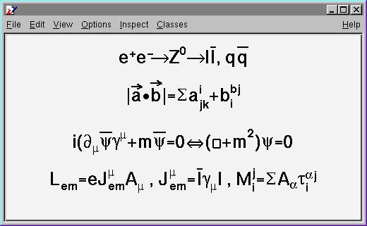

ROOT 学习笔记
=================
> ROOT 是粒子物理与核物理数据分析的好工具！！！      
> ROOT的学习不是一朝一夕的事情,需要反复反复再反复使用，才可能较好地掌握它.             
这里是我学习使用ROOT的总结、感悟. 本文档的出发点是给初学者提供一种学习ROOT的思路如果C++基础好,学习ROOT会很快上手！这里简单介绍ROOT里面几个
最常用到的类,以及这些类的基本操作方法对于一些重要的类,仔细研读源程序会
有很大收获！                                


> ROOT学习资料
> [1. ROOT_for_beginners](https://cloud.tsinghua.edu.cn/d/bad40bc16faa4061ada3/) // 个人觉得这是最适合新手的学习资料,一共5篇
> [2. 杨振伟老师ROOT课程讲义](https://cloud.tsinghua.edu.cn/d/9132b3d20f884fc59f1f/) // 适合新手入门
> [3. ROOT-User-Guide](https://root.cern.ch/root/htmldoc/guides/users-guide/ROOTUsersGuide.html)
> [4. $ROOTSYS/tutorials](https://root.cern.ch/root/htmldoc/guides/users-guide/ROOTUsersGuide.html#rootsystutorials-1) // tutorials源代码在root/tutorials下，是非常好的学习资料！
> [5. 新版本Reference-Guide](https://root.cern/doc/master/annotated.html )  
> [6. *旧版本Reference-Guide](https://root.cern.ch/root/html304/)


>  <font color=#DC143C >ROOT学习方法参考!!!</font>
> 1. 入门阶段：建议阅读顺序，ROOT_for_beginners，杨振伟老师ROOT课程讲义, 完成里面的练习
> 2. 提高阶段: ROOT-User-Guide 与 tutorials 结合使用 ( <font color=#DC143C >User-Guide不适合从头到尾阅读!!!</font>)
> 3. 熟练阶段： 在root环境下善用Tag键不全，必要时查阅Reference-Guide
  
 
作者：小关                                            


目录
-----
[toc]


---------------------------------------------------
# <font color=#DC143C> 附录: </font>

### <font color=#00BFFF> Markers  </font>


### <font color=#00BFFF> 希腊字母表  </font>


### <font color=#00BFFF> 数学符号  </font>


-------------------------------------------------------
# <font color=#DC143C> 一. ROOT 基础篇 </font>

### <font color=#00BFFF> 1.1 ROOT-Framework简介 </font>
*  $ROOTSYS/bin : 二进制文件: 
* $ROOTSYS/lib : ROOT库文件<font color=#DC143C> (写makefile时需要用到！！！)</font>
* $ROOTSYS/tutorials: ROOT例子源代码 
* $ROOTSYS/Test : 包含整个ROOT-Framework的全部实例,值得进一步探索！！!
* $ROOTSYS/include: 包含所有的头文件


--------------------------------------------------------
### <font color=#00BFFF> 1.2 ROOT 终端常用命令(更多内容参见cling) </font>

```C++
root -h  //help作用，查看root后面参数如何使用
root -l  //关root的欢迎界面
root -b  //关闭图形界面，及不显示Canvas
root myMacro.C > myMacro.log  // 将 myMacro.C 的结果输出到 myMacro.log中

root[] .?             // 查看root环境下所有的用法
root[].L myFile.C     // Load myFile.C 
root[].x myFile.C     // Load and execute myFile.C 
//更多用法参照 cling 的介绍
```


------------------------------------------------------------
### <font color=#00BFFF> 1.3 ROOT的代码规范  </font>

#### <font color=#FF00FF> 1.3.1 代码约定  </font>

|  命名规则          | 代码规范  |
|:---               |:---      |
|类名以 "T" 开头     |TLine, TTree, ...|
|非类类型以"_t"结尾   |Int_t, Double_t, Bool_t, ....|
|类的数据成员以"f"开头 |fTTree, ...|
|成员函数以大写字母开头 |Loop(), ...|
|常量以"k"开头        |kRed, ...|
|全局变量以"g"开头     |gROOT, gStyle, ...|
|静态数据成员以 "fg" 开头 |fgTokenClient, ...|
|枚举型以 "E" 开头        |EColorLevel, ...|
|局域变量与参数开头小写     |nbytes, ...|
|Getters and Setters 分别以 "Get" "Set" 开头|SetLast(), GetFirst(), ...|


-----------------------------------------------------------
#### <font color=#FF00FF> 1.3.2 数据类型规范  </font>

> 为避免新老机器对同一种数据类型可能有不同的长度, ROOT使用下面的 pre-defined 类型
```C++
* Char_t         //Signed Character 1 byte
* UChar_t        //Unsigned Character 1 byte
* Short_t        //Signed Short integer 2 bytes
* UShort_t       //Unsigned Short integer 2 bytes
* Int_t          //Signed integer 4 bytes
* UInt_t         //Unsigned integer 4 bytes
* Long64_t       //Portable signed long integer 8 bytes
* ULong64_t      //Portable unsigned long integer 8 bytes
* Float_t        //Float 4 bytes
* Double_t       //Float 8 bytes
* Double32_t     //Double 8 bytes in memory, written as a Float 4 bytes
* Bool_t         //Boolean (0=false, 1=true)
```

------------------------------------------------------------
### <font color=#00BFFF>  1.4 全局变量  </font>

#### <font color=#FF00FF> 1.4.1 gROOT  </font>

> By using gROOT pointer, you can get the access to every object created in a ROOT program
```C++
root[] gROOT->ProcessLine(".x myHist.C");
root[] gROOT->GetListOfFunctions();
root[] gROOT->GetListOfCanvases()->FindObject("c1");
...
```

#### <font color=#FF00FF> 1.4.2 gPad  </font>

> gPad is always pointing to the active pad
```C++
{
  gPad->SetFillColor(38);
  gPad->Modified(); // Tell the canvas that an object it is displaying has changed
  gPad->Update();  // Force the canvas to refresh
  ...
}
```

#### <font color=#FF00FF> 1.4.3 gStyle  </font>

```C++
root[] gStyle->SetFillStyle(); 
root[] gStyle->SetPalette(1);     // To plot with nice colors
root[] gStyle->SetOptFit(kTRUE);  // 显示拟合参数
root[] gStyle->SetOptStat(1);     // 显示详细的拟合参数
...

```

#### <font color=#FF00FF> 1.4.4 gRandom  </font>
 
> A pointor to the current random number generator. Points to 'TRandom3' by default
```C++
root[] gRandom->Print(); // 查看当前的 random number generator
root[] delete gRandom;   // 删除当前的 random number generator
root[] gRandom = new TRandom2(0); // seed = 0, 新的random number generator
...
```

#### <font color=#FF00FF> 1.4.5 gSystem  </font>

```C++
root[] gSystem->Getenv("USER")  // returns the value of the system enviroment variable 'USER' 
```

#### <font color=#FF00FF> 1.4.6 其他全局变量  </font>

> 在 root 终端键入g, 按 Tab 补全可查看所有的全局变量！


------------------------------------------------------------
### <font color=#00BFFF> 1.5 环境设置  </font>

#### <font color=#FF00FF> 1.5.1 rootlogon.C  </font>

> This script without a function declaration is executed automatically when ROOT is launched from the same directory as the file
```C++
{
   gStyle->SetPalette(1);                                      // 使画图颜色更加好看
   cout << "Salut " << gSystem->Getenv("USER") << "!" << endl;
   gSystem->Exec("date");                                      // 显示系统时间日期
}
```

#### <font color=#FF00FF> 1.5.2 rootlogoff.C  </font>

> rootlogoff.C is a script loaded at shutdown


#### <font color=#FF00FF> 1.5.3 rootalias.C  </font>

> rootalias.C file is loaded but not executed at start-up, it contians small functions like:
```C++
ls(path)
edit(filename)
dir(path)
pwd()
cd(path)
```


-----------------------------------------------------------------
### <font color=#00BFFF> 1.6 对象  </font>

#### <font color=#FF00FF> 1.6.1 Inspecting Objects  </font>

```C++
root[] TFile f("staff.root");
root[] f.Inspect() 
root[] f.Print()
```

#### <font color=#FF00FF> 1.6.2 Object Ownership  </font>

> 了解对象的所有权归属, 有助于对对象进行操作!
  
   ```C++
   2.1 By Current Directory (gDirectory)
       所有权归当前目录的有: histograms, tree, event list(TEventList)
    
       TH1F *h = (TH1F*)gDirectory->GetList()->FindObject("myHist");
   ```

   ```C++
   2.2 By the Master TROOT Object (gROOT)
       所有权归gROOT的有: 一些列 "collections of objects",比如 fCanvases， fColors,...
  
       TCanvas *cc = (TCanvas*)gROOT->GetListOfCanvases()->FindObject("c1");
   ```

   ```C++
   2.3 By Other Objcets
       When an object creates another, the creating object is the owner of the created one
       
       myHisto->Fit("gaus");
   ```

   ```C++
   2.4 By the user
   ```


--------------------------------------------------------------
### <font color=#00BFFF> 1.7 ROOT中的C++  </font>

#### <font color=#FF00FF> 1.7.1 C++ 解释器 -- Cling  </font>
 
>+ Cling 是 ROOT 使用的 C++ 解释器. Cling 可以简化我们在root环境下的C++语法! 
>+ Cling 是解释器, 不是编译器！ 它给我们在 root 环境下使用 C++ 带来便利! 比如：root 可以直接执行 ROOT 脚本(也叫"Macro")而不需要编译， 这样的 macro 甚至不需要包含必要的头文件， <font color=#DC143C>但且要求文件名与函数同名！ </font>
>+ ROOT Macro 一般不能通过C++编译!!!  <font color=#DC143C> 所以在写需要编译的复杂程序是不能使用 cling 带来的这些便利！ 切记！</font>
>+ [链接到cling](https://root.cern.ch/cling)

1. 解释器命令以"."开头, 在root终端可产看所有的命令
```C++
root[] .?  // 查看所有的命令
```
2. 命令行模式使用多行代码：以 "{" 开头,以 "}" 结尾
```C++
root[] {
root[] ? for(int i=0; i<5; i++){
root[] ?    cout<< i << endl;
root[] ?}
```

3. ROOT脚本的执行
> ROOT script files 通常也叫作 "Macros". 可以在一个脚本中执行另一个脚本.
```C++
// calls a script to build the root file if it does not exist
void cernstaff()
{
  if(gSystem->AccessPathName("cernstaff.root")) // 如果"cernstaff.root"不存在，则返回 true
  {
    gROOT->ProcessLine(".x cernbuid.C");
  }
}
```

----------------------------------------------------------------
#### <font color=#FF00FF> 1.7.2 ACLiC: Compiling Scripts Into Libraries  </font>

1. 使用方法
```C++
root[] .L MyScript.C+  // build and load a shared library containing your script

gROOT->ProcessLine(".L MyScript.C+");
```

2. 设置头文件路径
```C++
root[] .include  // get the include path
root[] .include $HOME/mypackage/inlcude  // append to the include path

gSystem->AddIncludePath(" -I$HOME/mypackage/inlcude");// 在脚本中添加
gSystem->SetIncludePath(" -I$HOME/mypackage/inlcude"); // overwrite the existing include path
gSystem->AddLinkedLibs("-L/my/path -lanylib"); // Add library
gSystem->Load("mydir/mylib"); // Load library

```


-------------------------------------------------------
### <font color=#00BFFF> 1.8 GUI 图形用户界面  </font>

#### <font color=#FF00FF> 1.8.1 画图  </font>
> 2D: lines, polygons(多边形), arrows, plots, histograms
> 3D graphical objects

```C++
  object.Draw()
```

#### <font color=#FF00FF> 1.8.2 操作画图对象  </font>
> 对屏幕上的对象进行操作将会改变对象的内存


##### 1.8.2.1 鼠标左键 -- Moving, Resizing and Modifying Objects 
>+ 图形界面 -- 点击鼠标左键
>+ 使用编程 -- 通过编程改变图形, 需要"Update the Pad"才能显示出来

##### 1.8.2.2 鼠标中键 -- 选中画图对象
>+ 图形界面 -- 点击鼠标中键
>+ 使用变成 -- root[ ] cd->cd

##### 1.8.2.3 鼠标右键 -- 快捷菜单
>+ 右键单击图形中任何地方, 将会显示对应对象的菜单
>+ 可以向一个类中添加菜单, 用  // \*MENU\* 标记注释


#### <font color=#FF00FF> 1.8.3 图形容器 -- TCanvas && TPad  </font>
>+ Canvases 等同于窗口, 而 Pads 是图像的真正载体
>+ TCanvas 是 TPad 的子类. 一个 canvas 本身是一个大 pad, 这个大的 pad 可以分为多个小 pad
>+ 任何时候，只能有一个 pad 处于 active 状态, 画图也将画在 active 的 pad 上
>+ 对 TPad 的操作同样适用于 TCanvas. Canvas 的使用可在 root 环境下右键查看.


##### 1.8.3.1 The Global Pad -- gPad
> gPad is always pointing to the active pad

+ Finding a n Object in a Pad
```C++
    root[] obj = gPad->GetPrimitive("myobjectname"); // 将myobjectname的指针返回给obj
    root[] obg = (TPaveLabel*)(gPad->GetPrimitive("myobjectname")); // 只当返回类型
```

+ Hinding an Object
```C++
   root[] li = gPad->GetListOfPrimitives();
   root[] li->Remove(obj);
```

##### 1.8.3.2 Pad 的坐标系
+ 用户坐标系 (最常用)
```C++
   root[] gPad->Range(float x1,float y1,float x2,float y2);
```
+ 归一化坐标系(NDC) 
  >+ 与窗口大小、用户坐标系无关. 
  >+ 横坐标范围(0,1), 纵坐标范围(0,1). 坐标原点(0,0)在左下角. 
  >+ 如果需要将文本画在图中的固定地方, 需要用到NDC坐标

+ 像素坐标系
  >+ 原点(0,0)在左上角

##### 1.8.3.3 坐标转换
  >+ 像素坐标: (px,py)
  >+ 用户坐标: (ux,xy)
  >+ 归一坐标: (apx,apy)
  >+ 绝对像素坐标: (apx,apy)
  > NDC to Pixel 
  > Pixel to User
  > Absolute pixel to user
  > User to Pixel
  > User to absolute pixel
  
##### 1.8.3.4 Divide a Pad into Sub-pads
+ 创建多个Pad, 画在同一个Canvas上
```C++
   root[] spad1 = new TPad("spad1","The first subpad",.1,.1,.5,.5);//NDC坐标
   root[] spad1->Draw()
```
+ 将同一个Pad分成多个Sub-Pads
```C++
   root[] pad1->Divide(3,2); // 3行2列
   root[] pad1->Divide(3,2,0.1,0.1); // 设定sub-pad间隔, 10% of the parent width
```

##### 1.8.3.5 Updating the Pad
> 默认地, 若对当前的 pad 进行操作, 图形界面并不会即时更新. 用鼠标点击一下 pad 即可刷新. 也可用代码实现:

```C++
  root[] gPad->Modified();  // the pad has changed
  root[] gPad->Update();    // update all modified pads 
```

##### 1.8.3.6 设置 Pad 的透明度

```C
  // istyle = 4000 - 4100, 4000完全透明，4100完全不透明
  root[] pad->SetFillStyle(istyle);
```

##### 1.8.3.7 设置对数坐标
>+ 对数坐标是对 pad 设置, 不是对直方图或者坐标轴
>+ 如果一个 pad 分成多个 sub-pad, 需要分别对各个 sub-pad 进行设置

```C++
  root[] gPad->SetLogx(1);  // 1-对数坐标, 0-重置
  root[] gPad->SetLogy(1);
  root[] gPad->SetLogz(1);
```

##### 1.8.3.8 WaitPrimitive 方法

```C++
  canvas->WaitPrimitive(); // 处于"等待"状态, 双击 canvas 结束
```


#### <font color=#FF00FF> 1.8.4 图形  </font>

##### 1.8.4.1 线条: 直线, 箭头, 折线
```C++
  直线：
      TLine* line = new TLine(Double_t x1, Double_t y1, 
                              Double_t x2, Double_t y2);  
  
  箭头：
      TArrow* arr = new TArrow(Double_t x1, Double_t y1,
                               Double_t x2, Double_t y2,
                               Float_t arrowsize, Option_t* option) 
             // Option选项: ">" "|>" "<" "<|" "<>" "<|>"
             // "|" 表示家头加粗, "<", ">" 分别表示左右箭头
      arr->SetFillColor(icolor); // 设置箭头的填充颜色
      arr->SetAngle(angle);      // 设置箭头的角度,默认 60 度
    
  折线:
      TPolyLine* polyl = new TPolyLine(Int_t n, Double_t* x,
                                       Double_t* y, Option_t* option)
                                       // n 是数据点的数目
```


##### 1.8.4.2 椭圆、扇形、圆
>+ 通过 TEllipse 来创建椭圆, 然后通过设置椭圆的 phi 角度范围定义扇形.
>+ ROOT 里面没有直接画圆的函数.
>+ 通过 TAttLine 设置图形的边界, TAttFill 设置填充方式

```C++
   TEllipse(Double_t x1, Double_t y1, Double_t r1, Double_t r2);
   TEllipse(Double_t x1, Double_t y1, Double_t r1, Double_t r2
            Double_t phimin, Double_t phimax, Double_t theta);
   // (x1,y1)为中心点, r1,r2分别是长轴和短轴, phimin,phimax是扇形张角范围
   // theta 是旋转角度

```


##### 1.8.4.2 方形
```C++
   TBox* box = new TBox(Double_t x1, Double_t x2,
                        Double_t y1, Double_t y2);
   // (x1,y1)是左下角顶点,(x2,y2)是右上角顶点
```


##### 1.8.4.3 Markers
> 通过 TMarker 方式创建. 点类型的 marker(1, 6, 7)不能调节大小
```C++
   TMarker* mark = new TMarker(Double_t x, Double_t y, Int_t marker);
```


##### 1.8.4.4 Feymann 图
> 两个有用的类: TCurlyLine, TCurlyArc
> 费曼图的例子参见: $ROOTSYS/tutorials/graphics/feyman.C


##### 1.8.4.5 文本与 Latex 数学公式
> ROOT 的文本输入采用 TLatex, 与 Latex的使用方法一致
>+ 常用 TLatex 用法 

| 名称  | 用法  | 效果  | 备注 |
|:-------:|:-------:|:---------:| :-------: |
| 上角标  |  x\^{y^{2}}    | $x^{y^{2}}$ |
| 下角标  |  x_{2y}        | $x_{2y}$    |
| 分数   |  #frac{x}{y} | $\frac{x}{y}$ |
| 根号   |  #sqrt{x}, #sqrt[3]{x}    | $\sqrt{x}, \sqrt[3]{3}$  |
| 大写括号| #{}{...}, #(){...}, #\| \|{...}|  
| 希腊字母 | #gamma, #Gamma | $\gamma, \Gamma$ | 见附录希腊字母表 | 

>+ 脚本 $ROOTSYS/tutorials/graphics/latex.C


>+ 脚本 $ROOTSYS/tutorials/graphics/latex2.C


>+ 脚本 $ROOTSYS/tutorials/graphics/latex3.C


##### 1.8.4.6 Text in a Pad
>+ TPaveLabel: Text 只有一行
>+ TPaveText: Text 有多行
>+ TPavesText: 多个 TPaveText 组成
>+ Option:
   option = "T" top frame
   option = "B" bottom frame
   option = "R" right frame
   option = "L" left frame
   option = "NDC" x1,y1,x2,y2 are given in NDC

```C++
  TPaveLabel(Double_t x1, Double_t y1, Double_t x2, Double_t y2,
             const char* label, Option_t* option);

  TPaveText pt1(Double_t x1, Double_t y1, Double_t x2, Double_t y2);
  TText* t1 = pt1.AddText("some text");

  TPavesText(Double_t x1, Double_t y1, Double_t x2, Double_t y2
             Int_t npaves, Option_t* option);
```


#### <font color=#FF00FF> 1.8.5 坐标设置  </font>


#### <font color=#FF00FF> 1.8.6 图形属性  </font>


### <font color=#00BFFF> 1.9 Input/Output  </font>


--------------------------------------------------------
# <font color=#DC143C> 二. ROOT 功能篇 </font>

### <font color=#00BFFF> 2.1 Histograms 直方图  </font>

#### <font color=#FF00FF> 2.1.1 TH1 </font>
* 从已有root文件中读取histogram
```C++
 TFile * in = new TFile("文件路径");
 TH1F  * h1 = (TH1F*)in->Get("ObjectName");
 TF1F  * h1 = (TH1F*)gROOT->FindObject("ObjectName"); //在ROOT环境下使用
```

* 创建并保存root文件
```C++
h1->GetNbinsX();          // get the number of bins in X axis
h1->GetBinCenter(i);      // get the center of bin NO.i
h1->GetBinContent(i);     // get the Y value of bin NO.i
h1->GetEntries();         // get the number of entry
```

* 直方图有用的用法
```C++
TH1F *hist = (TH1F*)h1->Clone();  // 克隆一个直方图
h->Scale(1./h->Integral());       // 归一化
```

* 直方图的画图技巧
```C++
hs->GetXaxis()->SetNdivisions(-505);   // 设置坐标值分度值
h->SetStats(0);                        // 关闭直方图右上方显示的box
h->SetOptStat(0);                      //
h->GetListOfFunctions()->Add(func); h->Draw(); // Draw the histo with the fit function
```

#### <font color=#FF00FF> 2.1.2 TH2  </font>


#### <font color=#FF00FF> 2.1.3 THStack </font>

* 同时画出多个直方图：THStack
```C++
THStack *hs = new THStack("hs","title");
hs->Add(h1);
hs->Add(h2);
```


-------------------------------------------------------------------
### <font color=#00BFFF> 2.2 Graphs 画图  </font>

#### <font color=#FF00FF> TGraph2DErrors  </font>
> I use TGraph2DErrors() to draw data(error value equal to 0), i try to fit with TF2 function, error happens: "fill data empty"  <font color=#DC143C>  // Reason: Reason: TF2 fit ignore data without an error </font>


#### <font color=#FF00FF> TLatex  </font>


#### <font color=#FF00FF> TLegend  </font>

* How to add a legend to a figure
```C++
* 新建一个TLegend: TLegend * legend = new TLegend();
* Fit function linked to the hist: TF1 * fun = hist->GetFunction();
* 创建legend内容 :      sprintf(message,"#chi^{2}=%.2f", fun->GetChisquare())
* AddEntry:            legend->AddEntry(fun,message);
* Drawing the TLegend: legend->Draw();
```


-------------------------------------------------------------------
### <font color=#00BFFF> 2.3 Fitting 拟合  </font>

> [Link-to-Root-User's-Guide](https://root.cern.ch/root/htmldoc/guides/users-guide/ROOTUsersGuide.html#fitting-histograms)

```C++
 gStyle->SetOptFit(kTRUE);           // 显示拟合参数
 hist->Fit("gaus","V","E1",-1,1.5); 
// Fit("function name","fit options","drawing options",fit limits) 
``` 

#### <font color=#FF00FF> 2.3.1 Use_predefined_funtion 使用自带函数  </font>

```C++
* Root 中自带的四类拟合函数： "gaus","expo","polN","landau"
* 获取拟合参数
  Get the function: TF1 * gfit = (TF1*)h->GetFunction("gaus");
  Get the parameters:
  gfit->GetParameter(0);
  gfit->GetParameter(1);
  gfit->GetParError(0);
  ......
  double par[3];
  gfit->GetParameter(par);
```

#### <font color=#FF00FF> 2.3.2 Use user-defined function 使用自定义函 </font>

> 自定义函数必须初始化才能使用
```C++
* Define the function 
* Include it in a TF1 
* Set parameters  : mw->SetParNames(); mw->SetParameter(1); mv->SetParameters(par);
* Make the fit    
* Sensitive to the initial values: mw->SetParLimits(0,lowlimit, highlimit);
* Get fit results : mw->GetChisquare();mw->GetNDF(); // Number of Degrees of Freedom
```

#### <font color=#FF00FF> 2.3.3 Use mixing functions 使用混合函数  </font>
```C++
* Pre-defined functions : TF1 *fc=new TF1("f5","pol3(0)+[4]*sin(gaus(5)+[8])",0,10)
* User-defined functions: 

    Double_t DeuxMaxwell(Double_t *x, Double_t *par)
    {
      /// Sum of 2 Maxwellian functions
      return Maxwell(x,&par[0])+Maxwell(x,&par[3]); 
    }

注意两点：
a.使用自定义函数拟合时，拟合结果对参数初始化很敏感  
b.一般需要给参数设定边界   
```

#### <font color=#FF00FF> 2.3.4 Fittting options 拟合选项  </font>
```C++
* "Q"   Quite model,终端不输出拟合结果
* "V"   Verbose model, 详细的输出    <font color=#DC143C>//(默认的模式介于两者之间) </font>
* "R"   使用函数定义时给定的区间进行拟合 (用于多区间拟合)
* "+"   在不删除前一个函数的情况下，将当前的拟合函数添加到list里面 <font color=#DC143C>     //默认情况是只保留最后一个拟合函数 </font>
* "N"   不存储拟合函数，也不画图显示   <font color=#DC143C  > //(默认情况是既保存又画图) </font>
* "0"   不画出拟合结果
* "LL"  An Improved Log Likelihood fit for low statistics   <font color=#DC143C> //(当Bin content大于100时，不要使用这种方式)</font> 
```

#### <font color=#FF00FF> 2.3.5 Set Bounds for Parameters 拟合参数设置 </font>
 
```C++
func->SetParameter();    // 单独给某一个参数赋初值
func->SetParameters();   // 同时给所有的参数赋初值
func->SetParLimits();    // 给某一个参数设定边界
func->FixParameter();    // 固定某个参数
```

#### <font color=#FF00FF> 2.3.6 Get the associated function </font> 
```C++
* TF1 *myfunc = h->GetFunction("myfunc");  // 从直方图的拟合函数中提取
* Fit Statistics: gStyle->SetOptFit(mode)  mode = pcev (defaul = 0111)
      p=1   打印 probability
      c=1   打印 Chi2/NDF
      e=1   打印 errors (if e=1, v must be 1)
      v=1   打印参数 name/values   
```

#### <font color=#FF00FF> 2.3.7 ROOT::Fit::Fitter ROOT6拟合新方法 </font>
[应用举例](https://root.cern.ch/doc/v612/combinedFit_8C.html)
>+ ROOT::Fit is a new ROOT Class in ROOT6
>+ 相比于TH1::Fit， ROOT::Fit 能对Fit进行更多精细的操作和控制！
>+ ROOT::Fit::BinData    used for least chi-square fits of histograms or TGraphs
   ROOT::Fit::UnBInData  used for fitting vectors of data points (e.g. from a TTree)

```C++
{
// 1. Create the input fit data object
  TH1 * h1 = (TH1*)filein->Get("histName");
  ROOT::Fit::DataOptions opt;
  opt.fIntegral = true; // Use the integral of bin content instead of bin center(default)
  ROOT::Fit::DataRange range(10, 50); 
  // ROOT::Fit::DataRange range;
  // range.setRange(10, 50);
  ROOT::Fit::BinData data(opt,range);
  ROOT::Fit::FillData(data, h1);


// 2. Create the input model functon
   TF1 * f1 = new TF1("f1","guas");
   ROOT::Math::WrappedMultiTF1 fitfunc(*f1,f1->GetNdim());


// 3. Congidure the fit
   Double_t par[3] = {100, 30, 10};
   ROOT::Fit::Fitter fitter;
   fitter.setFunction(fitfunc, false);
   fitter.Config().SetParamsSettings(3, par);
   fitter.Config().ParSettings(4).Fix();
   fitter.Config().ParSettings().SetLimits(-10, -1.E-4);
   fitter.Config().ParSettings(3).SetLimits(0,10000);
   fitter.Config().ParSettings(3).SetStepSize(5);


// 4. Chose the minimizer
   fitter.Config().SetMinimizer("Minuit","Migrad");
   // To print the default minimizer 


// 5. Perform the data fitting
   fitter.FitFCN(3, fitfunc, 0, data.Size(), true);

// 6. Examine the result
   ROOT::Fit::FitResult result = fitter.Result();
   result.Print(std::cout);


// 7. Draw 
   f1->SetFitResult(result, par);
   f1->SetRange(range().first, range().second);
   h1->GetListOfFunctions()->Add(f1);
   h1->Draw();
}
```

#### <font color=#FF00FF> 2.3.8 FUMILI Minimization Package  最小化算法 </font>
>* To minimize Chi-square functio  <font color=#DC143C>   //(ROOT中默认的拟合方式是最小Chi2)  </font>
>* To search maximum of likelihood function

##### 2.3.8.1 MINUIT
##### 2.3.8.2 MINUIT2


#### <font color=#FF00FF> 2.3.9 利用神经网络进行数据拟合 </font>


-----------------------------------------------------
### <font color=#00BFFF> 2.4 Trees 树  </font>


-----------------------------------------------------------
# <font color=#DC143C> 三. ROOT 提高篇 </font>

### <font color=#00BFFF> 3.1 Folders and Tasks  </font>

#### <font color=#FF00FF> 3.1.1 Folders </font>
> To reduce class dependencies and improve modularity
1. 创建文件夹

```C++
{
   // Add the top folder of my hierary to //root
   TFolder *aliroot=gROOT->GetRootFolder()->AddFolder("aliroot",
                                   "aliroot top level folders");
   // Add the hierarchy to the list of browsables
   gROOT->GetListOfBrowsables()->Add(aliroot,"aliroot");

   // Create and add the constants folder
   TFolder *constants=aliroot->AddFolder("Constants",
                                         "Detector constants");
}
```

2. 在文件夹添加内容 (Producer)
``` C++
TObjArray *array;
run_mc->Add(array);
```

3. 从文件夹读取内容 (Consumer)
``` C++
conf=(TFolder*)gROOT->FindObjectAny("/aliroot/Run/Configuration");
// or ...
conf=(TFolder*)gROOT->FindObjectAny("Configuration");
```

#### <font color=#FF00FF> 3.1.2 Tasks </font>


---------------------------------------------------
### <font color=#00BFFF> 3.2 Writing-GUI 手写GUI  </font>


----------------------------------------------------
### <font color=#00BFFF> 3.3 Geometry Package  </font>


---------------------------------------------------
### <font color=#00BFFF> 3.4 Python Interface  </font>


---------------------------------------------------
### <font color=#00BFFF> 3.5 Networking  </font>


----------------------------------------------------
### <font color=#00BFFF> 3.6 Threads 线程  </font>


---------------------------------------------------
### <font color=#00BFFF> 3.7 Parallel-Processing 并行计算  </font>


----------------------------------------------------
# <font color=#DC143C> 四. ROOT 运算篇 </font>


### <font color=#00BFFF> 4.1 Math-Libraries 数学库  </font>


----------------------------------------------------
### <font color=#00BFFF> 4.2 Matrix 矩阵  </font>


----------------------------------------------------
### <font color=#00BFFF>  4.3 Physics-Vectors 矢量运算 </font>


---------------------------------------------------
# <font color=#DC143C> 五. ROOT 其他篇 </font>


### <font color=#00BFFF>  5.1 TCutG   </font>
> <font color=#DC143C> Int_t TCutG::IsInside(Double_t x, Double_t y) const  </font>

1. 判断一个点是否在给定Cut范围内
```C++ 
if(mycut->IsInside(x,y)==1) // (x,y) is inside the cut region
if(mycut->IsInside(x,y)==0) // (x,y) is outside the cut region
```

2. 读取已有的Cut与作新的Cut
```C++
TCutG cut = (TCutG*)gPad->GetPrimitive("CUTG")       // get a cut
TCutG * mycut = (TCutG*)gPad->WaitPrimitive("CUTG"); // draw a new cut
```


### <font color=#00BFFF>  5.2 TList  </font>

```C++
TList * list = gPad->GetLIstOfPrimitives();   // List of objects in the current canvas
```


